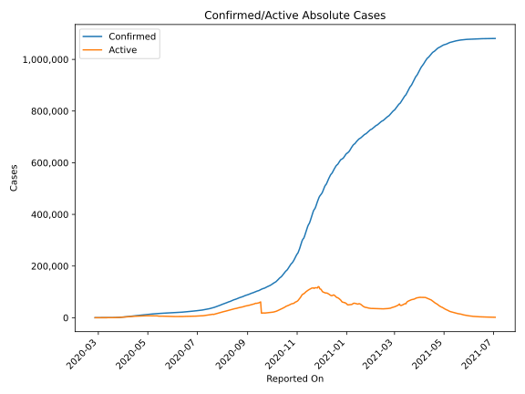
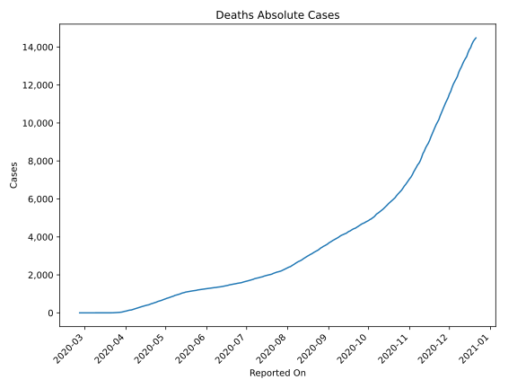
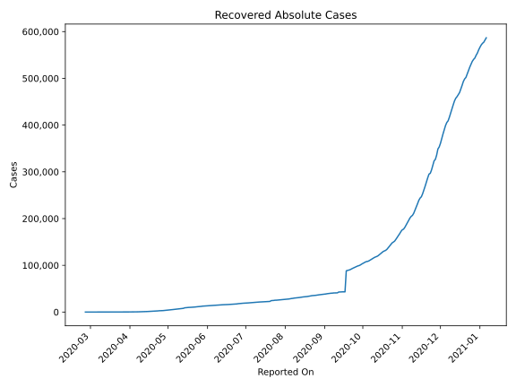
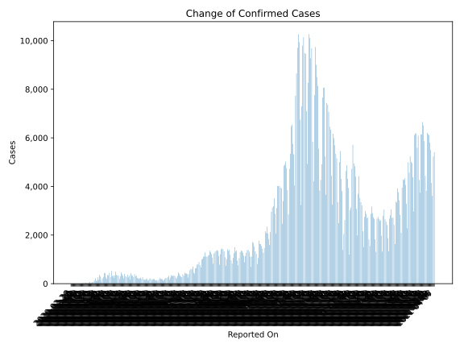
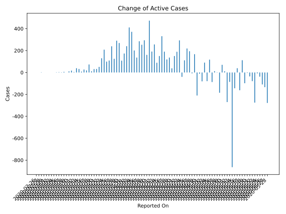
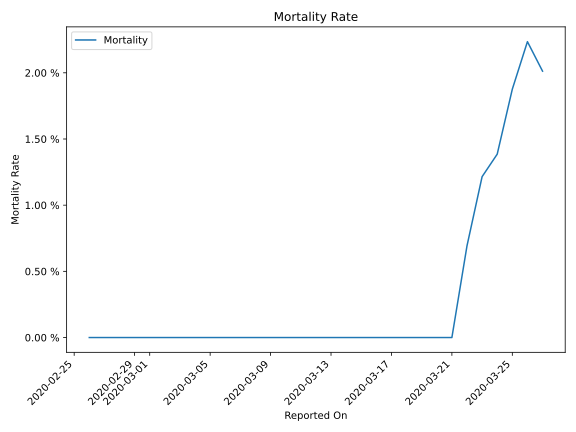

# Country Figures: Time Series for Romania 

| Reported On | Confirmed | Deaths | Recovered | Active | Mortality | &Delta; Confirmed | &Delta; Deaths | &Delta; Active | % Active of Population |
|-------------|-----------|--------|-----------|--------|-----------|-------------------|----------------|----------------|------------------------|
| 2020-04-05 | 3864 | 151 | 374 | 3339 |  3.91 %  | 251 | 5 | 201 |  0.017 %  | 
| 2020-04-04 | 3613 | 146 | 329 | 3138 |  4.04 %  | 430 | 13 | 371 |  0.016 %  | 
| 2020-04-03 | 3183 | 133 | 283 | 2767 |  4.18 %  | 445 | 18 | 411 |  0.014 %  | 
| 2020-04-02 | 2738 | 115 | 267 | 2356 |  4.20 %  | 278 | 23 | 240 |  0.012 %  | 
| 2020-04-01 | 2460 | 92 | 252 | 2116 |  3.74 %  | 215 | 10 | 173 |  0.011 %  | 
| 2020-03-31 | 2245 | 82 | 220 | 1943 |  3.65 %  | 136 | 17 | 108 |  0.010 %  | 
| 2020-03-30 | 2109 | 65 | 209 | 1835 |  3.08 %  | 294 | 22 | 269 |  0.009 %  | 
| 2020-03-29 | 1815 | 43 | 206 | 1566 |  2.37 %  | 363 | 6 | 290 |  0.008 %  | 
| 2020-03-28 | 1452 | 37 | 139 | 1276 |  2.55 %  | 160 | 11 | 125 |  0.007 %  | 
| 2020-03-27 | 1292 | 26 | 115 | 1151 |  2.01 %  | 263 | 3 | 239 |  0.006 %  | 
| 2020-03-26 | 1029 | 23 | 94 | 912 |  2.24 %  | 123 | 6 | 109 |  0.005 %  | 
| 2020-03-25 | 906 | 17 | 86 | 803 |  1.88 %  | 112 | 6 | 99 |  0.004 %  | 
| 2020-03-24 | 794 | 11 | 79 | 704 |  1.39 %  | 218 | 4 | 208 |  0.004 %  | 
| 2020-03-23 | 576 | 7 | 73 | 496 |  1.22 %  | 143 | 4 | 130 |  0.003 %  | 
| 2020-03-22 | 433 | 3 | 64 | 366 |  0.69 %  | 66 | 3 | 51 |  0.002 %  | 
| 2020-03-21 | 367 | 0 | 52 | 315 |  None  | 59 | 0 | 32 |  0.002 %  | 
| 2020-03-20 | 308 | 0 | 25 | 283 |  None  | 31 | 0 | 31 |  0.001 %  | 
| 2020-03-19 | 277 | 0 | 25 | 252 |  None  | 17 | 0 | 11 |  0.001 %  | 
| 2020-03-18 | 260 | 0 | 19 | 241 |  None  | 76 | 0 | 73 |  0.001 %  | 
| 2020-03-17 | 184 | 0 | 16 | 168 |  None  | 26 | 0 | 19 |  0.001 %  | 
| 2020-03-16 | 158 | 0 | 9 | 149 |  None  | 27 | 0 | 27 |  0.001 %  | 
| 2020-03-15 | 131 | 0 | 9 | 122 |  None  | 8 | 0 | 8 |  0.001 %  | 
| 2020-03-14 | 123 | 0 | 9 | 114 |  None  | 34 | 0 | 32 |  0.001 %  | 
| 2020-03-13 | 89 | 0 | 7 | 82 |  None  | 40 | 0 | 39 |  0.000 %  | 
| 2020-03-12 | 49 | 0 | 6 | 43 |  None  | 4 | 0 | 4 |  0.000 %  | 
| 2020-03-11 | 45 | 0 | 6 | 39 |  None  | 20 | 0 | 17 |  0.000 %  | 
| 2020-03-10 | 25 | 0 | 3 | 22 |  None  | 10 | 0 | 10 |  0.000 %  | 
| 2020-03-09 | 15 | 0 | 3 | 12 |  None  | 0 | 0 | 0 |  0.000 %  | 
| 2020-03-08 | 15 | 0 | 3 | 12 |  None  | 6 | 0 | 6 |  0.000 %  | 
| 2020-03-07 | 9 | 0 | 3 | 6 |  None  | 0 | 0 | -2 |  0.000 %  | 
| 2020-03-06 | 9 | 0 | 1 | 8 |  None  | 3 | 0 | 3 |  0.000 %  | 
| 2020-03-05 | 6 | 0 | 1 | 5 |  None  | 2 | 0 | 2 |  0.000 %  | 
| 2020-03-04 | 4 | 0 | 1 | 3 |  None  | 1 | 0 | 0 |  0.000 %  | 
| 2020-03-03 | 3 | 0 | 0 | 3 |  None  | 0 | 0 | 0 |  0.000 %  | 
| 2020-03-02 | 3 | 0 | 0 | 3 |  None  | 0 | 0 | 0 |  0.000 %  | 
| 2020-03-01 | 3 | 0 | 0 | 3 |  None  | 0 | 0 | 0 |  0.000 %  | 
| 2020-02-29 | 3 | 0 | 0 | 3 |  None  | 0 | 0 | 0 |  0.000 %  | 
| 2020-02-28 | 3 | 0 | 0 | 3 |  None  | 2 | 0 | 2 |  0.000 %  | 
| 2020-02-27 | 1 | 0 | 0 | 1 |  None  | 0 | 0 | 0 |  0.000 %  | 
| 2020-02-26 | 1 | 0 | 0 | 1 |  None  | None | None | None |  0.000 %  | 

