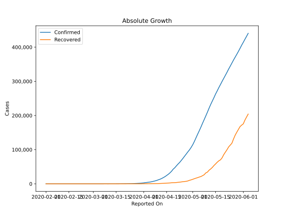
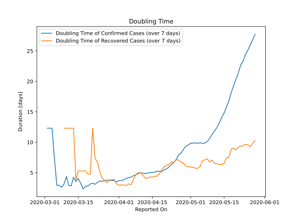

# Country Figures: Doubling Time of Infections for Russia 

The doubling time below are calculated based on
* an exponential growth assumption
* for time difference of past seven (7) days.
The doubling time's unit is "days".

The first doubling time indicates the increase of confirmed (infected)
cases. There, the *higher* the number is, the better is to take control
of the disease.

The second doubling time indicates the increase of recovered (healed)
cases. There, the *lower* the number is, the better it is to take
control of the disease.

| Reported On | Confirmed | Doubling Time (Confirmed) | Recovered | Doubling Time (Recovered) |
|-------------|-----------|---------------------------|-----------|---------------------------|
| 2020-05-09 | 198676 |  10.6 days  | 31916 |  6.8 days  | 
| 2020-05-08 | 187859 |  10.1 days  | 26608 |  7.3 days  | 
| 2020-05-07 | 177160 |  9.9 days  | 23803 |  7.1 days  | 
| 2020-05-06 | 165929 |  9.8 days  | 21327 |  7.0 days  | 
| 2020-05-05 | 155370 |  9.9 days  | 19865 |  6.0 days  | 
| 2020-05-04 | 145268 |  9.8 days  | 18095 |  5.7 days  | 
| 2020-05-03 | 134687 |  9.9 days  | 16639 |  5.7 days  | 
| 2020-05-02 | 124054 |  9.9 days  | 15013 |  5.9 days  | 
| 2020-05-01 | 114431 |  9.8 days  | 13220 |  6.0 days  | 
| 2020-04-30 | 106498 |  9.5 days  | 11619 |  5.9 days  | 
| 2020-04-29 | 99399 |  9.3 days  | 10286 |  6.1 days  | 
| 2020-04-28 | 93558 |  8.8 days  | 8456 |  6.6 days  | 
| 2020-04-27 | 87147 |  8.2 days  | 7346 |  6.8 days  | 
| 2020-04-26 | 80949 |  8.0 days  | 6767 |  7.1 days  | 
| 2020-04-25 | 74588 |  7.2 days  | 6250 |  7.1 days  | 
| 2020-04-24 | 68622 |  6.7 days  | 5568 |  6.7 days  | 
| 2020-04-23 | 62773 |  6.3 days  | 4891 |  6.8 days  | 
| 2020-04-22 | 57999 |  6.0 days  | 4420 |  6.4 days  | 
| 2020-04-21 | 52763 |  5.6 days  | 3873 |  6.2 days  | 
| 2020-04-20 | 47121 |  5.5 days  | 3446 |  6.0 days  | 
| 2020-04-19 | 42853 |  5.2 days  | 3291 |  5.5 days  | 
| 2020-04-18 | 36793 |  5.2 days  | 3057 |  4.9 days  | 
| 2020-04-17 | 32008 |  5.2 days  | 2590 |  4.4 days  | 
| 2020-04-16 | 27938 |  5.1 days  | 2304 |  4.4 days  | 
| 2020-04-15 | 24490 |  5.0 days  | 1986 |  4.3 days  | 
| 2020-04-14 | 21102 |  5.0 days  | 1694 |  4.3 days  | 
| 2020-04-13 | 18328 |  4.9 days  | 1470 |  4.1 days  | 
| 2020-04-12 | 15770 |  4.9 days  | 1291 |  4.1 days  | 
| 2020-04-11 | 13584 |  4.9 days  | 1045 |  4.6 days  | 
| 2020-04-10 | 11917 |  4.9 days  | 795 |  5.0 days  | 
| 2020-04-09 | 10131 |  5.0 days  | 698 |  4.8 days  | 
| 2020-04-08 | 8672 |  4.6 days  | 580 |  4.7 days  | 
| 2020-04-07 | 7497 |  4.5 days  | 494 |  3.8 days  | 
| 2020-04-06 | 6343 |  4.3 days  | 406 |  3.0 days  | 
| 2020-04-05 | 5389 |  4.2 days  | 355 |  3.2 days  | 
| 2020-04-04 | 4731 |  4.0 days  | 333 |  2.9 days  | 
| 2020-04-03 | 4149 |  3.8 days  | 281 |  3.0 days  | 
| 2020-04-02 | 3548 |  3.7 days  | 235 |  3.0 days  | 
| 2020-04-01 | 2777 |  3.7 days  | 190 |  2.9 days  | 
| 2020-03-31 | 2337 |  3.5 days  | 121 |  3.2 days  | 
| 2020-03-30 | 1836 |  3.7 days  | 66 |  3.9 days  | 
| 2020-03-29 | 1534 |  3.7 days  | 64 |  3.8 days  | 
| 2020-03-28 | 1264 |  3.8 days  | 49 |  3.8 days  | 
| 2020-03-27 | 1036 |  3.8 days  | 45 |  3.3 days  | 
| 2020-03-26 | 840 |  3.7 days  | 38 |  3.7 days  | 
| 2020-03-25 | 658 |  3.6 days  | 29 |  4.1 days  | 
| 2020-03-24 | 495 |  3.6 days  | 22 |  5.1 days  | 
| 2020-03-23 | 438 |  3.4 days  | 17 |  6.8 days  | 
| 2020-03-22 | 367 |  3.1 days  | 16 |  7.3 days  | 
| 2020-03-21 | 306 |  3.3 days  | 12 |  12.3 days  | 
| 2020-03-20 | 253 |  3.1 days  | 9 |  4.8 days  | 
| 2020-03-19 | 199 |  2.8 days  | 9 |  4.8 days  | 
| 2020-03-18 | 147 |  2.8 days  | 8 |  5.3 days  | 
| 2020-03-17 | 114 |  2.3 days  | 8 |  5.3 days  | 
| 2020-03-16 | 90 |  3.2 days  | 8 |  5.3 days  | 
| 2020-03-15 | 63 |  4.0 days  | 8 |  5.3 days  | 
| 2020-03-14 | 59 |  3.5 days  | 8 |  3.8 days  | 
| 2020-03-13 | 45 |  4.2 days  | 3 |  12.3 days  | 
| 2020-03-12 | 28 |  2.8 days  | 3 |  12.3 days  | 
| 2020-03-11 | 20 |  2.9 days  | 3 |  12.3 days  | 
| 2020-03-10 | 10 |  4.4 days  | 3 |  12.3 days  | 
| 2020-03-09 | 17 |  3.1 days  | 3 |  12.3 days  | 
| 2020-03-08 | 17 |  2.6 days  | 3 |  None  | 
| 2020-03-07 | 13 |  2.9 days  | 2 |  None  | 
| 2020-03-06 | 13 |  2.9 days  | 2 |  None  | 
| 2020-03-05 | 4 |  7.3 days  | 2 |  None  | 
| 2020-03-04 | 3 |  12.3 days  | 2 |  None  | 
| 2020-03-03 | 3 |  12.3 days  | 2 |  None  | 
| 2020-03-02 | 3 |  12.3 days  | 2 |  None  | 
| 2020-02-11 | 2 |  None  | 0 |  None  | 
| 2020-02-10 | 2 |  None  | 0 |  None  | 
| 2020-02-09 | 2 |  None  | 0 |  None  | 
| 2020-02-08 | 2 |  None  | 0 |  None  | 
| 2020-02-07 | 2 |  None  | 0 |  None  | 
| 2020-02-06 | 2 |  None  | 0 |  None  | 
| 2020-02-05 | 2 |  None  | 0 |  None  | 
| 2020-02-04 | 2 |  None  | 0 |  None  | 
| 2020-02-03 | 2 |  None  | 0 |  None  | 
| 2020-02-02 | 2 |  None  | 0 |  None  | 
| 2020-02-01 | 2 |  None  | 0 |  None  | 

