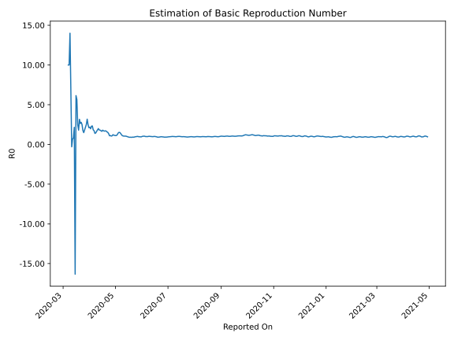

# Country Figures: Time Series for Basic Reproduction Number of Russia 

| Reported On | &Delta; Confirmed | Total &Delta; Confirmed First Interval | Total &Delta; Confirmed Second Interval | Estimated Basic Reproduction Number R0 | 
|-------------|-------------------|----------------------------------------|-----------------------------------------|---------------------------------------------------|
| 2020-04-27 | 6198 |  22950  |  21206  |  1.08  | 
| 2020-04-26 | 6361 |  21825  |  20755  |  1.05  | 
| 2020-04-25 | 5966 |  21501  |  19183  |  1.12  | 
| 2020-04-24 | 5849 |  19920  |  18363  |  1.08  | 
| 2020-04-23 | 4774 |  21206  |  15691  |  1.35  | 
| 2020-04-22 | 5236 |  20755  |  13680  |  1.52  | 
| 2020-04-21 | 5642 |  19183  |  12168  |  1.58  | 
| 2020-04-20 | 4268 |  18363  |  10906  |  1.68  | 
| 2020-04-19 | 6060 |  15691  |  9185  |  1.71  | 
| 2020-04-18 | 4785 |  13680  |  8197  |  1.67  | 
| 2020-04-17 | 4070 |  12168  |  7098  |  1.71  | 
| 2020-04-16 | 3448 |  10906  |  6087  |  1.79  | 
| 2020-04-15 | 3388 |  9185  |  5574  |  1.65  | 
| 2020-04-14 | 2774 |  8197  |  4742  |  1.73  | 
| 2020-04-13 | 2558 |  7098  |  3941  |  1.80  | 
| 2020-04-12 | 2186 |  6087  |  3348  |  1.82  | 
| 2020-04-11 | 1667 |  5574  |  2795  |  1.99  | 
| 2020-04-10 | 1786 |  4742  |  2612  |  1.82  | 
| 2020-04-09 | 1459 |  3941  |  2394  |  1.65  | 
| 2020-04-08 | 1175 |  3348  |  2313  |  1.45  | 
| 2020-04-07 | 1154 |  2795  |  2014  |  1.39  | 
| 2020-04-06 | 954 |  2612  |  1513  |  1.73  | 
| 2020-04-05 | 658 |  2394  |  1301  |  1.84  | 
| 2020-04-04 | 582 |  2313  |  996  |  2.32  | 
| 2020-04-03 | 601 |  2014  |  876  |  2.30  | 
| 2020-04-02 | 771 |  1513  |  769  |  1.97  | 
| 2020-04-01 | 440 |  1301  |  598  |  2.18  | 
| 2020-03-31 | 501 |  996  |  473  |  2.11  | 
| 2020-03-30 | 302 |  876  |  352  |  2.49  | 
| 2020-03-29 | 270 |  769  |  242  |  3.18  | 
| 2020-03-28 | 228 |  598  |  239  |  2.50  | 
| 2020-03-27 | 196 |  473  |  220  |  2.15  | 
| 2020-03-26 | 182 |  352  |  192  |  1.83  | 
| 2020-03-25 | 163 |  242  |  163  |  1.48  | 
| 2020-03-24 | 57 |  239  |  136  |  1.76  | 
| 2020-03-23 | 71 |  220  |  88  |  2.50  | 
| 2020-03-22 | 61 |  192  |  69  |  2.78  | 
| 2020-03-21 | 53 |  163  |  62  |  2.63  | 
| 2020-03-20 | 54 |  136  |  43  |  3.16  | 
| 2020-03-19 | 52 |  88  |  49  |  1.80  | 
| 2020-03-18 | 33 |  69  |  28  |  2.46  | 
| 2020-03-17 | 24 |  62  |  11  |  5.64  | 
| 2020-03-16 | 27 |  43  |  7  |  6.14  | 
| 2020-03-15 | 4 |  49  |  -3  |  -16.33  | 
| 2020-03-14 | 14 |  28  |  13  |  2.15  | 
| 2020-03-13 | 17 |  11  |  14  |  0.79  | 
| 2020-03-12 | 8 |  7  |  10  |  0.70  | 
| 2020-03-11 | 10 |  -3  |  10  |  -0.30  | 
| 2020-03-10 | -7 |  13  |  2  |  6.50  | 
| 2020-03-09 | 0 |  14  |  1  |  14.00  | 
| 2020-03-08 | 4 |  10  |  1  |  10.00  | 
| 2020-03-07 | 0 |  10  |  1  |  10.00  | 
| 2020-03-06 | 9 |  2  |  None  |  None  | 
| 2020-03-05 | 1 |  1  |  None  |  None  | 
| 2020-03-04 | 0 |  1  |  None  |  None  | 
| 2020-03-03 | 0 |  1  |  None  |  None  | 
| 2020-03-02 | 1 |  None  |  None  |  None  | 
| 2020-03-01 | 0 |  None  |  None  |  None  | 
| 2020-02-29 | 0 |  None  |  None  |  None  | 
| 2020-02-28 | 0 |  None  |  None  |  None  | 
| 2020-02-27 | 0 |  None  |  None  |  None  | 
| 2020-02-26 | 0 |  None  |  None  |  None  | 
| 2020-02-25 | 0 |  None  |  None  |  None  | 
| 2020-02-24 | 0 |  None  |  None  |  None  | 
| 2020-02-23 | 0 |  None  |  None  |  None  | 
| 2020-02-22 | 0 |  None  |  None  |  None  | 
| 2020-02-21 | 0 |  None  |  None  |  None  | 
| 2020-02-20 | 0 |  None  |  None  |  None  | 
| 2020-02-19 | 0 |  None  |  None  |  None  | 
| 2020-02-18 | 0 |  None  |  None  |  None  | 
| 2020-02-17 | 0 |  None  |  None  |  None  | 
| 2020-02-16 | 0 |  None  |  None  |  None  | 
| 2020-02-15 | 0 |  None  |  None  |  None  | 
| 2020-02-14 | 0 |  None  |  None  |  None  | 
| 2020-02-13 | 0 |  None  |  None  |  None  | 
| 2020-02-12 | 0 |  None  |  None  |  None  | 
| 2020-02-11 | 0 |  None  |  None  |  None  | 
| 2020-02-10 | 0 |  None  |  None  |  None  | 
| 2020-02-09 | 0 |  None  |  None  |  None  | 
| 2020-02-08 | 0 |  None  |  None  |  None  | 
| 2020-02-07 | 0 |  None  |  None  |  None  | 
| 2020-02-06 | 0 |  None  |  None  |  None  | 
| 2020-02-05 | 0 |  None  |  None  |  None  | 
| 2020-02-04 | 0 |  None  |  None  |  None  | 
| 2020-02-03 | 0 |  None  |  None  |  None  | 
| 2020-02-02 | 0 |  None  |  None  |  None  | 
| 2020-02-01 | 0 |  None  |  None  |  None  | 
| 2020-01-31 | None |  None  |  None  |  None  | 

