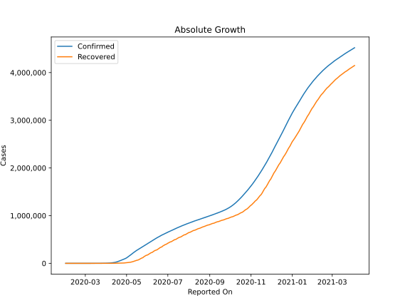
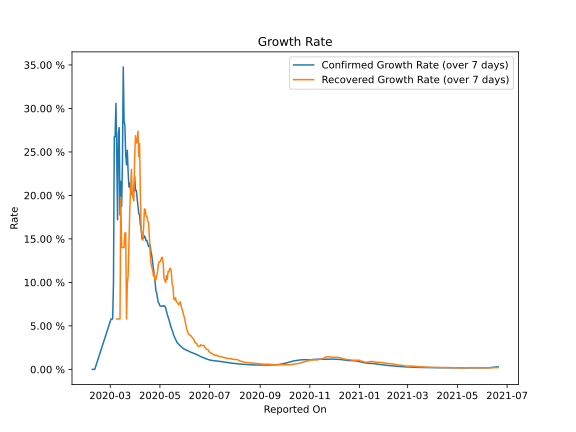

# Country Figures: Growth Rate for Russia 

The growth rates below are calculated based on
* an exponential growth assumption
* for time difference of past seven (7) days.
The growth rate is to be understood as on "growth per day".

The first growth rate indicates the increase of confirmed (infected) cases.

The second growth rate indicates the increase of recovered (healed) cases.

| Reported On | Confirmed | Growth Rate (Confirmed) | Recovered | Growth Rate (Recovered) |
|-------------|-----------|-------------------------|-----------|-------------------------|
| 2020-05-04 | 145268 |  7.30 %  | 18095 |  12.878 %  | 
| 2020-05-03 | 134687 |  7.27 %  | 16639 |  12.853 %  | 
| 2020-05-02 | 124054 |  7.27 %  | 15013 |  12.519 %  | 
| 2020-05-01 | 114431 |  7.31 %  | 13220 |  12.353 %  | 
| 2020-04-30 | 106498 |  7.55 %  | 11619 |  12.361 %  | 
| 2020-04-29 | 99399 |  7.70 %  | 10286 |  12.066 %  | 
| 2020-04-28 | 93558 |  8.18 %  | 8456 |  11.155 %  | 
| 2020-04-27 | 87147 |  8.78 %  | 7346 |  10.813 %  | 
| 2020-04-26 | 80949 |  9.09 %  | 6767 |  10.298 %  | 
| 2020-04-25 | 74588 |  10.10 %  | 6250 |  10.216 %  | 
| 2020-04-24 | 68622 |  10.89 %  | 5568 |  10.934 %  | 
| 2020-04-23 | 62773 |  11.56 %  | 4891 |  10.754 %  | 
| 2020-04-22 | 57999 |  12.32 %  | 4420 |  11.429 %  | 
| 2020-04-21 | 52763 |  13.09 %  | 3873 |  11.813 %  | 
| 2020-04-20 | 47121 |  13.49 %  | 3446 |  12.171 %  | 
| 2020-04-19 | 42853 |  14.28 %  | 3291 |  13.368 %  | 
| 2020-04-18 | 36793 |  14.23 %  | 3057 |  15.335 %  | 
| 2020-04-17 | 32008 |  14.11 %  | 2590 |  16.872 %  | 
| 2020-04-16 | 27938 |  14.49 %  | 2304 |  17.060 %  | 
| 2020-04-15 | 24490 |  14.83 %  | 1986 |  17.584 %  | 
| 2020-04-14 | 21102 |  14.78 %  | 1694 |  17.604 %  | 
| 2020-04-13 | 18328 |  15.16 %  | 1470 |  18.381 %  | 
| 2020-04-12 | 15770 |  15.34 %  | 1291 |  18.444 %  | 
| 2020-04-11 | 13584 |  15.07 %  | 1045 |  16.338 %  | 
| 2020-04-10 | 11917 |  15.07 %  | 795 |  14.857 %  | 
| 2020-04-09 | 10131 |  14.99 %  | 698 |  15.552 %  | 
| 2020-04-08 | 8672 |  16.27 %  | 580 |  15.943 %  | 
| 2020-04-07 | 7497 |  16.65 %  | 494 |  20.096 %  | 
| 2020-04-06 | 6343 |  17.71 %  | 406 |  25.953 %  | 
| 2020-04-05 | 5389 |  17.95 %  | 355 |  24.475 %  | 
| 2020-04-04 | 4731 |  18.86 %  | 333 |  27.376 %  | 
| 2020-04-03 | 4149 |  19.82 %  | 281 |  26.167 %  | 
| 2020-04-02 | 3548 |  20.58 %  | 235 |  26.029 %  | 
| 2020-04-01 | 2777 |  20.57 %  | 190 |  26.853 %  | 
| 2020-03-31 | 2337 |  22.17 %  | 121 |  24.354 %  | 
| 2020-03-30 | 1836 |  20.47 %  | 66 |  19.378 %  | 
| 2020-03-29 | 1534 |  20.43 %  | 64 |  19.804 %  | 
| 2020-03-28 | 1264 |  20.26 %  | 49 |  20.099 %  | 
| 2020-03-27 | 1036 |  20.14 %  | 45 |  22.992 %  | 
| 2020-03-26 | 840 |  20.57 %  | 38 |  20.577 %  | 
| 2020-03-25 | 658 |  21.41 %  | 29 |  18.398 %  | 
| 2020-03-24 | 495 |  20.98 %  | 22 |  14.451 %  | 
| 2020-03-23 | 438 |  22.61 %  | 17 |  10.768 %  | 
| 2020-03-22 | 367 |  25.17 %  | 16 |  9.902 %  | 
| 2020-03-21 | 306 |  23.51 %  | 12 |  5.792 %  | 
| 2020-03-20 | 253 |  24.67 %  | 9 |  15.694 %  | 
| 2020-03-19 | 199 |  28.02 %  | 9 |  15.694 %  | 
| 2020-03-18 | 147 |  28.50 %  | 8 |  14.012 %  | 
| 2020-03-17 | 114 |  34.77 %  | 8 |  14.012 %  | 
| 2020-03-16 | 90 |  23.81 %  | 8 |  14.012 %  | 
| 2020-03-15 | 63 |  18.71 %  | 8 |  14.012 %  | 
| 2020-03-14 | 59 |  21.61 %  | 8 |  19.804 %  | 
| 2020-03-13 | 45 |  17.74 %  | 3 |  5.792 %  | 
| 2020-03-12 | 28 |  27.80 %  | 3 |  5.792 %  | 
| 2020-03-11 | 20 |  27.10 %  | 3 |  5.792 %  | 
| 2020-03-10 | 10 |  17.20 %  | 3 |  5.792 %  | 
| 2020-03-09 | 17 |  24.78 %  | 3 |  5.792 %  | 
| 2020-03-08 | 17 |  30.57 %  | 3 |  None  | 
| 2020-03-07 | 13 |  26.74 %  | 2 |  None  | 
| 2020-03-06 | 13 |  26.74 %  | 2 |  None  | 
| 2020-03-05 | 4 |  9.90 %  | 2 |  None  | 
| 2020-03-04 | 3 |  5.79 %  | 2 |  None  | 
| 2020-03-03 | 3 |  5.79 %  | 2 |  None  | 
| 2020-03-02 | 3 |  5.79 %  | 2 |  None  | 
| 2020-02-11 | 2 |  None  | 0 |  None  | 
| 2020-02-10 | 2 |  None  | 0 |  None  | 
| 2020-02-09 | 2 |  None  | 0 |  None  | 
| 2020-02-08 | 2 |  None  | 0 |  None  | 
| 2020-02-07 | 2 |  None  | 0 |  None  | 
| 2020-02-06 | 2 |  None  | 0 |  None  | 
| 2020-02-05 | 2 |  None  | 0 |  None  | 
| 2020-02-04 | 2 |  None  | 0 |  None  | 
| 2020-02-03 | 2 |  None  | 0 |  None  | 
| 2020-02-02 | 2 |  None  | 0 |  None  | 
| 2020-02-01 | 2 |  None  | 0 |  None  | 

