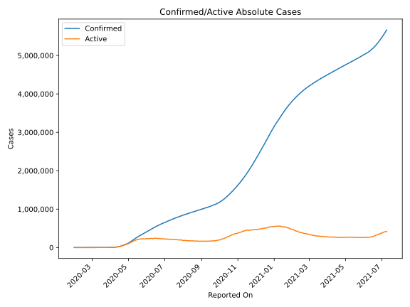
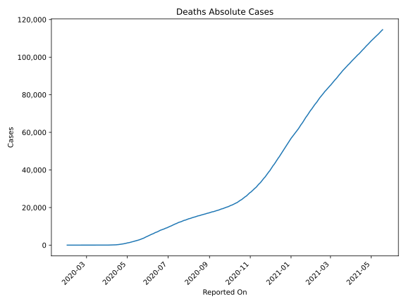
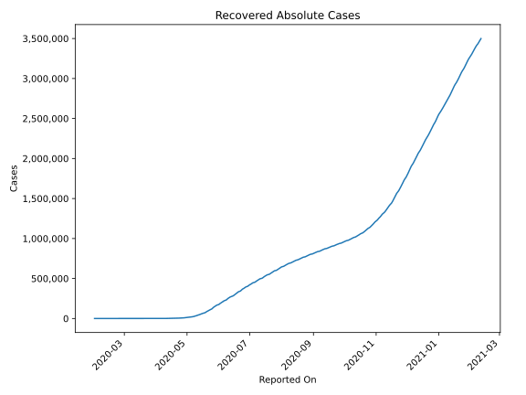
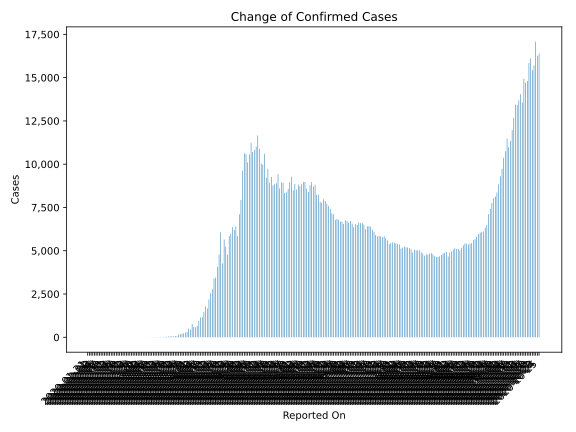
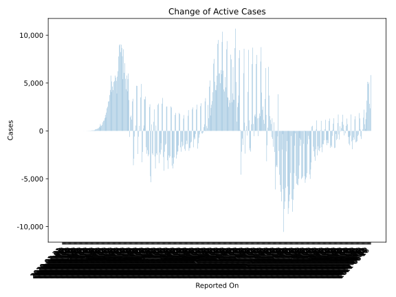
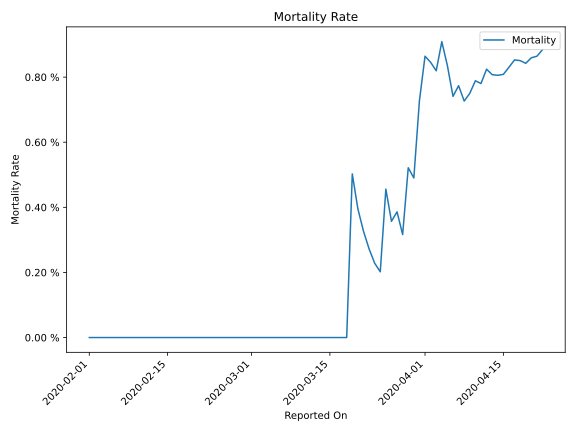

# Country Figures: Time Series for Russia 

| Reported On | Confirmed | Deaths | Recovered | Active | Mortality | &Delta; Confirmed | &Delta; Deaths | &Delta; Active | % Active of Population |
|-------------|-----------|--------|-----------|--------|-----------|-------------------|----------------|----------------|------------------------|
| 2020-04-04 | 4731 | 43 | 333 | 4355 |  0.91 %  | 582 | 9 | 521 |  0.003 %  | 
| 2020-04-03 | 4149 | 34 | 281 | 3834 |  0.82 %  | 601 | 4 | 551 |  0.003 %  | 
| 2020-04-02 | 3548 | 30 | 235 | 3283 |  0.85 %  | 771 | 6 | 720 |  0.002 %  | 
| 2020-04-01 | 2777 | 24 | 190 | 2563 |  0.86 %  | 440 | 7 | 364 |  0.002 %  | 
| 2020-03-31 | 2337 | 17 | 121 | 2199 |  0.73 %  | 501 | 8 | 438 |  0.002 %  | 
| 2020-03-30 | 1836 | 9 | 66 | 1761 |  0.49 %  | 302 | 1 | 299 |  0.001 %  | 
| 2020-03-29 | 1534 | 8 | 64 | 1462 |  0.52 %  | 270 | 4 | 251 |  0.001 %  | 
| 2020-03-28 | 1264 | 4 | 49 | 1211 |  0.32 %  | 228 | 0 | 224 |  0.001 %  | 
| 2020-03-27 | 1036 | 4 | 45 | 987 |  0.39 %  | 196 | 1 | 188 |  0.001 %  | 
| 2020-03-26 | 840 | 3 | 38 | 799 |  0.36 %  | 182 | 0 | 173 |  0.001 %  | 
| 2020-03-25 | 658 | 3 | 29 | 626 |  0.46 %  | 163 | 2 | 154 |  0.000 %  | 
| 2020-03-24 | 495 | 1 | 22 | 472 |  0.20 %  | 57 | 0 | 52 |  0.000 %  | 
| 2020-03-23 | 438 | 1 | 17 | 420 |  0.23 %  | 71 | 0 | 70 |  0.000 %  | 
| 2020-03-22 | 367 | 1 | 16 | 350 |  0.27 %  | 61 | 0 | 57 |  0.000 %  | 
| 2020-03-21 | 306 | 1 | 12 | 293 |  0.33 %  | 53 | 0 | 50 |  0.000 %  | 
| 2020-03-20 | 253 | 1 | 9 | 243 |  0.40 %  | 54 | 0 | 54 |  0.000 %  | 
| 2020-03-19 | 199 | 1 | 9 | 189 |  0.50 %  | 52 | 1 | 50 |  0.000 %  | 
| 2020-03-18 | 147 | 0 | 8 | 139 |  None  | 33 | 0 | 33 |  0.000 %  | 
| 2020-03-17 | 114 | 0 | 8 | 106 |  None  | 24 | 0 | 24 |  0.000 %  | 
| 2020-03-16 | 90 | 0 | 8 | 82 |  None  | 27 | 0 | 27 |  0.000 %  | 
| 2020-03-15 | 63 | 0 | 8 | 55 |  None  | 4 | 0 | 4 |  0.000 %  | 
| 2020-03-14 | 59 | 0 | 8 | 51 |  None  | 14 | 0 | 9 |  0.000 %  | 
| 2020-03-13 | 45 | 0 | 3 | 42 |  None  | 17 | 0 | 17 |  0.000 %  | 
| 2020-03-12 | 28 | 0 | 3 | 25 |  None  | 8 | 0 | 8 |  0.000 %  | 
| 2020-03-11 | 20 | 0 | 3 | 17 |  None  | 10 | 0 | 10 |  0.000 %  | 
| 2020-03-10 | 10 | 0 | 3 | 7 |  None  | -7 | 0 | -7 |  0.000 %  | 
| 2020-03-09 | 17 | 0 | 3 | 14 |  None  | 0 | 0 | 0 |  0.000 %  | 
| 2020-03-08 | 17 | 0 | 3 | 14 |  None  | 4 | 0 | 3 |  0.000 %  | 
| 2020-03-07 | 13 | 0 | 2 | 11 |  None  | 0 | 0 | 0 |  0.000 %  | 
| 2020-03-06 | 13 | 0 | 2 | 11 |  None  | 9 | 0 | 9 |  0.000 %  | 
| 2020-03-05 | 4 | 0 | 2 | 2 |  None  | 1 | 0 | 1 |  0.000 %  | 
| 2020-03-04 | 3 | 0 | 2 | 1 |  None  | 0 | 0 | 0 |  0.000 %  | 
| 2020-03-03 | 3 | 0 | 2 | 1 |  None  | 0 | 0 | 0 |  0.000 %  | 
| 2020-03-02 | 3 | 0 | 2 | 1 |  None  | 1 | 0 | 1 |  0.000 %  | 
| 2020-03-01 | 2 | 0 | 2 | 0 |  None  | 0 | 0 | 0 |  n/a  | 
| 2020-02-29 | 2 | 0 | 2 | 0 |  None  | 0 | 0 | 0 |  n/a  | 
| 2020-02-28 | 2 | 0 | 2 | 0 |  None  | 0 | 0 | 0 |  n/a  | 
| 2020-02-27 | 2 | 0 | 2 | 0 |  None  | 0 | 0 | 0 |  n/a  | 
| 2020-02-26 | 2 | 0 | 2 | 0 |  None  | 0 | 0 | 0 |  n/a  | 
| 2020-02-25 | 2 | 0 | 2 | 0 |  None  | 0 | 0 | 0 |  n/a  | 
| 2020-02-24 | 2 | 0 | 2 | 0 |  None  | 0 | 0 | 0 |  n/a  | 
| 2020-02-23 | 2 | 0 | 2 | 0 |  None  | 0 | 0 | 0 |  n/a  | 
| 2020-02-22 | 2 | 0 | 2 | 0 |  None  | 0 | 0 | 0 |  n/a  | 
| 2020-02-21 | 2 | 0 | 2 | 0 |  None  | 0 | 0 | 0 |  n/a  | 
| 2020-02-20 | 2 | 0 | 2 | 0 |  None  | 0 | 0 | 0 |  n/a  | 
| 2020-02-19 | 2 | 0 | 2 | 0 |  None  | 0 | 0 | 0 |  n/a  | 
| 2020-02-18 | 2 | 0 | 2 | 0 |  None  | 0 | 0 | 0 |  n/a  | 
| 2020-02-17 | 2 | 0 | 2 | 0 |  None  | 0 | 0 | 0 |  n/a  | 
| 2020-02-16 | 2 | 0 | 2 | 0 |  None  | 0 | 0 | 0 |  n/a  | 
| 2020-02-15 | 2 | 0 | 2 | 0 |  None  | 0 | 0 | 0 |  n/a  | 
| 2020-02-14 | 2 | 0 | 2 | 0 |  None  | 0 | 0 | 0 |  n/a  | 
| 2020-02-13 | 2 | 0 | 2 | 0 |  None  | 0 | 0 | 0 |  n/a  | 
| 2020-02-12 | 2 | 0 | 2 | 0 |  None  | 0 | 0 | -2 |  n/a  | 
| 2020-02-11 | 2 | 0 | 0 | 2 |  None  | 0 | 0 | 0 |  0.000 %  | 
| 2020-02-10 | 2 | 0 | 0 | 2 |  None  | 0 | 0 | 0 |  0.000 %  | 
| 2020-02-09 | 2 | 0 | 0 | 2 |  None  | 0 | 0 | 0 |  0.000 %  | 
| 2020-02-08 | 2 | 0 | 0 | 2 |  None  | 0 | 0 | 0 |  0.000 %  | 
| 2020-02-07 | 2 | 0 | 0 | 2 |  None  | 0 | 0 | 0 |  0.000 %  | 
| 2020-02-06 | 2 | 0 | 0 | 2 |  None  | 0 | 0 | 0 |  0.000 %  | 
| 2020-02-05 | 2 | 0 | 0 | 2 |  None  | 0 | 0 | 0 |  0.000 %  | 
| 2020-02-04 | 2 | 0 | 0 | 2 |  None  | 0 | 0 | 0 |  0.000 %  | 
| 2020-02-03 | 2 | 0 | 0 | 2 |  None  | 0 | 0 | 0 |  0.000 %  | 
| 2020-02-02 | 2 | 0 | 0 | 2 |  None  | 0 | 0 | 0 |  0.000 %  | 
| 2020-02-01 | 2 | 0 | 0 | 2 |  None  | 0 | None | None |  0.000 %  | 
| 2020-01-31 | 2 | None | None | None |  None  | None | None | None |  n/a  | 

