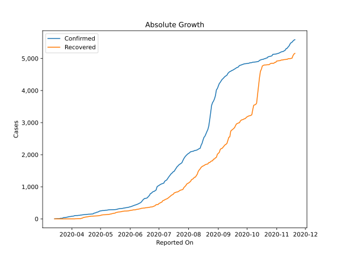
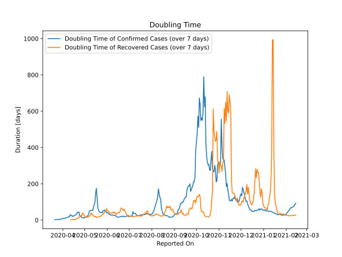

# Country Figures: Doubling Time of Infections for Rwanda 

The doubling time below are calculated based on
* an exponential growth assumption
* for time difference of past seven (7) days.
The doubling time's unit is "days".

The first doubling time indicates the increase of confirmed (infected)
cases. There, the *higher* the number is, the better is to take control
of the disease.

The second doubling time indicates the increase of recovered (healed)
cases. There, the *lower* the number is, the better it is to take
control of the disease.

| Reported On | Confirmed | Doubling Time (Confirmed) | Recovered | Doubling Time (Recovered) |
|-------------|-----------|---------------------------|-----------|---------------------------|
| 2020-04-06 | 105 |  12.3 days  | 4 |  None  | 
| 2020-04-05 | 104 |  12.6 days  | 4 |  None  | 
| 2020-04-04 | 102 |  9.5 days  | 0 |  None  | 
| 2020-04-03 | 89 |  10.1 days  | 0 |  None  | 
| 2020-04-02 | 84 |  9.7 days  | 0 |  None  | 
| 2020-04-01 | 82 |  7.3 days  | 0 |  None  | 
| 2020-03-31 | 75 |  8.1 days  | 0 |  None  | 
| 2020-03-30 | 70 |  7.6 days  | 0 |  None  | 
| 2020-03-29 | 70 |  4.1 days  | 0 |  None  | 
| 2020-03-28 | 60 |  4.2 days  | 0 |  None  | 
| 2020-03-27 | 54 |  4.5 days  | 0 |  None  | 
| 2020-03-26 | 50 |  3.0 days  | 0 |  None  | 
| 2020-03-25 | 41 |  3.3 days  | 0 |  None  | 
| 2020-03-24 | 40 |  3.1 days  | 0 |  None  | 
| 2020-03-23 | 36 |  2.8 days  | 0 |  None  | 
| 2020-03-22 | 19 |  2.0 days  | 0 |  None  | 
| 2020-03-21 | 17 |  2.0 days  | 0 |  None  | 
| 2020-03-20 | 17 |  None  | 0 |  None  | 
| 2020-03-19 | 8 |  None  | 0 |  None  | 
| 2020-03-18 | 8 |  None  | 0 |  None  | 
| 2020-03-17 | 7 |  None  | 0 |  None  | 
| 2020-03-16 | 5 |  None  | 0 |  None  | 
| 2020-03-15 | 1 |  None  | 0 |  None  | 
| 2020-03-14 | 1 |  None  | 0 |  None  | 

