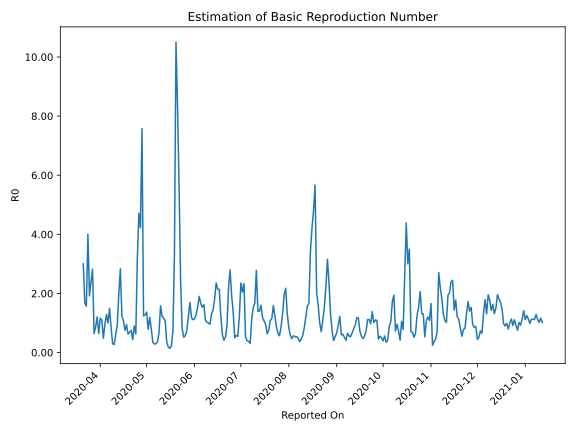

# Country Figures: Time Series for Basic Reproduction Number of Rwanda 

| Reported On | &Delta; Confirmed | Total &Delta; Confirmed First Interval | Total &Delta; Confirmed Second Interval | Estimated Basic Reproduction Number R0 | 
|-------------|-------------------|----------------------------------------|-----------------------------------------|---------------------------------------------------|
| 2020-05-02 | 6 |  42  |  53  |  0.79  | 
| 2020-05-01 | 6 |  52  |  38  |  1.37  | 
| 2020-04-30 | 18 |  42  |  33  |  1.27  | 
| 2020-04-29 | 13 |  36  |  29  |  1.24  | 
| 2020-04-28 | 5 |  53  |  7  |  7.57  | 
| 2020-04-27 | 16 |  38  |  9  |  4.22  | 
| 2020-04-26 | 8 |  33  |  7  |  4.71  | 
| 2020-04-25 | 7 |  29  |  9  |  3.22  | 
| 2020-04-24 | 22 |  7  |  11  |  0.64  | 
| 2020-04-23 | 1 |  9  |  10  |  0.90  | 
| 2020-04-22 | 3 |  7  |  16  |  0.44  | 
| 2020-04-21 | 3 |  9  |  12  |  0.75  | 
| 2020-04-20 | 0 |  11  |  16  |  0.69  | 
| 2020-04-19 | 3 |  10  |  16  |  0.62  | 
| 2020-04-18 | 1 |  16  |  17  |  0.94  | 
| 2020-04-17 | 5 |  12  |  16  |  0.75  | 
| 2020-04-16 | 2 |  16  |  15  |  1.07  | 
| 2020-04-15 | 2 |  16  |  13  |  1.23  | 
| 2020-04-14 | 7 |  17  |  6  |  2.83  | 
| 2020-04-13 | 1 |  16  |  8  |  2.00  | 
| 2020-04-12 | 6 |  15  |  16  |  0.94  | 
| 2020-04-11 | 2 |  13  |  21  |  0.62  | 
| 2020-04-10 | 8 |  6  |  22  |  0.27  | 
| 2020-04-09 | 0 |  8  |  27  |  0.30  | 
| 2020-04-08 | 5 |  16  |  19  |  0.84  | 
| 2020-04-07 | 0 |  21  |  14  |  1.50  | 
| 2020-04-06 | 1 |  22  |  22  |  1.00  | 
| 2020-04-05 | 2 |  27  |  21  |  1.29  | 
| 2020-04-04 | 13 |  19  |  20  |  0.95  | 
| 2020-04-03 | 5 |  14  |  29  |  0.48  | 
| 2020-04-02 | 2 |  22  |  20  |  1.10  | 
| 2020-04-01 | 7 |  21  |  18  |  1.17  | 
| 2020-03-31 | 5 |  20  |  31  |  0.65  | 
| 2020-03-30 | 0 |  29  |  24  |  1.21  | 
| 2020-03-29 | 10 |  20  |  23  |  0.87  | 
| 2020-03-28 | 6 |  18  |  28  |  0.64  | 
| 2020-03-27 | 4 |  31  |  11  |  2.82  | 
| 2020-03-26 | 9 |  24  |  10  |  2.40  | 
| 2020-03-25 | 1 |  23  |  12  |  1.92  | 
| 2020-03-24 | 4 |  28  |  7  |  4.00  | 
| 2020-03-23 | 17 |  11  |  7  |  1.57  | 
| 2020-03-22 | 2 |  10  |  6  |  1.67  | 
| 2020-03-21 | 0 |  12  |  4  |  3.00  | 
| 2020-03-20 | 9 |  7  |  None  |  None  | 
| 2020-03-19 | 0 |  7  |  None  |  None  | 
| 2020-03-18 | 1 |  6  |  None  |  None  | 
| 2020-03-17 | 2 |  4  |  None  |  None  | 
| 2020-03-16 | 4 |  None  |  None  |  None  | 
| 2020-03-15 | 0 |  None  |  None  |  None  | 
| 2020-03-14 | None |  None  |  None  |  None  | 

