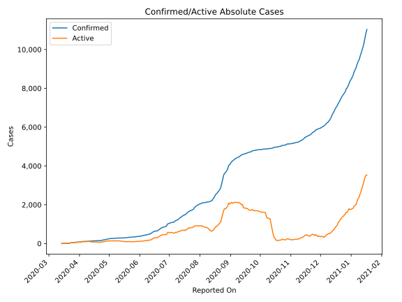
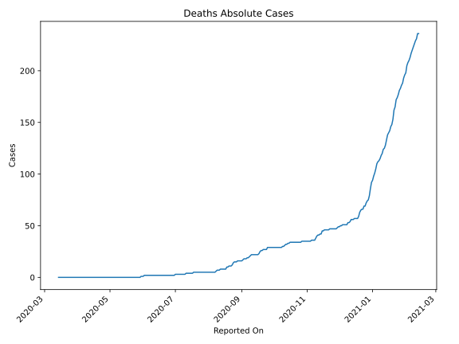
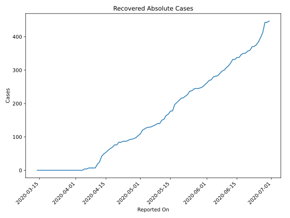
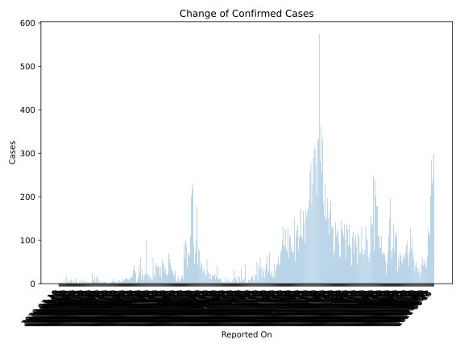
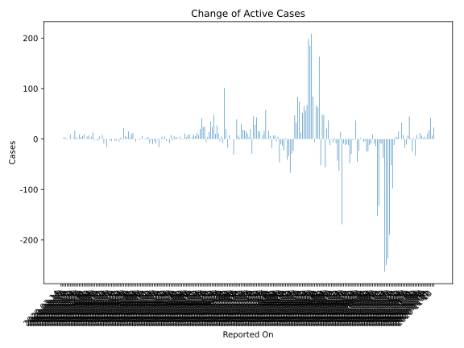
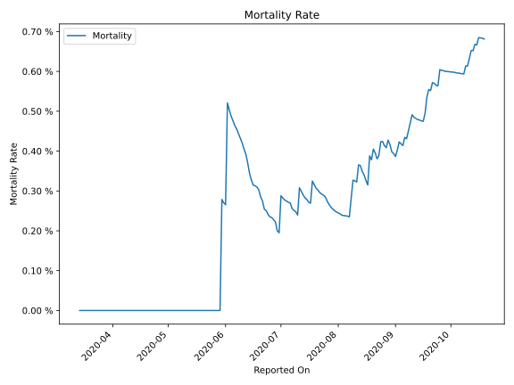

# Country Figures: Time Series for Rwanda 

| Reported On | Confirmed | Deaths | Recovered | Active | Mortality | &Delta; Confirmed | &Delta; Deaths | &Delta; Active | % Active of Population |
|-------------|-----------|--------|-----------|--------|-----------|-------------------|----------------|----------------|------------------------|
| 2020-03-21 | 17 | 0 | 0 | 17 |  None  | 0 | 0 | 0 |  0.000 %  | 
| 2020-03-20 | 17 | 0 | 0 | 17 |  None  | 9 | 0 | 9 |  0.000 %  | 
| 2020-03-19 | 8 | 0 | 0 | 8 |  None  | 0 | 0 | 0 |  0.000 %  | 
| 2020-03-18 | 8 | 0 | 0 | 8 |  None  | 1 | 0 | 1 |  0.000 %  | 
| 2020-03-17 | 7 | 0 | 0 | 7 |  None  | 2 | 0 | 2 |  0.000 %  | 
| 2020-03-16 | 5 | 0 | 0 | 5 |  None  | 4 | 0 | 4 |  0.000 %  | 
| 2020-03-15 | 1 | 0 | 0 | 1 |  None  | 0 | 0 | 0 |  0.000 %  | 
| 2020-03-14 | 1 | 0 | 0 | 1 |  None  | None | None | None |  0.000 %  | 

