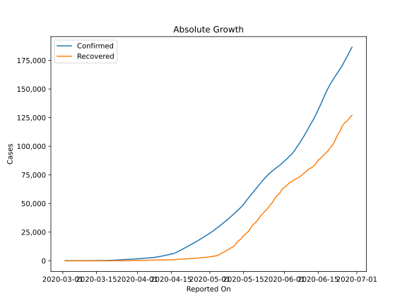
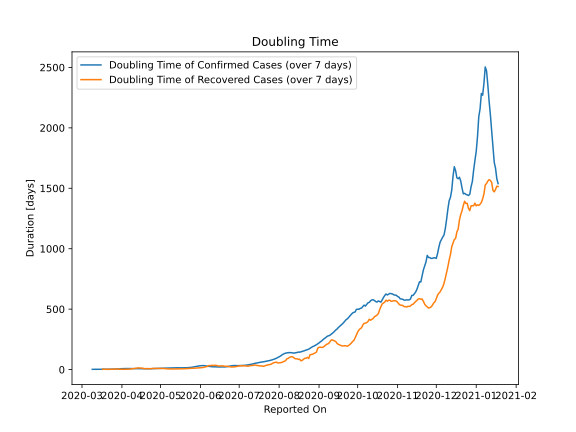

# Country Figures: Doubling Time of Infections for SaudiArabia 

The doubling time below are calculated based on
* an exponential growth assumption
* for time difference of past seven (7) days.
The doubling time's unit is "days".

The first doubling time indicates the increase of confirmed (infected)
cases. There, the *higher* the number is, the better is to take control
of the disease.

The second doubling time indicates the increase of recovered (healed)
cases. There, the *lower* the number is, the better it is to take
control of the disease.

| Reported On | Confirmed | Doubling Time (Confirmed) | Recovered | Doubling Time (Recovered) |
|-------------|-----------|---------------------------|-----------|---------------------------|
| 2020-04-10 | 3651 |  8.7 days  | 685 |  7.6 days  | 
| 2020-04-09 | 3287 |  9.1 days  | 666 |  7.2 days  | 
| 2020-04-08 | 2932 |  9.4 days  | 631 |  5.9 days  | 
| 2020-04-07 | 2795 |  8.7 days  | 615 |  4.0 days  | 
| 2020-04-06 | 2605 |  8.7 days  | 551 |  3.4 days  | 
| 2020-04-05 | 2402 |  8.2 days  | 488 |  2.8 days  | 
| 2020-04-04 | 2179 |  8.5 days  | 420 |  2.3 days  | 
| 2020-04-03 | 2039 |  8.3 days  | 351 |  2.4 days  | 
| 2020-04-02 | 1885 |  8.1 days  | 328 |  2.4 days  | 
| 2020-04-01 | 1720 |  7.8 days  | 264 |  2.5 days  | 
| 2020-03-31 | 1563 |  7.2 days  | 165 |  3.1 days  | 
| 2020-03-30 | 1453 |  5.4 days  | 115 |  3.0 days  | 
| 2020-03-29 | 1299 |  5.5 days  | 66 |  3.9 days  | 
| 2020-03-28 | 1203 |  4.7 days  | 37 |  6.1 days  | 
| 2020-03-27 | 1104 |  4.5 days  | 35 |  3.6 days  | 
| 2020-03-26 | 1012 |  4.1 days  | 33 |  3.2 days  | 
| 2020-03-25 | 900 |  3.3 days  | 29 |  3.4 days  | 
| 2020-03-24 | 767 |  3.6 days  | 28 |  3.5 days  | 
| 2020-03-23 | 562 |  3.4 days  | 19 |  2.5 days  | 
| 2020-03-22 | 511 |  3.4 days  | 17 |  2.0 days  | 
| 2020-03-21 | 392 |  4.0 days  | 16 |  2.1 days  | 
| 2020-03-20 | 344 |  3.8 days  | 8 |  2.7 days  | 
| 2020-03-19 | 274 |  3.0 days  | 6 |  3.0 days  | 
| 2020-03-18 | 171 |  2.6 days  | 6 |  3.0 days  | 
| 2020-03-17 | 171 |  2.6 days  | 6 |  3.0 days  | 
| 2020-03-16 | 118 |  2.7 days  | 2 |  None  | 
| 2020-03-15 | 103 |  2.5 days  | 1 |  None  | 
| 2020-03-14 | 103 |  1.9 days  | 1 |  None  | 
| 2020-03-13 | 86 |  2.0 days  | 1 |  None  | 
| 2020-03-12 | 45 |  2.5 days  | 1 |  None  | 
| 2020-03-11 | 21 |  1.9 days  | 1 |  None  | 
| 2020-03-10 | 20 |  1.9 days  | 1 |  None  | 
| 2020-03-09 | 15 |  2.1 days  | 0 |  None  | 
| 2020-03-08 | 11 |  None  | 0 |  None  | 
| 2020-03-07 | 5 |  None  | 0 |  None  | 
| 2020-03-06 | 5 |  None  | 0 |  None  | 
| 2020-03-05 | 5 |  None  | 0 |  None  | 
| 2020-03-04 | 1 |  None  | 0 |  None  | 
| 2020-03-03 | 1 |  None  | 0 |  None  | 
| 2020-03-02 | 1 |  None  | 0 |  None  | 

