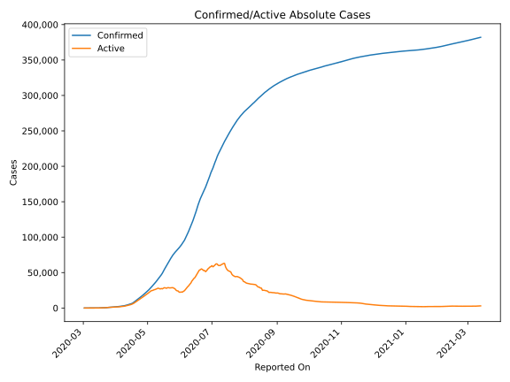
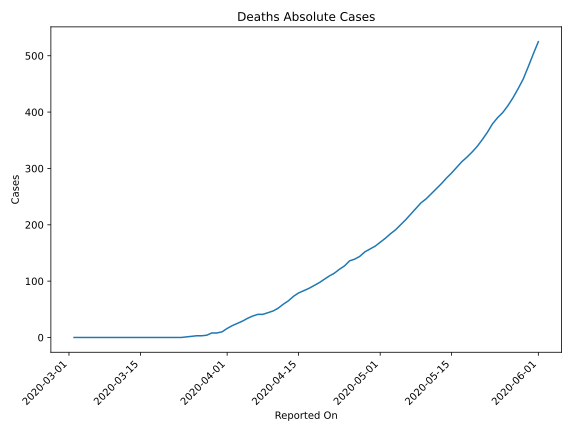
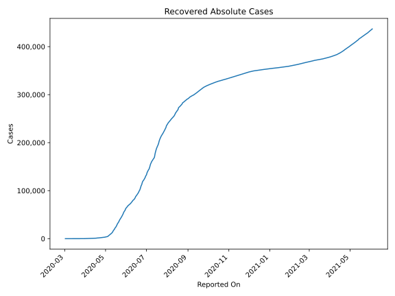
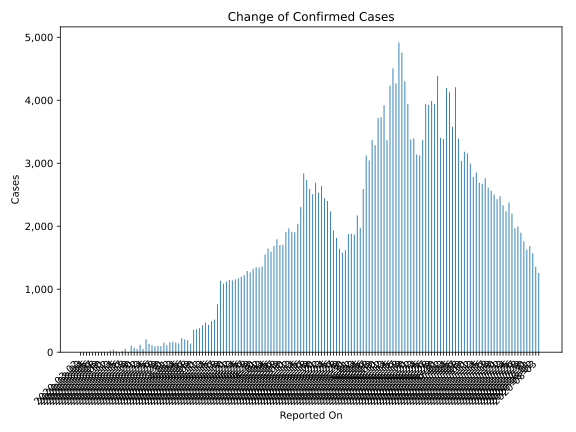
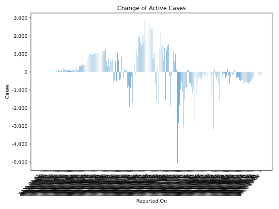
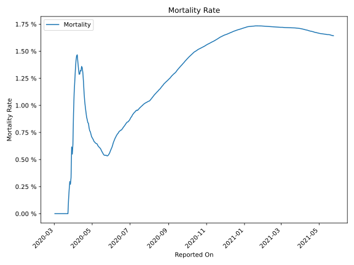

# Country Figures: Time Series for SaudiArabia 

| Reported On | Confirmed | Deaths | Recovered | Active | Mortality | &Delta; Confirmed | &Delta; Deaths | &Delta; Recovered | &Delta; Active | % Active of Population |
|-------------|-----------|--------|-----------|--------|-----------|-------------------|----------------|-------------------|----------------|------------------------|
| 2020-04-30 | 22753 | 162 | 3163 | 19428 |  0.71 %  | 1351 | 5 | 210 | 1136 |  0.058 %  | 
| 2020-04-29 | 21402 | 157 | 2953 | 18292 |  0.73 %  | 1325 | 5 | 169 | 1151 |  0.054 %  | 
| 2020-04-28 | 20077 | 152 | 2784 | 17141 |  0.76 %  | 1266 | 8 | 253 | 1005 |  0.051 %  | 
| 2020-04-27 | 18811 | 144 | 2531 | 16136 |  0.77 %  | 1289 | 5 | 174 | 1110 |  0.048 %  | 
| 2020-04-26 | 17522 | 139 | 2357 | 15026 |  0.79 %  | 1223 | 3 | 142 | 1078 |  0.045 %  | 
| 2020-04-25 | 16299 | 136 | 2215 | 13948 |  0.83 %  | 1197 | 9 | 166 | 1022 |  0.041 %  | 
| 2020-04-24 | 15102 | 127 | 2049 | 12926 |  0.84 %  | 1172 | 6 | 124 | 1042 |  0.038 %  | 
| 2020-04-23 | 13930 | 121 | 1925 | 11884 |  0.87 %  | 1158 | 7 | 113 | 1038 |  0.035 %  | 
| 2020-04-22 | 12772 | 114 | 1812 | 10846 |  0.89 %  | 1141 | 5 | 172 | 964 |  0.032 %  | 
| 2020-04-21 | 11631 | 109 | 1640 | 9882 |  0.94 %  | 1147 | 6 | 150 | 991 |  0.029 %  | 
| 2020-04-20 | 10484 | 103 | 1490 | 8891 |  0.98 %  | 1122 | 6 | 92 | 1024 |  0.026 %  | 
| 2020-04-19 | 9362 | 97 | 1398 | 7867 |  1.04 %  | 1088 | 5 | 69 | 1014 |  0.023 %  | 
| 2020-04-18 | 8274 | 92 | 1329 | 6853 |  1.11 %  | 1132 | 5 | 280 | 847 |  0.020 %  | 
| 2020-04-17 | 7142 | 87 | 1049 | 6006 |  1.22 %  | 762 | 4 | 59 | 699 |  0.018 %  | 
| 2020-04-16 | 6380 | 83 | 990 | 5307 |  1.30 %  | 518 | 4 | 59 | 455 |  0.016 %  | 
| 2020-04-15 | 5862 | 79 | 931 | 4852 |  1.35 %  | 493 | 6 | 42 | 445 |  0.014 %  | 
| 2020-04-14 | 5369 | 73 | 889 | 4407 |  1.36 %  | 435 | 8 | 84 | 343 |  0.013 %  | 
| 2020-04-13 | 4934 | 65 | 805 | 4064 |  1.32 %  | 472 | 6 | 44 | 422 |  0.012 %  | 
| 2020-04-12 | 4462 | 59 | 761 | 3642 |  1.32 %  | 429 | 7 | 41 | 381 |  0.011 %  | 
| 2020-04-11 | 4033 | 52 | 720 | 3261 |  1.29 %  | 382 | 5 | 35 | 342 |  0.010 %  | 
| 2020-04-10 | 3651 | 47 | 685 | 2919 |  1.29 %  | 364 | 3 | 19 | 342 |  0.009 %  | 
| 2020-04-09 | 3287 | 44 | 666 | 2577 |  1.34 %  | 355 | 3 | 35 | 317 |  0.008 %  | 
| 2020-04-08 | 2932 | 41 | 631 | 2260 |  1.40 %  | 137 | 0 | 16 | 121 |  0.007 %  | 
| 2020-04-07 | 2795 | 41 | 615 | 2139 |  1.47 %  | 190 | 3 | 64 | 123 |  0.006 %  | 
| 2020-04-06 | 2605 | 38 | 551 | 2016 |  1.46 %  | 203 | 4 | 63 | 136 |  0.006 %  | 
| 2020-04-05 | 2402 | 34 | 488 | 1880 |  1.42 %  | 223 | 5 | 68 | 150 |  0.006 %  | 
| 2020-04-04 | 2179 | 29 | 420 | 1730 |  1.33 %  | 140 | 4 | 69 | 67 |  0.005 %  | 
| 2020-04-03 | 2039 | 25 | 351 | 1663 |  1.23 %  | 154 | 4 | 23 | 127 |  0.005 %  | 
| 2020-04-02 | 1885 | 21 | 328 | 1536 |  1.11 %  | 165 | 5 | 64 | 96 |  0.005 %  | 
| 2020-04-01 | 1720 | 16 | 264 | 1440 |  0.93 %  | 157 | 6 | 99 | 52 |  0.004 %  | 
| 2020-03-31 | 1563 | 10 | 165 | 1388 |  0.64 %  | 110 | 2 | 50 | 58 |  0.004 %  | 
| 2020-03-30 | 1453 | 8 | 115 | 1330 |  0.55 %  | 154 | 0 | 49 | 105 |  0.004 %  | 
| 2020-03-29 | 1299 | 8 | 66 | 1225 |  0.62 %  | 96 | 4 | 29 | 63 |  0.004 %  | 
| 2020-03-28 | 1203 | 4 | 37 | 1162 |  0.33 %  | 99 | 1 | 2 | 96 |  0.003 %  | 
| 2020-03-27 | 1104 | 3 | 35 | 1066 |  0.27 %  | 92 | 0 | 2 | 90 |  0.003 %  | 
| 2020-03-26 | 1012 | 3 | 33 | 976 |  0.30 %  | 112 | 1 | 4 | 107 |  0.003 %  | 
| 2020-03-25 | 900 | 2 | 29 | 869 |  0.22 %  | 133 | 1 | 1 | 131 |  0.003 %  | 
| 2020-03-24 | 767 | 1 | 28 | 738 |  0.13 %  | 205 | 1 | 9 | 195 |  0.002 %  | 
| 2020-03-23 | 562 | 0 | 19 | 543 |  None  | 51 | 0 | 2 | 49 |  0.002 %  | 
| 2020-03-22 | 511 | 0 | 17 | 494 |  None  | 119 | 0 | 1 | 118 |  0.001 %  | 
| 2020-03-21 | 392 | 0 | 16 | 376 |  None  | 48 | 0 | 8 | 40 |  0.001 %  | 
| 2020-03-20 | 344 | 0 | 8 | 336 |  None  | 70 | 0 | 2 | 68 |  0.001 %  | 
| 2020-03-19 | 274 | 0 | 6 | 268 |  None  | 103 | 0 | 0 | 103 |  0.001 %  | 
| 2020-03-18 | 171 | 0 | 6 | 165 |  None  | 0 | 0 | 0 | 0 |  0.000 %  | 
| 2020-03-17 | 171 | 0 | 6 | 165 |  None  | 53 | 0 | 4 | 49 |  0.000 %  | 
| 2020-03-16 | 118 | 0 | 2 | 116 |  None  | 15 | 0 | 1 | 14 |  0.000 %  | 
| 2020-03-15 | 103 | 0 | 1 | 102 |  None  | 0 | 0 | 0 | 0 |  0.000 %  | 
| 2020-03-14 | 103 | 0 | 1 | 102 |  None  | 17 | 0 | 0 | 17 |  0.000 %  | 
| 2020-03-13 | 86 | 0 | 1 | 85 |  None  | 41 | 0 | 0 | 41 |  0.000 %  | 
| 2020-03-12 | 45 | 0 | 1 | 44 |  None  | 24 | 0 | 0 | 24 |  0.000 %  | 
| 2020-03-11 | 21 | 0 | 1 | 20 |  None  | 1 | 0 | 0 | 1 |  0.000 %  | 
| 2020-03-10 | 20 | 0 | 1 | 19 |  None  | 5 | 0 | 1 | 4 |  0.000 %  | 
| 2020-03-09 | 15 | 0 | 0 | 15 |  None  | 4 | 0 | 0 | 4 |  0.000 %  | 
| 2020-03-08 | 11 | 0 | 0 | 11 |  None  | 6 | 0 | 0 | 6 |  0.000 %  | 
| 2020-03-07 | 5 | 0 | 0 | 5 |  None  | 0 | 0 | 0 | 0 |  0.000 %  | 
| 2020-03-06 | 5 | 0 | 0 | 5 |  None  | 0 | 0 | 0 | 0 |  0.000 %  | 
| 2020-03-05 | 5 | 0 | 0 | 5 |  None  | 4 | 0 | 0 | 4 |  0.000 %  | 
| 2020-03-04 | 1 | 0 | 0 | 1 |  None  | 0 | 0 | 0 | 0 |  0.000 %  | 
| 2020-03-03 | 1 | 0 | 0 | 1 |  None  | 0 | 0 | 0 | 0 |  0.000 %  | 
| 2020-03-02 | 1 | 0 | 0 | 1 |  None  | None | None | None | None |  0.000 %  | 

