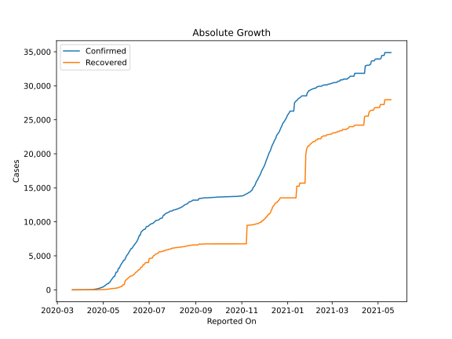
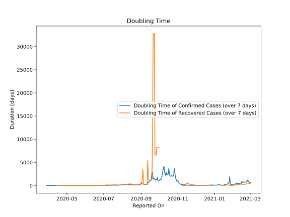

# Country Figures: Doubling Time of Infections for Sudan 

The doubling time below are calculated based on
* an exponential growth assumption
* for time difference of past seven (7) days.
The doubling time's unit is "days".

The first doubling time indicates the increase of confirmed (infected)
cases. There, the *higher* the number is, the better is to take control
of the disease.

The second doubling time indicates the increase of recovered (healed)
cases. There, the *lower* the number is, the better it is to take
control of the disease.

| Reported On | Confirmed | Doubling Time (Confirmed) | Recovered | Doubling Time (Recovered) |
|-------------|-----------|---------------------------|-----------|---------------------------|
| 2020-05-05 | 778 |  5.8 days  | 70 |  6.3 days  | 
| 2020-05-04 | 678 |  5.7 days  | 61 |  4.9 days  | 
| 2020-05-03 | 592 |  5.6 days  | 52 |  5.4 days  | 
| 2020-05-02 | 592 |  5.1 days  | 52 |  5.2 days  | 
| 2020-05-01 | 533 |  4.7 days  | 46 |  4.4 days  | 
| 2020-04-30 | 442 |  5.5 days  | 39 |  5.1 days  | 
| 2020-04-29 | 375 |  5.3 days  | 32 |  5.3 days  | 
| 2020-04-28 | 318 |  4.8 days  | 31 |  3.9 days  | 
| 2020-04-27 | 275 |  5.5 days  | 21 |  5.4 days  | 
| 2020-04-26 | 237 |  4.1 days  | 20 |  4.4 days  | 
| 2020-04-25 | 213 |  4.5 days  | 19 |  4.5 days  | 
| 2020-04-24 | 174 |  3.3 days  | 14 |  4.2 days  | 
| 2020-04-23 | 174 |  3.2 days  | 14 |  4.2 days  | 
| 2020-04-22 | 140 |  3.6 days  | 12 |  4.8 days  | 
| 2020-04-21 | 107 |  4.4 days  | 8 |  7.3 days  | 
| 2020-04-20 | 107 |  4.1 days  | 8 |  7.3 days  | 
| 2020-04-19 | 66 |  4.2 days  | 6 |  4.8 days  | 
| 2020-04-18 | 66 |  4.2 days  | 6 |  4.8 days  | 
| 2020-04-17 | 33 |  7.7 days  | 4 |  7.3 days  | 
| 2020-04-16 | 32 |  6.7 days  | 4 |  7.3 days  | 
| 2020-04-15 | 32 |  6.2 days  | 4 |  7.3 days  | 
| 2020-04-14 | 32 |  6.2 days  | 4 |  7.3 days  | 
| 2020-04-13 | 29 |  5.8 days  | 4 |  7.3 days  | 
| 2020-04-12 | 19 |  10.9 days  | 2 |  None  | 
| 2020-04-11 | 19 |  7.9 days  | 2 |  None  | 
| 2020-04-10 | 17 |  9.5 days  | 2 |  None  | 
| 2020-04-09 | 15 |  8.1 days  | 2 |  None  | 
| 2020-04-08 | 14 |  7.3 days  | 2 |  None  | 
| 2020-04-07 | 14 |  7.3 days  | 2 |  7.3 days  | 
| 2020-04-06 | 12 |  7.3 days  | 2 |  None  | 
| 2020-04-05 | 12 |  7.3 days  | 2 |  None  | 
| 2020-04-04 | 10 |  7.3 days  | 2 |  None  | 
| 2020-04-03 | 10 |  4.4 days  | 2 |  None  | 
| 2020-04-02 | 8 |  5.3 days  | 2 |  None  | 
| 2020-04-01 | 7 |  6.1 days  | 2 |  None  | 
| 2020-03-31 | 7 |  6.1 days  | 1 |  None  | 
| 2020-03-30 | 6 |  4.8 days  | 0 |  None  | 
| 2020-03-29 | 6 |  4.8 days  | 0 |  None  | 
| 2020-03-28 | 5 |  5.6 days  | 0 |  None  | 
| 2020-03-27 | 3 |  12.3 days  | 0 |  None  | 
| 2020-03-26 | 3 |  12.3 days  | 0 |  None  | 
| 2020-03-25 | 3 |  12.3 days  | 0 |  None  | 
| 2020-03-24 | 3 |  None  | 0 |  None  | 
| 2020-03-23 | 2 |  None  | 0 |  None  | 
| 2020-03-22 | 2 |  None  | 0 |  None  | 
| 2020-03-21 | 2 |  None  | 0 |  None  | 
| 2020-03-20 | 2 |  None  | 0 |  None  | 
| 2020-03-19 | 2 |  None  | 0 |  None  | 
| 2020-03-18 | 2 |  None  | 0 |  None  | 

