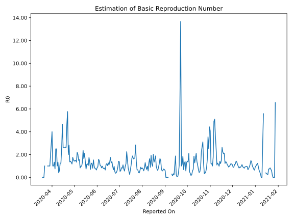

# Country Figures: Time Series for Basic Reproduction Number of Sudan 

| Reported On | &Delta; Confirmed | Total &Delta; Confirmed First Interval | Total &Delta; Confirmed Second Interval | Estimated Basic Reproduction Number R0 | 
|-------------|-------------------|----------------------------------------|-----------------------------------------|---------------------------------------------------|
| 2020-05-06 | 74 |  245  |  258  |  0.95  | 
| 2020-05-05 | 100 |  236  |  205  |  1.15  | 
| 2020-05-04 | 86 |  217  |  162  |  1.34  | 
| 2020-05-03 | 0 |  274  |  144  |  1.90  | 
| 2020-05-02 | 59 |  258  |  101  |  2.55  | 
| 2020-05-01 | 91 |  205  |  97  |  2.11  | 
| 2020-04-30 | 67 |  162  |  106  |  1.53  | 
| 2020-04-29 | 57 |  144  |  67  |  2.15  | 
| 2020-04-28 | 43 |  101  |  108  |  0.94  | 
| 2020-04-27 | 38 |  97  |  74  |  1.31  | 
| 2020-04-26 | 24 |  106  |  74  |  1.43  | 
| 2020-04-25 | 39 |  67  |  75  |  0.89  | 
| 2020-04-24 | 0 |  108  |  34  |  3.18  | 
| 2020-04-23 | 34 |  74  |  34  |  2.18  | 
| 2020-04-22 | 33 |  74  |  4  |  18.50  | 
| 2020-04-21 | 0 |  75  |  13  |  5.77  | 
| 2020-04-20 | 41 |  34  |  13  |  2.62  | 
| 2020-04-19 | 0 |  34  |  15  |  2.27  | 
| 2020-04-18 | 33 |  4  |  14  |  0.29  | 
| 2020-04-17 | 1 |  13  |  5  |  2.60  | 
| 2020-04-16 | 0 |  13  |  5  |  2.60  | 
| 2020-04-15 | 0 |  15  |  5  |  3.00  | 
| 2020-04-14 | 3 |  14  |  3  |  4.67  | 
| 2020-04-13 | 10 |  5  |  4  |  1.25  | 
| 2020-04-12 | 0 |  5  |  4  |  1.25  | 
| 2020-04-11 | 2 |  5  |  4  |  1.25  | 
| 2020-04-10 | 2 |  3  |  5  |  0.60  | 
| 2020-04-09 | 1 |  4  |  3  |  1.33  | 
| 2020-04-08 | 0 |  4  |  4  |  1.00  | 
| 2020-04-07 | 2 |  4  |  2  |  2.00  | 
| 2020-04-06 | 0 |  5  |  2  |  2.50  | 
| 2020-04-05 | 2 |  3  |  4  |  0.75  | 
| 2020-04-04 | 0 |  4  |  3  |  1.33  | 
| 2020-04-03 | 2 |  2  |  3  |  0.67  | 
| 2020-04-02 | 1 |  2  |  2  |  1.00  | 
| 2020-04-01 | 0 |  4  |  1  |  4.00  | 
| 2020-03-31 | 1 |  3  |  1  |  3.00  | 
| 2020-03-30 | 0 |  3  |  1  |  3.00  | 
| 2020-03-29 | 1 |  2  |  1  |  2.00  | 
| 2020-03-28 | 2 |  1  |  None  |  None  | 
| 2020-03-27 | 0 |  1  |  None  |  None  | 
| 2020-03-26 | 0 |  1  |  1  |  1.00  | 
| 2020-03-25 | 0 |  1  |  1  |  1.00  | 
| 2020-03-24 | 1 |  None  |  1  |  None  | 
| 2020-03-23 | 0 |  None  |  1  |  None  | 
| 2020-03-22 | 0 |  1  |  None  |  None  | 
| 2020-03-21 | 0 |  1  |  None  |  None  | 
| 2020-03-20 | 0 |  1  |  None  |  None  | 
| 2020-03-19 | 0 |  1  |  None  |  None  | 
| 2020-03-18 | 1 |  None  |  None  |  None  | 
| 2020-03-17 | 0 |  None  |  None  |  None  | 
| 2020-03-16 | 0 |  None  |  None  |  None  | 
| 2020-03-15 | 0 |  None  |  None  |  None  | 
| 2020-03-14 | 0 |  None  |  None  |  None  | 
| 2020-03-13 | None |  None  |  None  |  None  | 

