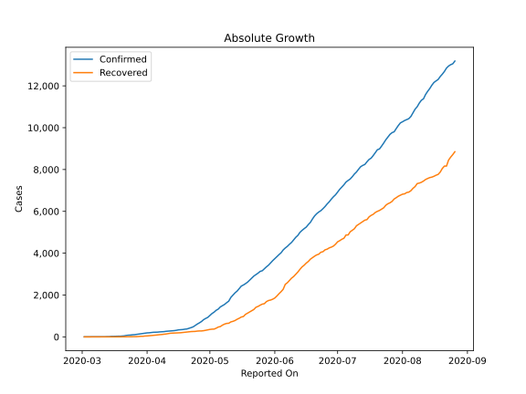
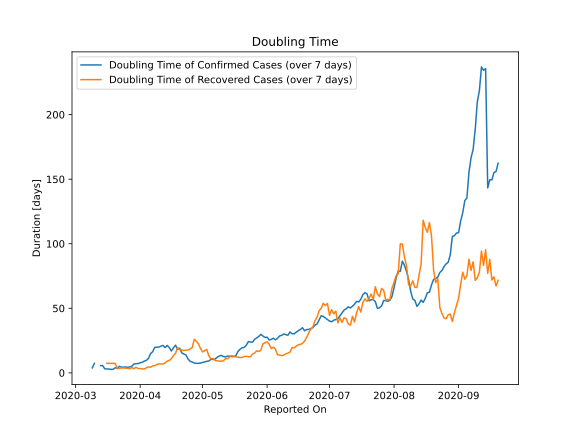

# Country Figures: Doubling Time of Infections for Senegal 

The doubling time below are calculated based on
* an exponential growth assumption
* for time difference of past seven (7) days.
The doubling time's unit is "days".

The first doubling time indicates the increase of confirmed (infected)
cases. There, the *higher* the number is, the better is to take control
of the disease.

The second doubling time indicates the increase of recovered (healed)
cases. There, the *lower* the number is, the better it is to take
control of the disease.

| Reported On | Confirmed | Doubling Time (Confirmed) | Recovered | Doubling Time (Recovered) |
|-------------|-----------|---------------------------|-----------|---------------------------|
| 2020-04-18 | 350 |  21.4 days  | 211 |  15.1 days  | 
| 2020-04-17 | 342 |  19.4 days  | 198 |  13.5 days  | 
| 2020-04-16 | 335 |  16.9 days  | 194 |  11.0 days  | 
| 2020-04-15 | 314 |  19.6 days  | 190 |  9.7 days  | 
| 2020-04-14 | 299 |  21.2 days  | 183 |  9.1 days  | 
| 2020-04-13 | 291 |  19.5 days  | 178 |  7.7 days  | 
| 2020-04-12 | 280 |  21.2 days  | 171 |  6.9 days  | 
| 2020-04-11 | 278 |  20.7 days  | 152 |  6.8 days  | 
| 2020-04-10 | 265 |  20.0 days  | 137 |  7.0 days  | 
| 2020-04-09 | 250 |  19.9 days  | 123 |  6.4 days  | 
| 2020-04-08 | 244 |  19.7 days  | 113 |  5.6 days  | 
| 2020-04-07 | 237 |  16.3 days  | 105 |  5.4 days  | 
| 2020-04-06 | 226 |  14.9 days  | 92 |  4.3 days  | 
| 2020-04-05 | 222 |  11.2 days  | 82 |  4.7 days  | 
| 2020-04-04 | 219 |  9.6 days  | 72 |  3.8 days  | 
| 2020-04-03 | 207 |  9.1 days  | 66 |  3.0 days  | 
| 2020-04-02 | 195 |  8.2 days  | 55 |  3.0 days  | 
| 2020-04-01 | 190 |  7.8 days  | 45 |  3.3 days  | 
| 2020-03-31 | 175 |  7.2 days  | 40 |  3.3 days  | 
| 2020-03-30 | 162 |  7.1 days  | 27 |  4.3 days  | 
| 2020-03-29 | 142 |  6.8 days  | 27 |  3.2 days  | 
| 2020-03-28 | 130 |  5.1 days  | 18 |  4.1 days  | 
| 2020-03-27 | 119 |  4.6 days  | 11 |  3.2 days  | 
| 2020-03-26 | 105 |  4.3 days  | 9 |  3.6 days  | 
| 2020-03-25 | 99 |  4.5 days  | 9 |  3.6 days  | 
| 2020-03-24 | 86 |  4.4 days  | 8 |  3.8 days  | 
| 2020-03-23 | 79 |  4.4 days  | 8 |  3.8 days  | 
| 2020-03-22 | 67 |  5.1 days  | 5 |  3.3 days  | 
| 2020-03-21 | 47 |  3.5 days  | 5 |  3.3 days  | 
| 2020-03-20 | 38 |  4.0 days  | 2 |  7.3 days  | 
| 2020-03-19 | 31 |  2.7 days  | 2 |  7.3 days  | 
| 2020-03-18 | 31 |  2.7 days  | 2 |  7.3 days  | 
| 2020-03-17 | 26 |  2.9 days  | 2 |  7.3 days  | 
| 2020-03-16 | 24 |  3.0 days  | 2 |  7.3 days  | 
| 2020-03-15 | 24 |  3.0 days  | 1 |  None  | 
| 2020-03-14 | 10 |  5.6 days  | 1 |  None  | 
| 2020-03-13 | 10 |  5.6 days  | 1 |  None  | 
| 2020-03-12 | 4 |  None  | 1 |  None  | 
| 2020-03-11 | 4 |  None  | 1 |  None  | 
| 2020-03-10 | 4 |  7.3 days  | 1 |  None  | 
| 2020-03-09 | 4 |  3.8 days  | 1 |  None  | 
| 2020-03-08 | 4 |  None  | 1 |  None  | 
| 2020-03-07 | 4 |  None  | 0 |  None  | 
| 2020-03-06 | 4 |  None  | 0 |  None  | 
| 2020-03-05 | 4 |  None  | 0 |  None  | 
| 2020-03-04 | 4 |  None  | 0 |  None  | 
| 2020-03-03 | 2 |  None  | 0 |  None  | 
| 2020-03-02 | 1 |  None  | 0 |  None  | 

