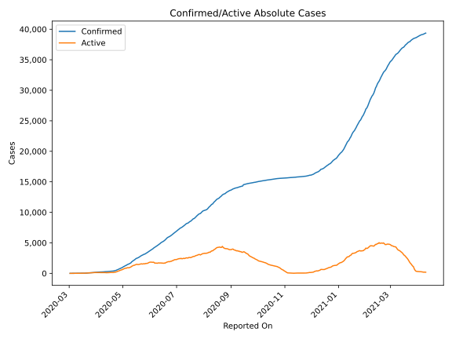
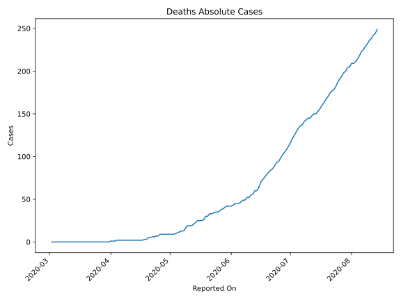
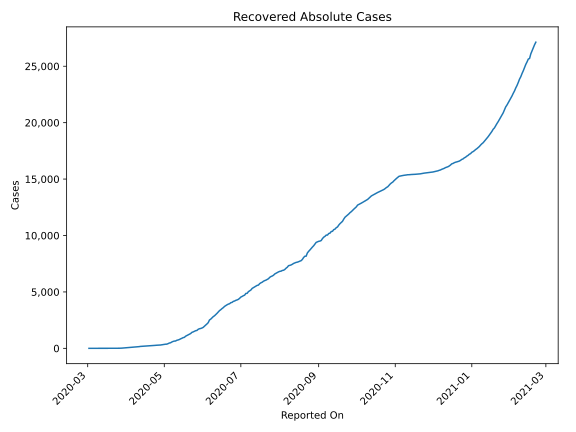
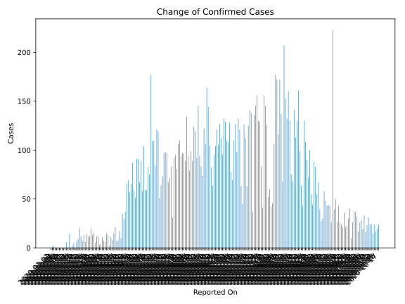
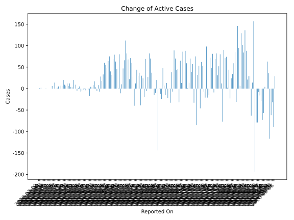
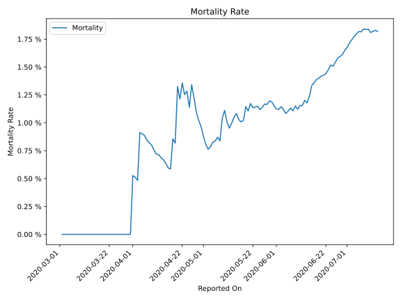

# Country Figures: Time Series for Senegal 

| Reported On | Confirmed | Deaths | Recovered | Active | Mortality | &Delta; Confirmed | &Delta; Deaths | &Delta; Active | % Active of Population |
|-------------|-----------|--------|-----------|--------|-----------|-------------------|----------------|----------------|------------------------|
| 2020-04-05 | 222 | 2 | 82 | 138 |  0.90 %  | 3 | 0 | -7 |  0.001 %  | 
| 2020-04-04 | 219 | 2 | 72 | 145 |  0.91 %  | 12 | 1 | 5 |  0.001 %  | 
| 2020-04-03 | 207 | 1 | 66 | 140 |  0.48 %  | 12 | 0 | 1 |  0.001 %  | 
| 2020-04-02 | 195 | 1 | 55 | 139 |  0.51 %  | 5 | 0 | -5 |  0.001 %  | 
| 2020-04-01 | 190 | 1 | 45 | 144 |  0.53 %  | 15 | 1 | 9 |  0.001 %  | 
| 2020-03-31 | 175 | 0 | 40 | 135 |  None  | 13 | 0 | 0 |  0.001 %  | 
| 2020-03-30 | 162 | 0 | 27 | 135 |  None  | 20 | 0 | 20 |  0.001 %  | 
| 2020-03-29 | 142 | 0 | 27 | 115 |  None  | 12 | 0 | 3 |  0.001 %  | 
| 2020-03-28 | 130 | 0 | 18 | 112 |  None  | 11 | 0 | 4 |  0.001 %  | 
| 2020-03-27 | 119 | 0 | 11 | 108 |  None  | 14 | 0 | 12 |  0.001 %  | 
| 2020-03-26 | 105 | 0 | 9 | 96 |  None  | 6 | 0 | 6 |  0.001 %  | 
| 2020-03-25 | 99 | 0 | 9 | 90 |  None  | 13 | 0 | 12 |  0.001 %  | 
| 2020-03-24 | 86 | 0 | 8 | 78 |  None  | 7 | 0 | 7 |  0.000 %  | 
| 2020-03-23 | 79 | 0 | 8 | 71 |  None  | 12 | 0 | 9 |  0.000 %  | 
| 2020-03-22 | 67 | 0 | 5 | 62 |  None  | 20 | 0 | 20 |  0.000 %  | 
| 2020-03-21 | 47 | 0 | 5 | 42 |  None  | 9 | 0 | 6 |  0.000 %  | 
| 2020-03-20 | 38 | 0 | 2 | 36 |  None  | 7 | 0 | 7 |  0.000 %  | 
| 2020-03-19 | 31 | 0 | 2 | 29 |  None  | 0 | 0 | 0 |  0.000 %  | 
| 2020-03-18 | 31 | 0 | 2 | 29 |  None  | 5 | 0 | 5 |  0.000 %  | 
| 2020-03-17 | 26 | 0 | 2 | 24 |  None  | 2 | 0 | 2 |  0.000 %  | 
| 2020-03-16 | 24 | 0 | 2 | 22 |  None  | 0 | 0 | -1 |  0.000 %  | 
| 2020-03-15 | 24 | 0 | 1 | 23 |  None  | 14 | 0 | 14 |  0.000 %  | 
| 2020-03-14 | 10 | 0 | 1 | 9 |  None  | 0 | 0 | 0 |  0.000 %  | 
| 2020-03-13 | 10 | 0 | 1 | 9 |  None  | 6 | 0 | 6 |  0.000 %  | 
| 2020-03-12 | 4 | 0 | 1 | 3 |  None  | 0 | 0 | 0 |  0.000 %  | 
| 2020-03-11 | 4 | 0 | 1 | 3 |  None  | 0 | 0 | 0 |  0.000 %  | 
| 2020-03-10 | 4 | 0 | 1 | 3 |  None  | 0 | 0 | 0 |  0.000 %  | 
| 2020-03-09 | 4 | 0 | 1 | 3 |  None  | 0 | 0 | 0 |  0.000 %  | 
| 2020-03-08 | 4 | 0 | 1 | 3 |  None  | 0 | 0 | -1 |  0.000 %  | 
| 2020-03-07 | 4 | 0 | 0 | 4 |  None  | 0 | 0 | 0 |  0.000 %  | 
| 2020-03-06 | 4 | 0 | 0 | 4 |  None  | 0 | 0 | 0 |  0.000 %  | 
| 2020-03-05 | 4 | 0 | 0 | 4 |  None  | 0 | 0 | 0 |  0.000 %  | 
| 2020-03-04 | 4 | 0 | 0 | 4 |  None  | 2 | 0 | 2 |  0.000 %  | 
| 2020-03-03 | 2 | 0 | 0 | 2 |  None  | 1 | 0 | 1 |  0.000 %  | 
| 2020-03-02 | 1 | 0 | 0 | 1 |  None  | None | None | None |  0.000 %  | 

