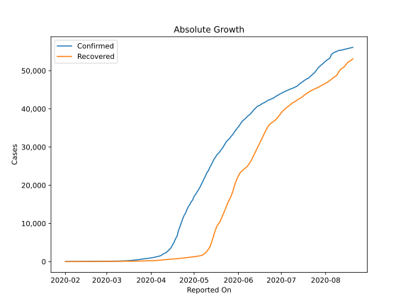
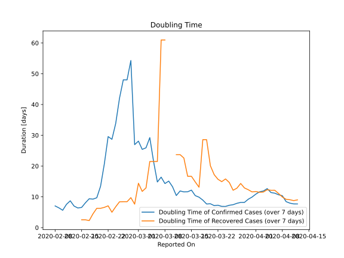

# Country Figures: Doubling Time of Infections for Singapore 

The doubling time below are calculated based on
* an exponential growth assumption
* for time difference of past seven (7) days.
The doubling time's unit is "days".

The first doubling time indicates the increase of confirmed (infected)
cases. There, the *higher* the number is, the better is to take control
of the disease.

The second doubling time indicates the increase of recovered (healed)
cases. There, the *lower* the number is, the better it is to take
control of the disease.

| Reported On | Confirmed | Doubling Time (Confirmed) | Recovered | Doubling Time (Recovered) |
|-------------|-----------|---------------------------|-----------|---------------------------|
| 2020-05-09 | 22460 |  20.0 days  | 2296 |  9.4 days  | 
| 2020-05-08 | 21707 |  20.7 days  | 2040 |  10.5 days  | 
| 2020-05-07 | 20939 |  19.1 days  | 1712 |  15.5 days  | 
| 2020-05-06 | 20198 |  19.3 days  | 1634 |  15.6 days  | 
| 2020-05-05 | 19410 |  18.9 days  | 1519 |  16.6 days  | 
| 2020-05-04 | 18778 |  18.7 days  | 1457 |  17.3 days  | 
| 2020-05-03 | 18205 |  17.1 days  | 1408 |  17.4 days  | 
| 2020-05-02 | 17548 |  15.3 days  | 1347 |  16.7 days  | 
| 2020-05-01 | 17101 |  14.3 days  | 1268 |  17.5 days  | 
| 2020-04-30 | 16169 |  13.5 days  | 1244 |  16.7 days  | 
| 2020-04-29 | 15641 |  11.5 days  | 1188 |  17.5 days  | 
| 2020-04-28 | 14951 |  10.2 days  | 1128 |  16.7 days  | 
| 2020-04-27 | 14423 |  8.6 days  | 1095 |  15.9 days  | 
| 2020-04-26 | 13624 |  7.0 days  | 1060 |  15.4 days  | 
| 2020-04-25 | 12693 |  6.8 days  | 1002 |  16.4 days  | 
| 2020-04-24 | 12075 |  5.9 days  | 956 |  16.5 days  | 
| 2020-04-23 | 11178 |  5.6 days  | 924 |  16.4 days  | 
| 2020-04-22 | 10141 |  5.1 days  | 896 |  15.6 days  | 
| 2020-04-21 | 9125 |  5.0 days  | 839 |  15.6 days  | 
| 2020-04-20 | 8014 |  5.1 days  | 801 |  15.9 days  | 
| 2020-04-19 | 6588 |  5.4 days  | 768 |  15.7 days  | 
| 2020-04-18 | 5992 |  5.4 days  | 740 |  14.7 days  | 
| 2020-04-17 | 5050 |  5.9 days  | 708 |  13.7 days  | 
| 2020-04-16 | 4427 |  6.1 days  | 683 |  12.6 days  | 
| 2020-04-15 | 3699 |  6.2 days  | 652 |  10.6 days  | 
| 2020-04-14 | 3252 |  6.5 days  | 611 |  10.4 days  | 
| 2020-04-13 | 2918 |  6.8 days  | 586 |  9.5 days  | 
| 2020-04-12 | 2532 |  7.7 days  | 560 |  9.0 days  | 
| 2020-04-11 | 2299 |  7.7 days  | 528 |  8.8 days  | 
| 2020-04-10 | 2108 |  7.9 days  | 492 |  9.1 days  | 
| 2020-04-09 | 1910 |  8.4 days  | 460 |  9.2 days  | 
| 2020-04-08 | 1623 |  10.4 days  | 406 |  9.9 days  | 
| 2020-04-07 | 1481 |  10.7 days  | 377 |  11.1 days  | 
| 2020-04-06 | 1375 |  11.2 days  | 344 |  12.1 days  | 
| 2020-04-05 | 1309 |  11.4 days  | 320 |  12.1 days  | 
| 2020-04-04 | 1189 |  12.7 days  | 297 |  12.3 days  | 
| 2020-04-03 | 1114 |  11.9 days  | 282 |  11.6 days  | 
| 2020-04-02 | 1049 |  11.7 days  | 266 |  11.5 days  | 
| 2020-04-01 | 1000 |  10.9 days  | 245 |  11.7 days  | 
| 2020-03-31 | 926 |  9.9 days  | 240 |  11.6 days  | 
| 2020-03-30 | 879 |  9.2 days  | 228 |  12.3 days  | 
| 2020-03-29 | 844 |  8.2 days  | 212 |  12.9 days  | 
| 2020-03-28 | 802 |  8.2 days  | 198 |  14.3 days  | 
| 2020-03-27 | 732 |  7.9 days  | 183 |  12.8 days  | 
| 2020-03-26 | 683 |  7.4 days  | 172 |  12.1 days  | 
| 2020-03-25 | 631 |  7.3 days  | 160 |  14.7 days  | 
| 2020-03-24 | 558 |  6.9 days  | 156 |  15.8 days  | 
| 2020-03-23 | 509 |  6.9 days  | 152 |  14.9 days  | 
| 2020-03-22 | 455 |  7.3 days  | 144 |  15.7 days  | 
| 2020-03-21 | 432 |  7.2 days  | 140 |  17.2 days  | 
| 2020-03-20 | 385 |  7.7 days  | 124 |  20.1 days  | 
| 2020-03-19 | 345 |  7.7 days  | 114 |  28.6 days  | 
| 2020-03-18 | 313 |  8.9 days  | 114 |  28.6 days  | 
| 2020-03-17 | 266 |  9.9 days  | 114 |  13.1 days  | 
| 2020-03-16 | 243 |  10.4 days  | 109 |  14.8 days  | 
| 2020-03-15 | 226 |  12.2 days  | 105 |  16.7 days  | 
| 2020-03-14 | 212 |  11.6 days  | 105 |  16.7 days  | 
| 2020-03-13 | 200 |  11.6 days  | 97 |  22.6 days  | 
| 2020-03-12 | 178 |  11.9 days  | 96 |  23.7 days  | 
| 2020-03-11 | 178 |  10.4 days  | 96 |  23.7 days  | 
| 2020-03-10 | 160 |  13.3 days  | 78 |  None  | 
| 2020-03-09 | 150 |  15.1 days  | 78 |  None  | 
| 2020-03-08 | 150 |  14.3 days  | 78 |  61.0 days  | 
| 2020-03-07 | 138 |  16.4 days  | 78 |  61.0 days  | 
| 2020-03-06 | 130 |  14.8 days  | 78 |  21.5 days  | 
| 2020-03-05 | 117 |  21.5 days  | 78 |  21.5 days  | 
| 2020-03-04 | 110 |  29.2 days  | 78 |  21.5 days  | 
| 2020-03-03 | 110 |  25.9 days  | 78 |  12.9 days  | 
| 2020-03-02 | 108 |  25.4 days  | 78 |  11.8 days  | 
| 2020-03-01 | 106 |  28.1 days  | 72 |  14.4 days  | 
| 2020-02-29 | 102 |  27.0 days  | 72 |  7.6 days  | 
| 2020-02-28 | 93 |  54.3 days  | 62 |  9.7 days  | 
| 2020-02-27 | 93 |  48.0 days  | 62 |  8.4 days  | 
| 2020-02-26 | 93 |  48.0 days  | 62 |  8.4 days  | 
| 2020-02-25 | 91 |  42.0 days  | 53 |  8.4 days  | 
| 2020-02-24 | 89 |  33.8 days  | 51 |  6.8 days  | 
| 2020-02-23 | 89 |  28.7 days  | 51 |  5.0 days  | 
| 2020-02-22 | 85 |  29.6 days  | 37 |  7.1 days  | 
| 2020-02-21 | 85 |  20.7 days  | 37 |  6.6 days  | 
| 2020-02-20 | 84 |  13.4 days  | 34 |  6.3 days  | 
| 2020-02-19 | 84 |  9.7 days  | 34 |  6.3 days  | 
| 2020-02-18 | 81 |  9.3 days  | 29 |  4.5 days  | 
| 2020-02-17 | 77 |  9.4 days  | 24 |  2.3 days  | 
| 2020-02-16 | 75 |  8.1 days  | 18 |  2.5 days  | 
| 2020-02-15 | 72 |  6.6 days  | 18 |  2.5 days  | 
| 2020-02-14 | 67 |  6.4 days  | 17 |  None  | 
| 2020-02-13 | 58 |  7.0 days  | 15 |  None  | 
| 2020-02-12 | 50 |  8.7 days  | 15 |  None  | 
| 2020-02-11 | 47 |  7.6 days  | 9 |  None  | 
| 2020-02-10 | 45 |  5.6 days  | 2 |  None  | 
| 2020-02-09 | 40 |  6.4 days  | 2 |  None  | 
| 2020-02-08 | 33 |  7.0 days  | 2 |  None  | 
| 2020-02-07 | 30 |  None  | 0 |  None  | 
| 2020-02-06 | 28 |  None  | 0 |  None  | 
| 2020-02-05 | 28 |  None  | 0 |  None  | 
| 2020-02-04 | 24 |  None  | 0 |  None  | 
| 2020-02-03 | 18 |  None  | 0 |  None  | 
| 2020-02-02 | 18 |  None  | 0 |  None  | 
| 2020-02-01 | 16 |  None  | 0 |  None  | 

