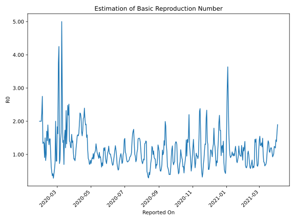

# Country Figures: Time Series for Basic Reproduction Number of Singapore 

| Reported On | &Delta; Confirmed | Total &Delta; Confirmed First Interval | Total &Delta; Confirmed Second Interval | Estimated Basic Reproduction Number R0 | 
|-------------|-------------------|----------------------------------------|-----------------------------------------|---------------------------------------------------|
| 2020-04-28 | 528 |  3245  |  4590  |  0.71  | 
| 2020-04-27 | 799 |  3483  |  4149  |  0.84  | 
| 2020-04-26 | 931 |  3568  |  4075  |  0.88  | 
| 2020-04-25 | 618 |  4061  |  3587  |  1.13  | 
| 2020-04-24 | 897 |  4590  |  2889  |  1.59  | 
| 2020-04-23 | 1037 |  4149  |  2740  |  1.51  | 
| 2020-04-22 | 1016 |  4075  |  2132  |  1.91  | 
| 2020-04-21 | 1111 |  3587  |  1895  |  1.89  | 
| 2020-04-20 | 1426 |  2889  |  1400  |  2.06  | 
| 2020-04-19 | 596 |  2740  |  1144  |  2.40  | 
| 2020-04-18 | 942 |  2132  |  1008  |  2.12  | 
| 2020-04-17 | 623 |  1895  |  909  |  2.08  | 
| 2020-04-16 | 728 |  1400  |  818  |  1.71  | 
| 2020-04-15 | 447 |  1144  |  733  |  1.56  | 
| 2020-04-14 | 334 |  1008  |  601  |  1.68  | 
| 2020-04-13 | 386 |  909  |  434  |  2.09  | 
| 2020-04-12 | 233 |  818  |  367  |  2.23  | 
| 2020-04-11 | 191 |  733  |  326  |  2.25  | 
| 2020-04-10 | 198 |  601  |  309  |  1.94  | 
| 2020-04-09 | 287 |  434  |  263  |  1.65  | 
| 2020-04-08 | 142 |  367  |  235  |  1.56  | 
| 2020-04-07 | 106 |  326  |  205  |  1.59  | 
| 2020-04-06 | 66 |  309  |  198  |  1.56  | 
| 2020-04-05 | 120 |  263  |  194  |  1.36  | 
| 2020-04-04 | 75 |  235  |  196  |  1.20  | 
| 2020-04-03 | 65 |  205  |  213  |  0.96  | 
| 2020-04-02 | 49 |  198  |  244  |  0.81  | 
| 2020-04-01 | 74 |  194  |  223  |  0.87  | 
| 2020-03-31 | 47 |  196  |  228  |  0.86  | 
| 2020-03-30 | 35 |  213  |  199  |  1.07  | 
| 2020-03-29 | 42 |  244  |  173  |  1.41  | 
| 2020-03-28 | 70 |  223  |  164  |  1.36  | 
| 2020-03-27 | 49 |  228  |  142  |  1.61  | 
| 2020-03-26 | 52 |  199  |  166  |  1.20  | 
| 2020-03-25 | 73 |  173  |  142  |  1.22  | 
| 2020-03-24 | 49 |  164  |  119  |  1.38  | 
| 2020-03-23 | 54 |  142  |  101  |  1.41  | 
| 2020-03-22 | 23 |  166  |  66  |  2.52  | 
| 2020-03-21 | 47 |  142  |  65  |  2.18  | 
| 2020-03-20 | 40 |  119  |  48  |  2.48  | 
| 2020-03-19 | 32 |  101  |  52  |  1.94  | 
| 2020-03-18 | 47 |  66  |  50  |  1.32  | 
| 2020-03-17 | 23 |  65  |  28  |  2.32  | 
| 2020-03-16 | 17 |  48  |  40  |  1.20  | 
| 2020-03-15 | 14 |  52  |  30  |  1.73  | 
| 2020-03-14 | 12 |  50  |  33  |  1.52  | 
| 2020-03-13 | 22 |  28  |  40  |  0.70  | 
| 2020-03-12 | 0 |  40  |  28  |  1.43  | 
| 2020-03-11 | 18 |  30  |  22  |  1.36  | 
| 2020-03-10 | 10 |  33  |  11  |  3.00  | 
| 2020-03-09 | 0 |  40  |  8  |  5.00  | 
| 2020-03-08 | 12 |  28  |  17  |  1.65  | 
| 2020-03-07 | 8 |  22  |  15  |  1.47  | 
| 2020-03-06 | 13 |  11  |  13  |  0.85  | 
| 2020-03-05 | 7 |  8  |  11  |  0.73  | 
| 2020-03-04 | 0 |  17  |  4  |  4.25  | 
| 2020-03-03 | 2 |  15  |  4  |  3.75  | 
| 2020-03-02 | 2 |  13  |  8  |  1.62  | 
| 2020-03-01 | 4 |  11  |  6  |  1.83  | 
| 2020-02-29 | 9 |  4  |  5  |  0.80  | 
| 2020-02-28 | 0 |  4  |  5  |  0.80  | 
| 2020-02-27 | 0 |  8  |  4  |  2.00  | 
| 2020-02-26 | 2 |  6  |  8  |  0.75  | 
| 2020-02-25 | 2 |  5  |  9  |  0.56  | 
| 2020-02-24 | 0 |  5  |  12  |  0.42  | 
| 2020-02-23 | 4 |  4  |  14  |  0.29  | 
| 2020-02-22 | 0 |  8  |  19  |  0.42  | 
| 2020-02-21 | 1 |  9  |  25  |  0.36  | 
| 2020-02-20 | 0 |  12  |  25  |  0.48  | 
| 2020-02-19 | 3 |  14  |  22  |  0.64  | 
| 2020-02-18 | 4 |  19  |  18  |  1.06  | 
| 2020-02-17 | 2 |  25  |  17  |  1.47  | 
| 2020-02-16 | 3 |  25  |  17  |  1.47  | 
| 2020-02-15 | 5 |  22  |  17  |  1.29  | 
| 2020-02-14 | 9 |  18  |  12  |  1.50  | 
| 2020-02-13 | 8 |  17  |  9  |  1.89  | 
| 2020-02-12 | 3 |  17  |  12  |  1.42  | 
| 2020-02-11 | 2 |  17  |  10  |  1.70  | 
| 2020-02-10 | 5 |  12  |  12  |  1.00  | 
| 2020-02-09 | 7 |  9  |  11  |  0.82  | 
| 2020-02-08 | 3 |  12  |  8  |  1.50  | 
| 2020-02-07 | 2 |  10  |  11  |  0.91  | 
| 2020-02-06 | 0 |  12  |  9  |  1.33  | 
| 2020-02-05 | 4 |  11  |  8  |  1.38  | 
| 2020-02-04 | 6 |  8  |  6  |  1.33  | 
| 2020-02-03 | 0 |  11  |  4  |  2.75  | 
| 2020-02-02 | 2 |  9  |  4  |  2.25  | 
| 2020-02-01 | 3 |  8  |  4  |  2.00  | 
| 2020-01-31 | 3 |  6  |  3  |  2.00  | 
| 2020-01-30 | 3 |  4  |  2  |  2.00  | 
| 2020-01-29 | 0 |  4  |  2  |  2.00  | 
| 2020-01-28 | 2 |  4  |  None  |  None  | 
| 2020-01-27 | 1 |  3  |  None  |  None  | 
| 2020-01-26 | 1 |  2  |  None  |  None  | 
| 2020-01-25 | 0 |  2  |  None  |  None  | 
| 2020-01-24 | 2 |  None  |  None  |  None  | 
| 2020-01-23 | None |  None  |  None  |  None  | 

