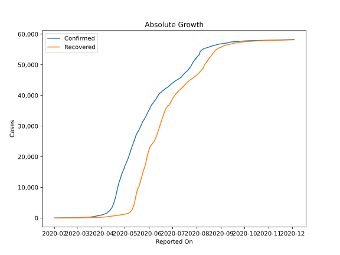
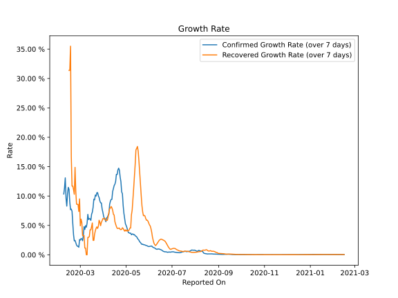

# Country Figures: Growth Rate for Singapore 

The growth rates below are calculated based on
* an exponential growth assumption
* for time difference of past seven (7) days.
The growth rate is to be understood as on "growth per day".

The first growth rate indicates the increase of confirmed (infected) cases.

The second growth rate indicates the increase of recovered (healed) cases.

| Reported On | Confirmed | Growth Rate (Confirmed) | Recovered | Growth Rate (Recovered) |
|-------------|-----------|-------------------------|-----------|-------------------------|
| 2020-04-20 | 8014 |  14.43 %  | 801 |  4.465 %  | 
| 2020-04-19 | 6588 |  13.66 %  | 768 |  4.512 %  | 
| 2020-04-18 | 5992 |  13.69 %  | 740 |  4.822 %  | 
| 2020-04-17 | 5050 |  12.48 %  | 708 |  5.200 %  | 
| 2020-04-16 | 4427 |  12.01 %  | 683 |  5.647 %  | 
| 2020-04-15 | 3699 |  11.77 %  | 652 |  6.767 %  | 
| 2020-04-14 | 3252 |  11.24 %  | 611 |  6.898 %  | 
| 2020-04-13 | 2918 |  10.75 %  | 586 |  7.610 %  | 
| 2020-04-12 | 2532 |  9.42 %  | 560 |  7.995 %  | 
| 2020-04-11 | 2299 |  9.42 %  | 528 |  8.219 %  | 
| 2020-04-10 | 2108 |  9.11 %  | 492 |  7.951 %  | 
| 2020-04-09 | 1910 |  8.56 %  | 460 |  7.825 %  | 
| 2020-04-08 | 1623 |  6.92 %  | 406 |  7.216 %  | 
| 2020-04-07 | 1481 |  6.71 %  | 377 |  6.452 %  | 
| 2020-04-06 | 1375 |  6.39 %  | 344 |  5.876 %  | 
| 2020-04-05 | 1309 |  6.27 %  | 320 |  5.882 %  | 
| 2020-04-04 | 1189 |  5.63 %  | 297 |  5.792 %  | 
| 2020-04-03 | 1114 |  6.00 %  | 282 |  6.177 %  | 
| 2020-04-02 | 1049 |  6.13 %  | 266 |  6.229 %  | 
| 2020-04-01 | 1000 |  6.58 %  | 245 |  6.087 %  | 
| 2020-03-31 | 926 |  7.24 %  | 240 |  6.154 %  | 
| 2020-03-30 | 879 |  7.80 %  | 228 |  5.792 %  | 
| 2020-03-29 | 844 |  8.83 %  | 212 |  5.525 %  | 
| 2020-03-28 | 802 |  8.84 %  | 198 |  4.952 %  | 
| 2020-03-27 | 732 |  9.18 %  | 183 |  5.560 %  | 
| 2020-03-26 | 683 |  9.76 %  | 172 |  5.876 %  | 
| 2020-03-25 | 631 |  10.02 %  | 160 |  4.843 %  | 
| 2020-03-24 | 558 |  10.58 %  | 156 |  4.481 %  | 
| 2020-03-23 | 509 |  10.56 %  | 152 |  4.750 %  | 
| 2020-03-22 | 455 |  10.00 %  | 144 |  4.512 %  | 
| 2020-03-21 | 432 |  10.17 %  | 140 |  4.110 %  | 
| 2020-03-20 | 385 |  9.36 %  | 124 |  3.508 %  | 
| 2020-03-19 | 345 |  9.45 %  | 114 |  2.455 %  | 
| 2020-03-18 | 313 |  8.06 %  | 114 |  2.455 %  | 
| 2020-03-17 | 266 |  7.26 %  | 114 |  5.421 %  | 
| 2020-03-16 | 243 |  6.89 %  | 109 |  4.781 %  | 
| 2020-03-15 | 226 |  5.86 %  | 105 |  4.246 %  | 
| 2020-03-14 | 212 |  6.13 %  | 105 |  4.246 %  | 
| 2020-03-13 | 200 |  6.15 %  | 97 |  3.114 %  | 
| 2020-03-12 | 178 |  5.99 %  | 96 |  2.966 %  | 
| 2020-03-11 | 178 |  6.88 %  | 96 |  2.966 %  | 
| 2020-03-10 | 160 |  5.35 %  | 78 |  None  | 
| 2020-03-09 | 150 |  4.69 %  | 78 |  None  | 
| 2020-03-08 | 150 |  4.96 %  | 78 |  1.143 %  | 
| 2020-03-07 | 138 |  4.32 %  | 78 |  1.143 %  | 
| 2020-03-06 | 130 |  4.78 %  | 78 |  3.280 %  | 
| 2020-03-05 | 117 |  3.28 %  | 78 |  3.280 %  | 
| 2020-03-04 | 110 |  2.40 %  | 78 |  3.280 %  | 
| 2020-03-03 | 110 |  2.71 %  | 78 |  5.520 %  | 
| 2020-03-02 | 108 |  2.76 %  | 78 |  6.070 %  | 
| 2020-03-01 | 106 |  2.50 %  | 72 |  4.926 %  | 
| 2020-02-29 | 102 |  2.60 %  | 72 |  9.511 %  | 
| 2020-02-28 | 93 |  1.28 %  | 62 |  7.375 %  | 
| 2020-02-27 | 93 |  1.45 %  | 62 |  8.582 %  | 
| 2020-02-26 | 93 |  1.45 %  | 62 |  8.582 %  | 
| 2020-02-25 | 91 |  1.66 %  | 53 |  8.614 %  | 
| 2020-02-24 | 89 |  2.07 %  | 51 |  10.768 %  | 
| 2020-02-23 | 89 |  2.44 %  | 51 |  14.878 %  | 
| 2020-02-22 | 85 |  2.37 %  | 37 |  10.294 %  | 
| 2020-02-21 | 85 |  3.40 %  | 37 |  11.110 %  | 
| 2020-02-20 | 84 |  5.29 %  | 34 |  11.690 %  | 
| 2020-02-19 | 84 |  7.41 %  | 34 |  11.690 %  | 
| 2020-02-18 | 81 |  7.78 %  | 29 |  16.715 %  | 
| 2020-02-17 | 77 |  7.67 %  | 24 |  35.499 %  | 
| 2020-02-16 | 75 |  8.98 %  | 18 |  31.389 %  | 
| 2020-02-15 | 72 |  11.15 %  | 18 |  31.389 %  | 
| 2020-02-14 | 67 |  11.48 %  | 17 |  None  | 
| 2020-02-13 | 58 |  10.40 %  | 15 |  None  | 
| 2020-02-12 | 50 |  8.28 %  | 15 |  None  | 
| 2020-02-11 | 47 |  9.60 %  | 9 |  None  | 
| 2020-02-10 | 45 |  13.09 %  | 2 |  None  | 
| 2020-02-09 | 40 |  11.41 %  | 2 |  None  | 
| 2020-02-08 | 33 |  10.34 %  | 2 |  None  | 
| 2020-02-07 | 30 |  None  | 0 |  None  | 
| 2020-02-06 | 28 |  None  | 0 |  None  | 
| 2020-02-05 | 28 |  None  | 0 |  None  | 
| 2020-02-04 | 24 |  None  | 0 |  None  | 
| 2020-02-03 | 18 |  None  | 0 |  None  | 
| 2020-02-02 | 18 |  None  | 0 |  None  | 
| 2020-02-01 | 16 |  None  | 0 |  None  | 

