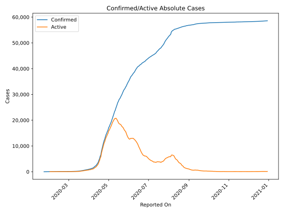
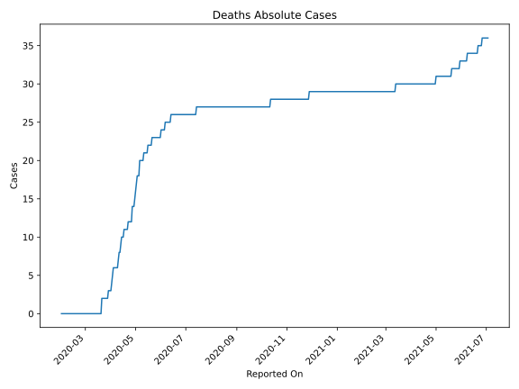
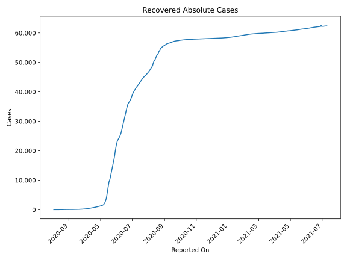
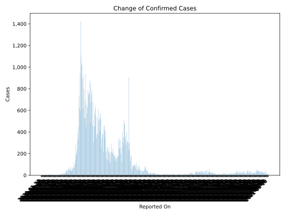
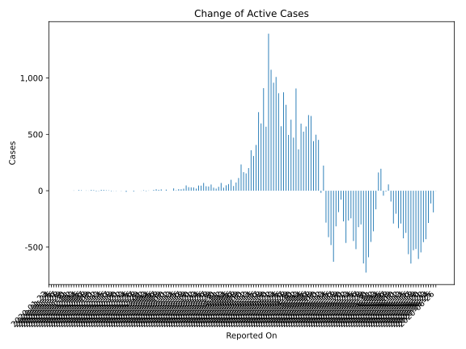
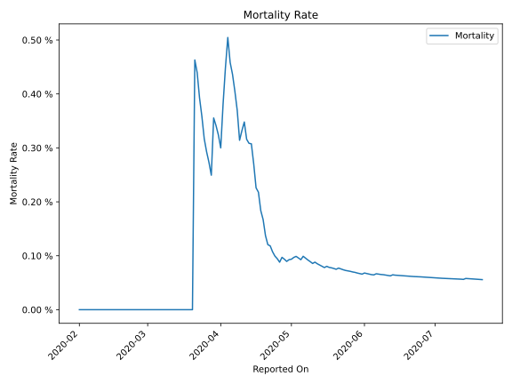

# Country Figures: Time Series for Singapore 

| Reported On | Confirmed | Deaths | Recovered | Active | Mortality | &Delta; Confirmed | &Delta; Deaths | &Delta; Recovered | &Delta; Active | % Active of Population |
|-------------|-----------|--------|-----------|--------|-----------|-------------------|----------------|-------------------|----------------|------------------------|
| 2020-05-09 | 22460 | 20 | 2296 | 20144 |  0.09 %  | 753 | 0 | 256 | 497 |  0.357 %  | 
| 2020-05-08 | 21707 | 20 | 2040 | 19647 |  0.09 %  | 768 | 0 | 328 | 440 |  0.348 %  | 
| 2020-05-07 | 20939 | 20 | 1712 | 19207 |  0.10 %  | 741 | 0 | 78 | 663 |  0.341 %  | 
| 2020-05-06 | 20198 | 20 | 1634 | 18544 |  0.10 %  | 788 | 2 | 115 | 671 |  0.329 %  | 
| 2020-05-05 | 19410 | 18 | 1519 | 17873 |  0.09 %  | 632 | 0 | 62 | 570 |  0.317 %  | 
| 2020-05-04 | 18778 | 18 | 1457 | 17303 |  0.10 %  | 573 | 0 | 49 | 524 |  0.307 %  | 
| 2020-05-03 | 18205 | 18 | 1408 | 16779 |  0.10 %  | 657 | 1 | 61 | 595 |  0.298 %  | 
| 2020-05-02 | 17548 | 17 | 1347 | 16184 |  0.10 %  | 447 | 1 | 79 | 367 |  0.287 %  | 
| 2020-05-01 | 17101 | 16 | 1268 | 15817 |  0.09 %  | 932 | 1 | 24 | 907 |  0.281 %  | 
| 2020-04-30 | 16169 | 15 | 1244 | 14910 |  0.09 %  | 528 | 1 | 56 | 471 |  0.264 %  | 
| 2020-04-29 | 15641 | 14 | 1188 | 14439 |  0.09 %  | 690 | 0 | 60 | 630 |  0.256 %  | 
| 2020-04-28 | 14951 | 14 | 1128 | 13809 |  0.09 %  | 528 | 0 | 33 | 495 |  0.245 %  | 
| 2020-04-27 | 14423 | 14 | 1095 | 13314 |  0.10 %  | 799 | 2 | 35 | 762 |  0.236 %  | 
| 2020-04-26 | 13624 | 12 | 1060 | 12552 |  0.09 %  | 931 | 0 | 58 | 873 |  0.223 %  | 
| 2020-04-25 | 12693 | 12 | 1002 | 11679 |  0.09 %  | 618 | 0 | 46 | 572 |  0.207 %  | 
| 2020-04-24 | 12075 | 12 | 956 | 11107 |  0.10 %  | 897 | 0 | 32 | 865 |  0.197 %  | 
| 2020-04-23 | 11178 | 12 | 924 | 10242 |  0.11 %  | 1037 | 0 | 28 | 1009 |  0.182 %  | 
| 2020-04-22 | 10141 | 12 | 896 | 9233 |  0.12 %  | 1016 | 1 | 57 | 958 |  0.164 %  | 
| 2020-04-21 | 9125 | 11 | 839 | 8275 |  0.12 %  | 1111 | 0 | 38 | 1073 |  0.147 %  | 
| 2020-04-20 | 8014 | 11 | 801 | 7202 |  0.14 %  | 1426 | 0 | 33 | 1393 |  0.128 %  | 
| 2020-04-19 | 6588 | 11 | 768 | 5809 |  0.17 %  | 596 | 0 | 28 | 568 |  0.103 %  | 
| 2020-04-18 | 5992 | 11 | 740 | 5241 |  0.18 %  | 942 | 0 | 32 | 910 |  0.093 %  | 
| 2020-04-17 | 5050 | 11 | 708 | 4331 |  0.22 %  | 623 | 1 | 25 | 597 |  0.077 %  | 
| 2020-04-16 | 4427 | 10 | 683 | 3734 |  0.23 %  | 728 | 0 | 31 | 697 |  0.066 %  | 
| 2020-04-15 | 3699 | 10 | 652 | 3037 |  0.27 %  | 447 | 0 | 41 | 406 |  0.054 %  | 
| 2020-04-14 | 3252 | 10 | 611 | 2631 |  0.31 %  | 334 | 1 | 25 | 308 |  0.047 %  | 
| 2020-04-13 | 2918 | 9 | 586 | 2323 |  0.31 %  | 386 | 1 | 26 | 359 |  0.041 %  | 
| 2020-04-12 | 2532 | 8 | 560 | 1964 |  0.32 %  | 233 | 0 | 32 | 201 |  0.035 %  | 
| 2020-04-11 | 2299 | 8 | 528 | 1763 |  0.35 %  | 191 | 1 | 36 | 154 |  0.031 %  | 
| 2020-04-10 | 2108 | 7 | 492 | 1609 |  0.33 %  | 198 | 1 | 32 | 165 |  0.029 %  | 
| 2020-04-09 | 1910 | 6 | 460 | 1444 |  0.31 %  | 287 | 0 | 54 | 233 |  0.026 %  | 
| 2020-04-08 | 1623 | 6 | 406 | 1211 |  0.37 %  | 142 | 0 | 29 | 113 |  0.021 %  | 
| 2020-04-07 | 1481 | 6 | 377 | 1098 |  0.41 %  | 106 | 0 | 33 | 73 |  0.019 %  | 
| 2020-04-06 | 1375 | 6 | 344 | 1025 |  0.44 %  | 66 | 0 | 24 | 42 |  0.018 %  | 
| 2020-04-05 | 1309 | 6 | 320 | 983 |  0.46 %  | 120 | 0 | 23 | 97 |  0.017 %  | 
| 2020-04-04 | 1189 | 6 | 297 | 886 |  0.50 %  | 75 | 1 | 15 | 59 |  0.016 %  | 
| 2020-04-03 | 1114 | 5 | 282 | 827 |  0.45 %  | 65 | 1 | 16 | 48 |  0.015 %  | 
| 2020-04-02 | 1049 | 4 | 266 | 779 |  0.38 %  | 49 | 1 | 21 | 27 |  0.014 %  | 
| 2020-04-01 | 1000 | 3 | 245 | 752 |  0.30 %  | 74 | 0 | 5 | 69 |  0.013 %  | 
| 2020-03-31 | 926 | 3 | 240 | 683 |  0.32 %  | 47 | 0 | 12 | 35 |  0.012 %  | 
| 2020-03-30 | 879 | 3 | 228 | 648 |  0.34 %  | 35 | 0 | 16 | 19 |  0.011 %  | 
| 2020-03-29 | 844 | 3 | 212 | 629 |  0.36 %  | 42 | 1 | 14 | 27 |  0.011 %  | 
| 2020-03-28 | 802 | 2 | 198 | 602 |  0.25 %  | 70 | 0 | 15 | 55 |  0.011 %  | 
| 2020-03-27 | 732 | 2 | 183 | 547 |  0.27 %  | 49 | 0 | 11 | 38 |  0.010 %  | 
| 2020-03-26 | 683 | 2 | 172 | 509 |  0.29 %  | 52 | 0 | 12 | 40 |  0.009 %  | 
| 2020-03-25 | 631 | 2 | 160 | 469 |  0.32 %  | 73 | 0 | 4 | 69 |  0.008 %  | 
| 2020-03-24 | 558 | 2 | 156 | 400 |  0.36 %  | 49 | 0 | 4 | 45 |  0.007 %  | 
| 2020-03-23 | 509 | 2 | 152 | 355 |  0.39 %  | 54 | 0 | 8 | 46 |  0.006 %  | 
| 2020-03-22 | 455 | 2 | 144 | 309 |  0.44 %  | 23 | 0 | 4 | 19 |  0.005 %  | 
| 2020-03-21 | 432 | 2 | 140 | 290 |  0.46 %  | 47 | 2 | 16 | 29 |  0.005 %  | 
| 2020-03-20 | 385 | 0 | 124 | 261 |  None  | 40 | 0 | 10 | 30 |  0.005 %  | 
| 2020-03-19 | 345 | 0 | 114 | 231 |  None  | 32 | 0 | 0 | 32 |  0.004 %  | 
| 2020-03-18 | 313 | 0 | 114 | 199 |  None  | 47 | 0 | 0 | 47 |  0.004 %  | 
| 2020-03-17 | 266 | 0 | 114 | 152 |  None  | 23 | 0 | 5 | 18 |  0.003 %  | 
| 2020-03-16 | 243 | 0 | 109 | 134 |  None  | 17 | 0 | 4 | 13 |  0.002 %  | 
| 2020-03-15 | 226 | 0 | 105 | 121 |  None  | 14 | 0 | 0 | 14 |  0.002 %  | 
| 2020-03-14 | 212 | 0 | 105 | 107 |  None  | 12 | 0 | 8 | 4 |  0.002 %  | 
| 2020-03-13 | 200 | 0 | 97 | 103 |  None  | 22 | 0 | 1 | 21 |  0.002 %  | 
| 2020-03-12 | 178 | 0 | 96 | 82 |  None  | 0 | 0 | 0 | 0 |  0.001 %  | 
| 2020-03-11 | 178 | 0 | 96 | 82 |  None  | 18 | 0 | 18 | 0 |  0.001 %  | 
| 2020-03-10 | 160 | 0 | 78 | 82 |  None  | 10 | 0 | 0 | 10 |  0.001 %  | 
| 2020-03-09 | 150 | 0 | 78 | 72 |  None  | 0 | 0 | 0 | 0 |  0.001 %  | 
| 2020-03-08 | 150 | 0 | 78 | 72 |  None  | 12 | 0 | 0 | 12 |  0.001 %  | 
| 2020-03-07 | 138 | 0 | 78 | 60 |  None  | 8 | 0 | 0 | 8 |  0.001 %  | 
| 2020-03-06 | 130 | 0 | 78 | 52 |  None  | 13 | 0 | 0 | 13 |  0.001 %  | 
| 2020-03-05 | 117 | 0 | 78 | 39 |  None  | 7 | 0 | 0 | 7 |  0.001 %  | 
| 2020-03-04 | 110 | 0 | 78 | 32 |  None  | 0 | 0 | 0 | 0 |  0.001 %  | 
| 2020-03-03 | 110 | 0 | 78 | 32 |  None  | 2 | 0 | 0 | 2 |  0.001 %  | 
| 2020-03-02 | 108 | 0 | 78 | 30 |  None  | 2 | 0 | 6 | -4 |  0.001 %  | 
| 2020-03-01 | 106 | 0 | 72 | 34 |  None  | 4 | 0 | 0 | 4 |  0.001 %  | 
| 2020-02-29 | 102 | 0 | 72 | 30 |  None  | 9 | 0 | 10 | -1 |  0.001 %  | 
| 2020-02-28 | 93 | 0 | 62 | 31 |  None  | 0 | 0 | 0 | 0 |  0.001 %  | 
| 2020-02-27 | 93 | 0 | 62 | 31 |  None  | 0 | 0 | 0 | 0 |  0.001 %  | 
| 2020-02-26 | 93 | 0 | 62 | 31 |  None  | 2 | 0 | 9 | -7 |  0.001 %  | 
| 2020-02-25 | 91 | 0 | 53 | 38 |  None  | 2 | 0 | 2 | 0 |  0.001 %  | 
| 2020-02-24 | 89 | 0 | 51 | 38 |  None  | 0 | 0 | 0 | 0 |  0.001 %  | 
| 2020-02-23 | 89 | 0 | 51 | 38 |  None  | 4 | 0 | 14 | -10 |  0.001 %  | 
| 2020-02-22 | 85 | 0 | 37 | 48 |  None  | 0 | 0 | 0 | 0 |  0.001 %  | 
| 2020-02-21 | 85 | 0 | 37 | 48 |  None  | 1 | 0 | 3 | -2 |  0.001 %  | 
| 2020-02-20 | 84 | 0 | 34 | 50 |  None  | 0 | 0 | 0 | 0 |  0.001 %  | 
| 2020-02-19 | 84 | 0 | 34 | 50 |  None  | 3 | 0 | 5 | -2 |  0.001 %  | 
| 2020-02-18 | 81 | 0 | 29 | 52 |  None  | 4 | 0 | 5 | -1 |  0.001 %  | 
| 2020-02-17 | 77 | 0 | 24 | 53 |  None  | 2 | 0 | 6 | -4 |  0.001 %  | 
| 2020-02-16 | 75 | 0 | 18 | 57 |  None  | 3 | 0 | 0 | 3 |  0.001 %  | 
| 2020-02-15 | 72 | 0 | 18 | 54 |  None  | 5 | 0 | 1 | 4 |  0.001 %  | 
| 2020-02-14 | 67 | 0 | 17 | 50 |  None  | 9 | 0 | 2 | 7 |  0.001 %  | 
| 2020-02-13 | 58 | 0 | 15 | 43 |  None  | 8 | 0 | 0 | 8 |  0.001 %  | 
| 2020-02-12 | 50 | 0 | 15 | 35 |  None  | 3 | 0 | 6 | -3 |  0.001 %  | 
| 2020-02-11 | 47 | 0 | 9 | 38 |  None  | 2 | 0 | 7 | -5 |  0.001 %  | 
| 2020-02-10 | 45 | 0 | 2 | 43 |  None  | 5 | 0 | 0 | 5 |  0.001 %  | 
| 2020-02-09 | 40 | 0 | 2 | 38 |  None  | 7 | 0 | 0 | 7 |  0.001 %  | 
| 2020-02-08 | 33 | 0 | 2 | 31 |  None  | 3 | 0 | 2 | 1 |  0.001 %  | 
| 2020-02-07 | 30 | 0 | 0 | 30 |  None  | 2 | 0 | 0 | 2 |  0.001 %  | 
| 2020-02-06 | 28 | 0 | 0 | 28 |  None  | 0 | 0 | 0 | 0 |  0.000 %  | 
| 2020-02-05 | 28 | 0 | 0 | 28 |  None  | 4 | 0 | 0 | 4 |  0.000 %  | 
| 2020-02-04 | 24 | 0 | 0 | 24 |  None  | 6 | 0 | 0 | 6 |  0.000 %  | 
| 2020-02-03 | 18 | 0 | 0 | 18 |  None  | 0 | 0 | 0 | 0 |  0.000 %  | 
| 2020-02-02 | 18 | 0 | 0 | 18 |  None  | 2 | 0 | 0 | 2 |  0.000 %  | 
| 2020-02-01 | 16 | 0 | 0 | 16 |  None  | 3 | None | None | None |  0.000 %  | 
| 2020-01-31 | 13 | None | None | None |  None  | 3 | None | None | None |  n/a  | 
| 2020-01-30 | 10 | None | None | None |  None  | 3 | None | None | None |  n/a  | 
| 2020-01-29 | 7 | None | None | None |  None  | 0 | None | None | None |  n/a  | 
| 2020-01-28 | 7 | None | None | None |  None  | 2 | None | None | None |  n/a  | 
| 2020-01-27 | 5 | None | None | None |  None  | 1 | None | None | None |  n/a  | 
| 2020-01-26 | 4 | None | None | None |  None  | 1 | None | None | None |  n/a  | 
| 2020-01-25 | 3 | None | None | None |  None  | 0 | None | None | None |  n/a  | 
| 2020-01-24 | 3 | None | None | None |  None  | 2 | None | None | None |  n/a  | 
| 2020-01-23 | 1 | None | None | None |  None  | None | None | None | None |  n/a  | 

