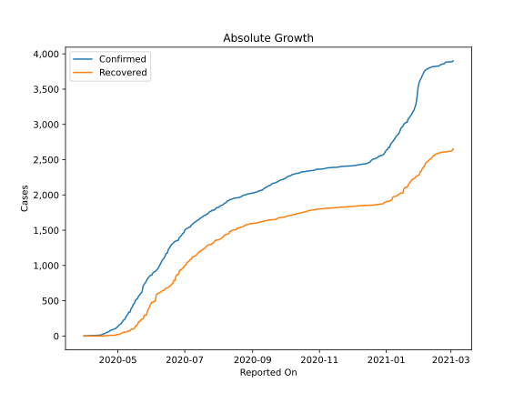
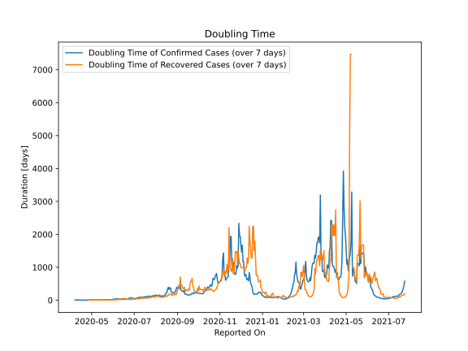

# Country Figures: Doubling Time of Infections for SierraLeone 

The doubling time below are calculated based on
* an exponential growth assumption
* for time difference of past seven (7) days.
The doubling time's unit is "days".

The first doubling time indicates the increase of confirmed (infected)
cases. There, the *higher* the number is, the better is to take control
of the disease.

The second doubling time indicates the increase of recovered (healed)
cases. There, the *lower* the number is, the better it is to take
control of the disease.

| Reported On | Confirmed | Doubling Time (Confirmed) | Recovered | Doubling Time (Recovered) |
|-------------|-----------|---------------------------|-----------|---------------------------|
| 2020-05-04 | 178 |  7.8 days  | 37 |  4.0 days  | 
| 2020-05-03 | 166 |  8.7 days  | 29 |  4.9 days  | 
| 2020-05-02 | 155 |  8.0 days  | 21 |  6.9 days  | 
| 2020-05-01 | 136 |  9.9 days  | 21 |  6.9 days  | 
| 2020-04-30 | 124 |  7.7 days  | 21 |  6.9 days  | 
| 2020-04-29 | 104 |  9.4 days  | 12 |  7.3 days  | 
| 2020-04-28 | 104 |  7.0 days  | 12 |  7.3 days  | 
| 2020-04-27 | 93 |  6.6 days  | 10 |  9.8 days  | 
| 2020-04-26 | 93 |  5.3 days  | 10 |  9.8 days  | 
| 2020-04-25 | 82 |  5.2 days  | 10 |  None  | 
| 2020-04-24 | 82 |  4.6 days  | 10 |  None  | 
| 2020-04-23 | 64 |  3.7 days  | 10 |  None  | 
| 2020-04-22 | 61 |  3.5 days  | 6 |  None  | 
| 2020-04-21 | 50 |  3.5 days  | 6 |  None  | 
| 2020-04-20 | 43 |  3.7 days  | 6 |  None  | 
| 2020-04-19 | 35 |  4.2 days  | 6 |  None  | 
| 2020-04-18 | 30 |  4.0 days  | 0 |  None  | 
| 2020-04-17 | 26 |  4.5 days  | 0 |  None  | 
| 2020-04-16 | 15 |  6.7 days  | 0 |  None  | 
| 2020-04-15 | 13 |  8.2 days  | 0 |  None  | 
| 2020-04-14 | 11 |  8.3 days  | 0 |  None  | 
| 2020-04-13 | 10 |  9.8 days  | 0 |  None  | 
| 2020-04-12 | 10 |  9.8 days  | 0 |  None  | 
| 2020-04-11 | 8 |  7.3 days  | 0 |  None  | 
| 2020-04-10 | 8 |  3.8 days  | 0 |  None  | 
| 2020-04-09 | 7 |  4.2 days  | 0 |  None  | 
| 2020-04-08 | 7 |  4.2 days  | 0 |  None  | 
| 2020-04-07 | 6 |  3.0 days  | 0 |  None  | 
| 2020-04-06 | 6 |  None  | 0 |  None  | 
| 2020-04-05 | 6 |  None  | 0 |  None  | 
| 2020-04-04 | 4 |  None  | 0 |  None  | 
| 2020-04-03 | 2 |  None  | 0 |  None  | 
| 2020-04-02 | 2 |  None  | 0 |  None  | 
| 2020-04-01 | 2 |  None  | 0 |  None  | 
| 2020-03-31 | 1 |  None  | 0 |  None  | 

