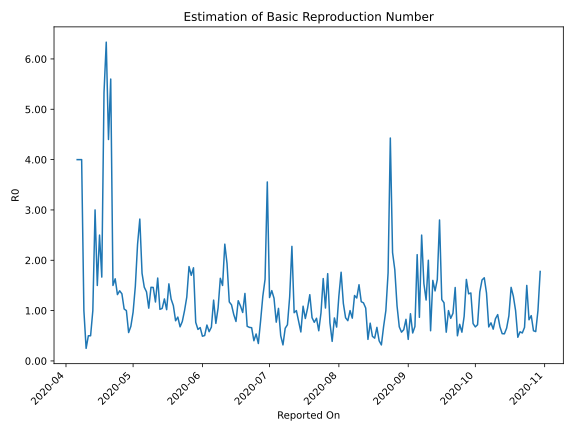

# Country Figures: Time Series for Basic Reproduction Number of SierraLeone 

| Reported On | &Delta; Confirmed | Total &Delta; Confirmed First Interval | Total &Delta; Confirmed Second Interval | Estimated Basic Reproduction Number R0 | 
|-------------|-------------------|----------------------------------------|-----------------------------------------|---------------------------------------------------|
| 2020-05-03 | 11 |  51  |  22  |  2.32  | 
| 2020-05-02 | 19 |  43  |  29  |  1.48  | 
| 2020-05-01 | 12 |  31  |  32  |  0.97  | 
| 2020-04-30 | 20 |  22  |  32  |  0.69  | 
| 2020-04-29 | 0 |  22  |  39  |  0.56  | 
| 2020-04-28 | 11 |  29  |  29  |  1.00  | 
| 2020-04-27 | 0 |  32  |  31  |  1.03  | 
| 2020-04-26 | 11 |  32  |  24  |  1.33  | 
| 2020-04-25 | 0 |  39  |  28  |  1.39  | 
| 2020-04-24 | 18 |  29  |  22  |  1.32  | 
| 2020-04-23 | 3 |  31  |  19  |  1.63  | 
| 2020-04-22 | 11 |  24  |  16  |  1.50  | 
| 2020-04-21 | 7 |  28  |  5  |  5.60  | 
| 2020-04-20 | 8 |  22  |  5  |  4.40  | 
| 2020-04-19 | 5 |  19  |  3  |  6.33  | 
| 2020-04-18 | 4 |  16  |  3  |  5.33  | 
| 2020-04-17 | 11 |  5  |  3  |  1.67  | 
| 2020-04-16 | 2 |  5  |  2  |  2.50  | 
| 2020-04-15 | 2 |  3  |  2  |  1.50  | 
| 2020-04-14 | 1 |  3  |  1  |  3.00  | 
| 2020-04-13 | 0 |  3  |  3  |  1.00  | 
| 2020-04-12 | 2 |  2  |  4  |  0.50  | 
| 2020-04-11 | 0 |  2  |  4  |  0.50  | 
| 2020-04-10 | 1 |  1  |  4  |  0.25  | 
| 2020-04-09 | 0 |  3  |  3  |  1.00  | 
| 2020-04-08 | 1 |  4  |  1  |  4.00  | 
| 2020-04-07 | 0 |  4  |  1  |  4.00  | 
| 2020-04-06 | 0 |  4  |  1  |  4.00  | 
| 2020-04-05 | 2 |  3  |  None  |  None  | 
| 2020-04-04 | 2 |  1  |  None  |  None  | 
| 2020-04-03 | 0 |  1  |  None  |  None  | 
| 2020-04-02 | 0 |  1  |  None  |  None  | 
| 2020-04-01 | 1 |  None  |  None  |  None  | 
| 2020-03-31 | None |  None  |  None  |  None  | 

