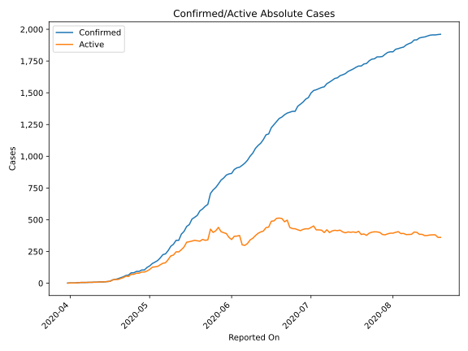
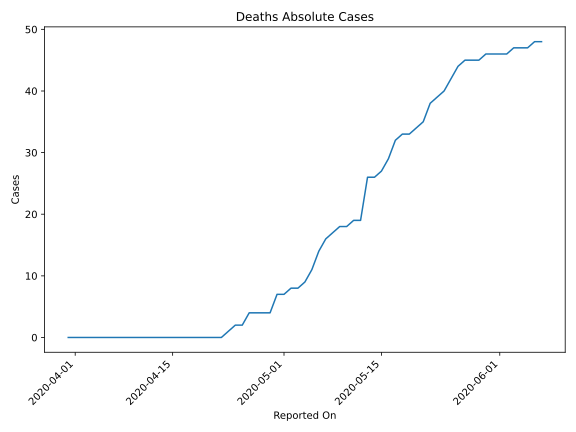
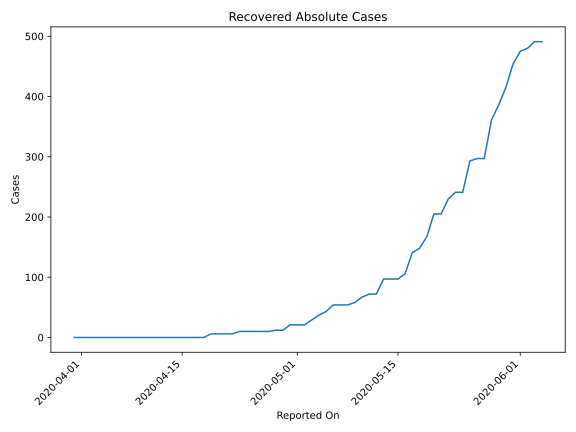
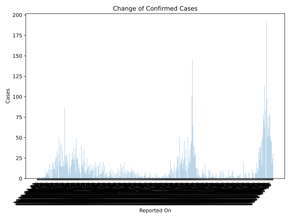
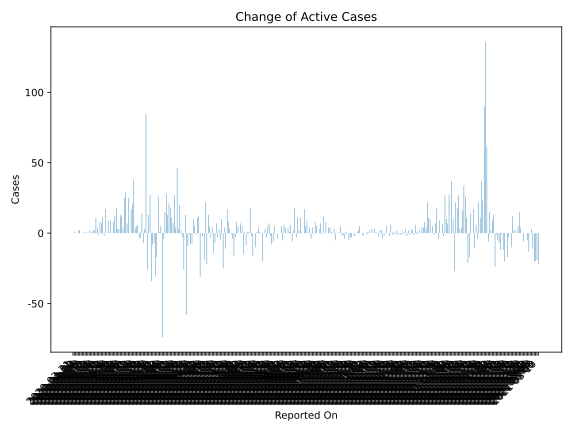
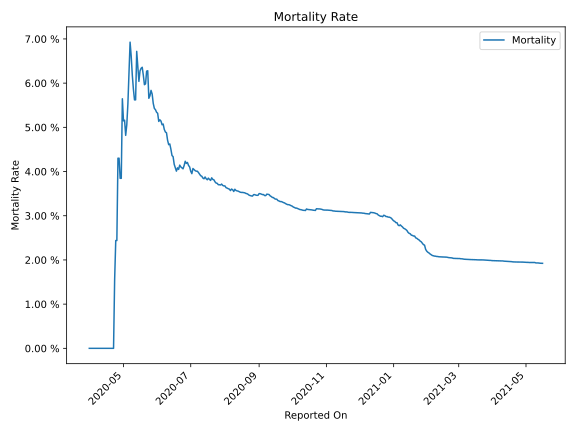

# Country Figures: Time Series for SierraLeone 

| Reported On | Confirmed | Deaths | Recovered | Active | Mortality | &Delta; Confirmed | &Delta; Deaths | &Delta; Recovered | &Delta; Active | % Active of Population |
|-------------|-----------|--------|-----------|--------|-----------|-------------------|----------------|-------------------|----------------|------------------------|
| 2020-04-26 | 93 | 4 | 10 | 79 |  4.30 %  | 11 | 2 | 0 | 9 |  0.001 %  | 
| 2020-04-25 | 82 | 2 | 10 | 70 |  2.44 %  | 0 | 0 | 0 | 0 |  0.001 %  | 
| 2020-04-24 | 82 | 2 | 10 | 70 |  2.44 %  | 18 | 1 | 0 | 17 |  0.001 %  | 
| 2020-04-23 | 64 | 1 | 10 | 53 |  1.56 %  | 3 | 1 | 4 | -2 |  0.001 %  | 
| 2020-04-22 | 61 | 0 | 6 | 55 |  None  | 11 | 0 | 0 | 11 |  0.001 %  | 
| 2020-04-21 | 50 | 0 | 6 | 44 |  None  | 7 | 0 | 0 | 7 |  0.001 %  | 
| 2020-04-20 | 43 | 0 | 6 | 37 |  None  | 8 | 0 | 0 | 8 |  0.000 %  | 
| 2020-04-19 | 35 | 0 | 6 | 29 |  None  | 5 | 0 | 6 | -1 |  0.000 %  | 
| 2020-04-18 | 30 | 0 | 0 | 30 |  None  | 4 | 0 | 0 | 4 |  0.000 %  | 
| 2020-04-17 | 26 | 0 | 0 | 26 |  None  | 11 | 0 | 0 | 11 |  0.000 %  | 
| 2020-04-16 | 15 | 0 | 0 | 15 |  None  | 2 | 0 | 0 | 2 |  0.000 %  | 
| 2020-04-15 | 13 | 0 | 0 | 13 |  None  | 2 | 0 | 0 | 2 |  0.000 %  | 
| 2020-04-14 | 11 | 0 | 0 | 11 |  None  | 1 | 0 | 0 | 1 |  0.000 %  | 
| 2020-04-13 | 10 | 0 | 0 | 10 |  None  | 0 | 0 | 0 | 0 |  0.000 %  | 
| 2020-04-12 | 10 | 0 | 0 | 10 |  None  | 2 | 0 | 0 | 2 |  0.000 %  | 
| 2020-04-11 | 8 | 0 | 0 | 8 |  None  | 0 | 0 | 0 | 0 |  0.000 %  | 
| 2020-04-10 | 8 | 0 | 0 | 8 |  None  | 1 | 0 | 0 | 1 |  0.000 %  | 
| 2020-04-09 | 7 | 0 | 0 | 7 |  None  | 0 | 0 | 0 | 0 |  0.000 %  | 
| 2020-04-08 | 7 | 0 | 0 | 7 |  None  | 1 | 0 | 0 | 1 |  0.000 %  | 
| 2020-04-07 | 6 | 0 | 0 | 6 |  None  | 0 | 0 | 0 | 0 |  0.000 %  | 
| 2020-04-06 | 6 | 0 | 0 | 6 |  None  | 0 | 0 | 0 | 0 |  0.000 %  | 
| 2020-04-05 | 6 | 0 | 0 | 6 |  None  | 2 | 0 | 0 | 2 |  0.000 %  | 
| 2020-04-04 | 4 | 0 | 0 | 4 |  None  | 2 | 0 | 0 | 2 |  0.000 %  | 
| 2020-04-03 | 2 | 0 | 0 | 2 |  None  | 0 | 0 | 0 | 0 |  0.000 %  | 
| 2020-04-02 | 2 | 0 | 0 | 2 |  None  | 0 | 0 | 0 | 0 |  0.000 %  | 
| 2020-04-01 | 2 | 0 | 0 | 2 |  None  | 1 | 0 | 0 | 1 |  0.000 %  | 
| 2020-03-31 | 1 | 0 | 0 | 1 |  None  | None | None | None | None |  0.000 %  | 

