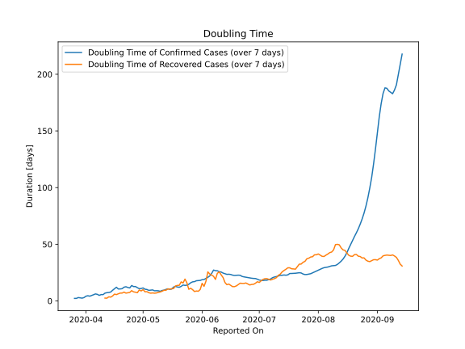

# Country Figures: New Infections in Previous 7 Days per 100,000 Population for ElSalvador 

<!--  --> 

| Reported On | &Delta; Confirmed (on the day) | &Delta; Confirmed (last 7 days) | New Cases in Previous 7 Days per 100,000 Population |
|-------------|--------------------------------|---------------------------------|-----------------------------------------------------|
| 2020-05-09 |  42  |  338  |  5.264  |
| 2020-05-08 |  47  |  318  |  4.953  |
| 2020-05-07 |  62  |  300  |  4.672  |
| 2020-05-06 |  46  |  256  |  3.987  |
| 2020-05-05 |  32  |  242  |  3.769  |
| 2020-05-04 |  65  |  232  |  3.613  |
| 2020-05-03 |  44  |  192  |  2.990  |
| 2020-05-02 |  22  |  172  |  2.679  |
| 2020-05-01 |  29  |  150  |  2.336  |
| 2020-04-30 |  18  |  145  |  2.258  |
| 2020-04-29 |  32  |  140  |  2.180  |
| 2020-04-28 |  22  |  120  |  1.869  |
| 2020-04-27 |  25  |  105  |  1.635  |
| 2020-04-26 |  24  |  97  |  1.511  |
| 2020-04-25 |  None  |  84  |  1.308  |
| 2020-04-24 |  24  |  97  |  1.511  |
| 2020-04-23 |  13  |  86  |  1.339  |
| 2020-04-22 |  12  |  78  |  1.215  |
| 2020-04-21 |  7  |  76  |  1.184  |
| 2020-04-20 |  17  |  81  |  1.262  |
| 2020-04-19 |  11  |  76  |  1.184  |
| 2020-04-18 |  13  |  72  |  1.121  |
| 2020-04-17 |  13  |  60  |  0.934  |
| 2020-04-16 |  5  |  61  |  0.950  |
| 2020-04-15 |  10  |  66  |  1.028  |
| 2020-04-14 |  12  |  71  |  1.106  |
| 2020-04-13 |  12  |  68  |  1.059  |
| 2020-04-12 |  7  |  63  |  0.981  |
| 2020-04-11 |  1  |  62  |  0.966  |
| 2020-04-10 |  14  |  71  |  1.106  |
| 2020-04-09 |  10  |  62  |  0.966  |
| 2020-04-08 |  15  |  61  |  0.950  |
| 2020-04-07 |  9  |  46  |  0.716  |
| 2020-04-06 |  7  |  39  |  0.607  |
| 2020-04-05 |  6  |  38  |  0.592  |
| 2020-04-04 |  10  |  37  |  0.576  |
| 2020-04-03 |  5  |  33  |  0.514  |
| 2020-04-02 |  9  |  28  |  0.436  |
| 2020-04-01 |  None  |  23  |  0.358  |
| 2020-03-31 |  2  |  27  |  0.421  |
| 2020-03-30 |  6  |  27  |  0.421  |
| 2020-03-29 |  5  |  21  |  0.327  |
| 2020-03-28 |  6  |  16  |  0.249  |
| 2020-03-27 |  None  |  12  |  0.187  |
| 2020-03-26 |  4  |  12  |  0.187  |
| 2020-03-25 |  4  |  8  |  0.125  |
| 2020-03-24 |  2  |  4  |  0.062  |
| 2020-03-23 |  None  |  2  |  0.031  |
| 2020-03-22 |  None  |  2  |  0.031  |
| 2020-03-21 |  2  |  2  |  0.031  |
| 2020-03-20 |  None  |  None  |  None  |
| 2020-03-19 |  None  |  None  |  None  |

