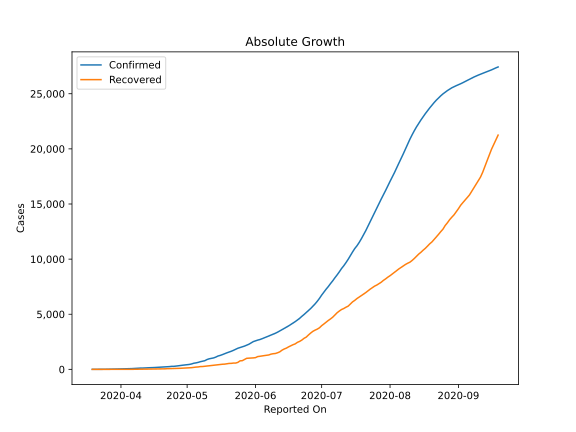

# Country Figures: Doubling Time of Infections for ElSalvador 

The doubling time below are calculated based on
* an exponential growth assumption
* for time difference of past seven (7) days.
The doubling time's unit is "days".

The first doubling time indicates the increase of confirmed (infected)
cases. There, the *higher* the number is, the better is to take control
of the disease.

The second doubling time indicates the increase of recovered (healed)
cases. There, the *lower* the number is, the better it is to take
control of the disease.

| Reported On | Confirmed | Doubling Time (Confirmed) | Recovered | Doubling Time (Recovered) |
|-------------|-----------|---------------------------|-----------|---------------------------|
| 2020-04-26 | 298 |  12.7 days  | 83 |  8.0 days  | 
| 2020-04-25 | 274 |  13.6 days  | 75 |  9.1 days  | 
| 2020-04-24 | 274 |  11.4 days  | 75 |  7.5 days  | 
| 2020-04-23 | 250 |  11.9 days  | 67 |  7.2 days  | 
| 2020-04-22 | 237 |  12.5 days  | 63 |  6.9 days  | 
| 2020-04-21 | 225 |  12.1 days  | 48 |  7.8 days  | 
| 2020-04-20 | 218 |  10.8 days  | 46 |  6.9 days  | 
| 2020-04-19 | 201 |  10.6 days  | 44 |  6.9 days  | 
| 2020-04-18 | 190 |  10.5 days  | 43 |  6.3 days  | 
| 2020-04-17 | 177 |  12.1 days  | 38 |  5.6 days  | 
| 2020-04-16 | 164 |  10.8 days  | 33 |  6.0 days  | 
| 2020-04-15 | 159 |  9.4 days  | 30 |  4.4 days  | 
| 2020-04-14 | 149 |  7.8 days  | 25 |  3.3 days  | 
| 2020-04-13 | 137 |  7.4 days  | 22 |  3.6 days  | 
| 2020-04-12 | 125 |  7.3 days  | 21 |  2.4 days  | 
| 2020-04-11 | 118 |  6.9 days  | 19 |  2.5 days  | 
| 2020-04-10 | 117 |  5.5 days  | 15 |  None  | 
| 2020-04-09 | 103 |  5.6 days  | 14 |  None  | 
| 2020-04-08 | 93 |  4.9 days  | 9 |  None  | 
| 2020-04-07 | 78 |  5.8 days  | 5 |  None  | 
| 2020-04-06 | 69 |  6.2 days  | 5 |  None  | 
| 2020-04-05 | 62 |  5.5 days  | 2 |  None  | 
| 2020-04-04 | 56 |  4.8 days  | 2 |  None  | 
| 2020-04-03 | 46 |  4.2 days  | 0 |  None  | 
| 2020-04-02 | 41 |  4.6 days  | 0 |  None  | 
| 2020-04-01 | 32 |  4.2 days  | 0 |  None  | 
| 2020-03-31 | 32 |  2.9 days  | 0 |  None  | 
| 2020-03-30 | 30 |  2.4 days  | 0 |  None  | 
| 2020-03-29 | 24 |  2.7 days  | 0 |  None  | 
| 2020-03-28 | 19 |  3.0 days  | 0 |  None  | 
| 2020-03-27 | 13 |  2.2 days  | 0 |  None  | 
| 2020-03-26 | 13 |  2.2 days  | 0 |  None  | 
| 2020-03-25 | 9 |  None  | 0 |  None  | 
| 2020-03-24 | 5 |  None  | 0 |  None  | 
| 2020-03-23 | 3 |  None  | 0 |  None  | 
| 2020-03-22 | 3 |  None  | 0 |  None  | 
| 2020-03-21 | 3 |  None  | 0 |  None  | 
| 2020-03-20 | 1 |  None  | 0 |  None  | 
| 2020-03-19 | 1 |  None  | 0 |  None  | 

