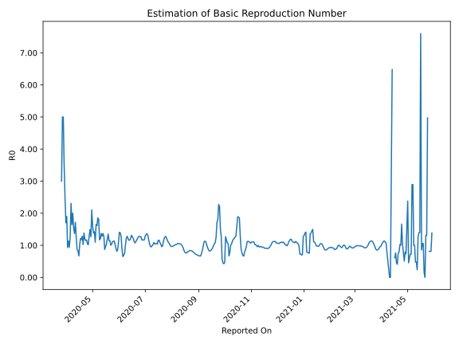

# Country Figures: Time Series for Basic Reproduction Number of ElSalvador 

| Reported On | &Delta; Confirmed | Total &Delta; Confirmed First Interval | Total &Delta; Confirmed Second Interval | Estimated Basic Reproduction Number R0 | 
|-------------|-------------------|----------------------------------------|-----------------------------------------|---------------------------------------------------|
| 2020-05-07 | 62 |  187  |  101  |  1.85  | 
| 2020-05-06 | 46 |  163  |  101  |  1.61  | 
| 2020-05-05 | 32 |  160  |  97  |  1.65  | 
| 2020-05-04 | 65 |  113  |  103  |  1.10  | 
| 2020-05-03 | 44 |  101  |  71  |  1.42  | 
| 2020-05-02 | 22 |  101  |  73  |  1.38  | 
| 2020-05-01 | 29 |  97  |  61  |  1.59  | 
| 2020-04-30 | 18 |  103  |  49  |  2.10  | 
| 2020-04-29 | 32 |  71  |  56  |  1.27  | 
| 2020-04-28 | 22 |  73  |  49  |  1.49  | 
| 2020-04-27 | 25 |  61  |  47  |  1.30  | 
| 2020-04-26 | 24 |  49  |  48  |  1.02  | 
| 2020-04-25 | 0 |  56  |  54  |  1.04  | 
| 2020-04-24 | 24 |  49  |  42  |  1.17  | 
| 2020-04-23 | 13 |  47  |  41  |  1.15  | 
| 2020-04-22 | 12 |  48  |  40  |  1.20  | 
| 2020-04-21 | 7 |  54  |  39  |  1.38  | 
| 2020-04-20 | 17 |  42  |  41  |  1.02  | 
| 2020-04-19 | 11 |  41  |  32  |  1.28  | 
| 2020-04-18 | 13 |  40  |  34  |  1.18  | 
| 2020-04-17 | 13 |  39  |  32  |  1.22  | 
| 2020-04-16 | 5 |  41  |  40  |  1.02  | 
| 2020-04-15 | 10 |  32  |  48  |  0.67  | 
| 2020-04-14 | 12 |  34  |  41  |  0.83  | 
| 2020-04-13 | 12 |  32  |  37  |  0.86  | 
| 2020-04-12 | 7 |  40  |  32  |  1.25  | 
| 2020-04-11 | 1 |  48  |  28  |  1.71  | 
| 2020-04-10 | 14 |  41  |  30  |  1.37  | 
| 2020-04-09 | 10 |  37  |  24  |  1.54  | 
| 2020-04-08 | 15 |  32  |  16  |  2.00  | 
| 2020-04-07 | 9 |  28  |  17  |  1.65  | 
| 2020-04-06 | 7 |  30  |  13  |  2.31  | 
| 2020-04-05 | 6 |  24  |  19  |  1.26  | 
| 2020-04-04 | 10 |  16  |  17  |  0.94  | 
| 2020-04-03 | 5 |  17  |  15  |  1.13  | 
| 2020-04-02 | 9 |  13  |  14  |  0.93  | 
| 2020-04-01 | 0 |  19  |  10  |  1.90  | 
| 2020-03-31 | 2 |  17  |  10  |  1.70  | 
| 2020-03-30 | 6 |  15  |  6  |  2.50  | 
| 2020-03-29 | 5 |  14  |  4  |  3.50  | 
| 2020-03-28 | 6 |  10  |  2  |  5.00  | 
| 2020-03-27 | 0 |  10  |  2  |  5.00  | 
| 2020-03-26 | 4 |  6  |  2  |  3.00  | 
| 2020-03-25 | 4 |  4  |  None  |  None  | 
| 2020-03-24 | 2 |  2  |  None  |  None  | 
| 2020-03-23 | 0 |  2  |  None  |  None  | 
| 2020-03-22 | 0 |  2  |  None  |  None  | 
| 2020-03-21 | 2 |  None  |  None  |  None  | 
| 2020-03-20 | 0 |  None  |  None  |  None  | 
| 2020-03-19 | None |  None  |  None  |  None  | 

