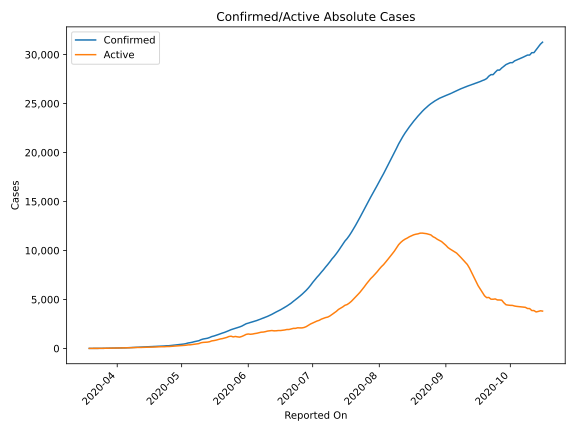
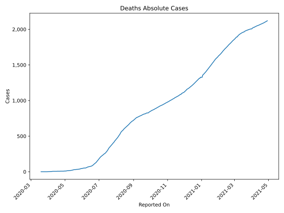
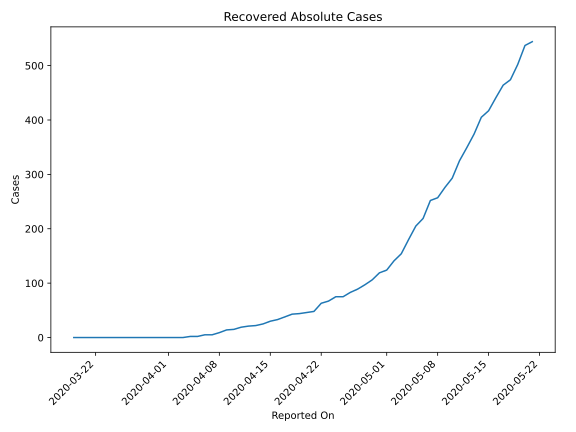
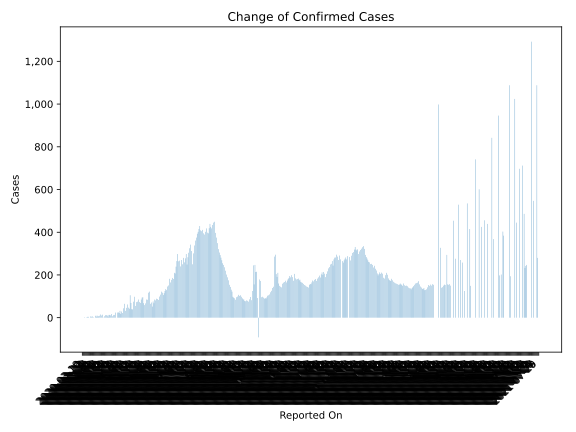
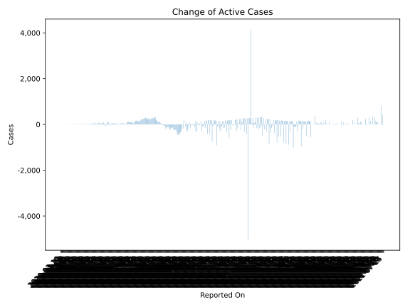
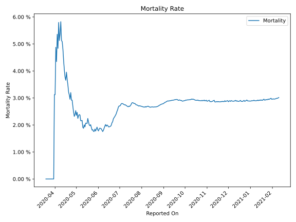

# Country Figures: Time Series for ElSalvador 

| Reported On | Confirmed | Deaths | Recovered | Active | Mortality | &Delta; Confirmed | &Delta; Deaths | &Delta; Recovered | &Delta; Active | % Active of Population |
|-------------|-----------|--------|-----------|--------|-----------|-------------------|----------------|-------------------|----------------|------------------------|
| 2020-05-07 | 695 | 15 | 252 | 428 |  2.16 %  | 62 | 0 | 33 | 29 |  0.007 %  | 
| 2020-05-06 | 633 | 15 | 219 | 399 |  2.37 %  | 46 | 1 | 14 | 31 |  0.006 %  | 
| 2020-05-05 | 587 | 14 | 205 | 368 |  2.39 %  | 32 | 1 | 25 | 6 |  0.006 %  | 
| 2020-05-04 | 555 | 13 | 180 | 362 |  2.34 %  | 65 | 2 | 26 | 37 |  0.006 %  | 
| 2020-05-03 | 490 | 11 | 154 | 325 |  2.24 %  | 44 | 0 | 13 | 31 |  0.005 %  | 
| 2020-05-02 | 446 | 11 | 141 | 294 |  2.47 %  | 22 | 1 | 17 | 4 |  0.005 %  | 
| 2020-05-01 | 424 | 10 | 124 | 290 |  2.36 %  | 29 | 0 | 5 | 24 |  0.005 %  | 
| 2020-04-30 | 395 | 10 | 119 | 266 |  2.53 %  | 18 | 1 | 13 | 4 |  0.004 %  | 
| 2020-04-29 | 377 | 9 | 106 | 262 |  2.39 %  | 32 | 1 | 9 | 22 |  0.004 %  | 
| 2020-04-28 | 345 | 8 | 97 | 240 |  2.32 %  | 22 | 0 | 8 | 14 |  0.004 %  | 
| 2020-04-27 | 323 | 8 | 89 | 226 |  2.48 %  | 25 | 0 | 6 | 19 |  0.004 %  | 
| 2020-04-26 | 298 | 8 | 83 | 207 |  2.68 %  | 24 | 0 | 8 | 16 |  0.003 %  | 
| 2020-04-25 | 274 | 8 | 75 | 191 |  2.92 %  | 0 | 0 | 0 | 0 |  0.003 %  | 
| 2020-04-24 | 274 | 8 | 75 | 191 |  2.92 %  | 24 | 0 | 8 | 16 |  0.003 %  | 
| 2020-04-23 | 250 | 8 | 67 | 175 |  3.20 %  | 13 | 1 | 4 | 8 |  0.003 %  | 
| 2020-04-22 | 237 | 7 | 63 | 167 |  2.95 %  | 12 | 0 | 15 | -3 |  0.003 %  | 
| 2020-04-21 | 225 | 7 | 48 | 170 |  3.11 %  | 7 | 0 | 2 | 5 |  0.003 %  | 
| 2020-04-20 | 218 | 7 | 46 | 165 |  3.21 %  | 17 | 0 | 2 | 15 |  0.003 %  | 
| 2020-04-19 | 201 | 7 | 44 | 150 |  3.48 %  | 11 | 0 | 1 | 10 |  0.002 %  | 
| 2020-04-18 | 190 | 7 | 43 | 140 |  3.68 %  | 13 | 0 | 5 | 8 |  0.002 %  | 
| 2020-04-17 | 177 | 7 | 38 | 132 |  3.95 %  | 13 | 1 | 5 | 7 |  0.002 %  | 
| 2020-04-16 | 164 | 6 | 33 | 125 |  3.66 %  | 5 | 0 | 3 | 2 |  0.002 %  | 
| 2020-04-15 | 159 | 6 | 30 | 123 |  3.77 %  | 10 | 0 | 5 | 5 |  0.002 %  | 
| 2020-04-14 | 149 | 6 | 25 | 118 |  4.03 %  | 12 | 0 | 3 | 9 |  0.002 %  | 
| 2020-04-13 | 137 | 6 | 22 | 109 |  4.38 %  | 12 | 0 | 1 | 11 |  0.002 %  | 
| 2020-04-12 | 125 | 6 | 21 | 98 |  4.80 %  | 7 | 0 | 2 | 5 |  0.002 %  | 
| 2020-04-11 | 118 | 6 | 19 | 93 |  5.08 %  | 1 | 0 | 4 | -3 |  0.001 %  | 
| 2020-04-10 | 117 | 6 | 15 | 96 |  5.13 %  | 14 | 0 | 1 | 13 |  0.001 %  | 
| 2020-04-09 | 103 | 6 | 14 | 83 |  5.83 %  | 10 | 1 | 5 | 4 |  0.001 %  | 
| 2020-04-08 | 93 | 5 | 9 | 79 |  5.38 %  | 15 | 1 | 4 | 10 |  0.001 %  | 
| 2020-04-07 | 78 | 4 | 5 | 69 |  5.13 %  | 9 | 0 | 0 | 9 |  0.001 %  | 
| 2020-04-06 | 69 | 4 | 5 | 60 |  5.80 %  | 7 | 1 | 3 | 3 |  0.001 %  | 
| 2020-04-05 | 62 | 3 | 2 | 57 |  4.84 %  | 6 | 0 | 0 | 6 |  0.001 %  | 
| 2020-04-04 | 56 | 3 | 2 | 51 |  5.36 %  | 10 | 1 | 2 | 7 |  0.001 %  | 
| 2020-04-03 | 46 | 2 | 0 | 44 |  4.35 %  | 5 | 0 | 0 | 5 |  0.001 %  | 
| 2020-04-02 | 41 | 2 | 0 | 39 |  4.88 %  | 9 | 1 | 0 | 8 |  0.001 %  | 
| 2020-04-01 | 32 | 1 | 0 | 31 |  3.12 %  | 0 | 0 | 0 | 0 |  0.000 %  | 
| 2020-03-31 | 32 | 1 | 0 | 31 |  3.12 %  | 2 | 1 | 0 | 1 |  0.000 %  | 
| 2020-03-30 | 30 | 0 | 0 | 30 |  None  | 6 | 0 | 0 | 6 |  0.000 %  | 
| 2020-03-29 | 24 | 0 | 0 | 24 |  None  | 5 | 0 | 0 | 5 |  0.000 %  | 
| 2020-03-28 | 19 | 0 | 0 | 19 |  None  | 6 | 0 | 0 | 6 |  0.000 %  | 
| 2020-03-27 | 13 | 0 | 0 | 13 |  None  | 0 | 0 | 0 | 0 |  0.000 %  | 
| 2020-03-26 | 13 | 0 | 0 | 13 |  None  | 4 | 0 | 0 | 4 |  0.000 %  | 
| 2020-03-25 | 9 | 0 | 0 | 9 |  None  | 4 | 0 | 0 | 4 |  0.000 %  | 
| 2020-03-24 | 5 | 0 | 0 | 5 |  None  | 2 | 0 | 0 | 2 |  0.000 %  | 
| 2020-03-23 | 3 | 0 | 0 | 3 |  None  | 0 | 0 | 0 | 0 |  0.000 %  | 
| 2020-03-22 | 3 | 0 | 0 | 3 |  None  | 0 | 0 | 0 | 0 |  0.000 %  | 
| 2020-03-21 | 3 | 0 | 0 | 3 |  None  | 2 | 0 | 0 | 2 |  0.000 %  | 
| 2020-03-20 | 1 | 0 | 0 | 1 |  None  | 0 | 0 | 0 | 0 |  0.000 %  | 
| 2020-03-19 | 1 | 0 | 0 | 1 |  None  | None | None | None | None |  0.000 %  | 

