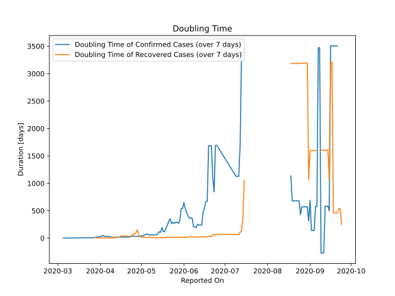

# Country Figures: New Infections in Previous 7 Days per 100,000 Population for SanMarino 

<!--  --> 

| Reported On | &Delta; Confirmed (on the day) | &Delta; Confirmed (last 7 days) | New Cases in Previous 7 Days per 100,000 Population |
|-------------|--------------------------------|---------------------------------|-----------------------------------------------------|
| 2020-05-08 |  1  |  43  |  127.275  |
| 2020-05-07 |  14  |  53  |  156.874  |
| 2020-05-06 |  19  |  45  |  133.195  |
| 2020-05-05 |  7  |  36  |  106.556  |
| 2020-05-04 |  None  |  44  |  130.235  |
| 2020-05-03 |  2  |  44  |  130.235  |
| 2020-05-02 |  None  |  67  |  198.313  |
| 2020-05-01 |  11  |  67  |  198.313  |
| 2020-04-30 |  6  |  68  |  201.273  |
| 2020-04-29 |  10  |  75  |  221.992  |
| 2020-04-28 |  15  |  77  |  227.912  |
| 2020-04-27 |  None  |  76  |  224.952  |
| 2020-04-26 |  25  |  77  |  227.912  |
| 2020-04-25 |  None  |  58  |  171.674  |
| 2020-04-24 |  12  |  78  |  230.872  |
| 2020-04-23 |  13  |  75  |  221.992  |
| 2020-04-22 |  12  |  116  |  343.348  |
| 2020-04-21 |  14  |  105  |  310.789  |
| 2020-04-20 |  1  |  106  |  313.749  |
| 2020-04-19 |  6  |  105  |  310.789  |
| 2020-04-18 |  20  |  99  |  293.029  |
| 2020-04-17 |  9  |  91  |  269.350  |
| 2020-04-16 |  54  |  93  |  275.270  |
| 2020-04-15 |  1  |  93  |  275.270  |
| 2020-04-14 |  15  |  92  |  272.310  |
| 2020-04-13 |  None  |  90  |  266.390  |
| 2020-04-12 |  None  |  90  |  266.390  |
| 2020-04-11 |  12  |  97  |  287.110  |
| 2020-04-10 |  11  |  99  |  293.029  |
| 2020-04-09 |  54  |  88  |  260.471  |
| 2020-04-08 |  None  |  43  |  127.275  |
| 2020-04-07 |  13  |  43  |  127.275  |
| 2020-04-06 |  None  |  36  |  106.556  |
| 2020-04-05 |  7  |  42  |  124.316  |
| 2020-04-04 |  14  |  35  |  103.596  |
| 2020-04-03 |  None  |  22  |  65.118  |
| 2020-04-02 |  9  |  37  |  109.516  |
| 2020-04-01 |  None  |  28  |  82.877  |
| 2020-03-31 |  6  |  49  |  145.035  |
| 2020-03-30 |  6  |  43  |  127.275  |
| 2020-03-29 |  None  |  49  |  145.035  |
| 2020-03-28 |  1  |  80  |  236.791  |
| 2020-03-27 |  15  |  79  |  233.832  |
| 2020-03-26 |  None  |  89  |  263.431  |
| 2020-03-25 |  21  |  89  |  263.431  |
| 2020-03-24 |  None  |  78  |  230.872  |
| 2020-03-23 |  12  |  78  |  230.872  |
| 2020-03-22 |  31  |  74  |  219.032  |
| 2020-03-21 |  None  |  64  |  189.433  |
| 2020-03-20 |  25  |  64  |  189.433  |
| 2020-03-19 |  None  |  50  |  147.995  |
| 2020-03-18 |  10  |  57  |  168.714  |
| 2020-03-17 |  None  |  58  |  171.674  |
| 2020-03-16 |  8  |  73  |  216.072  |
| 2020-03-15 |  21  |  65  |  192.393  |
| 2020-03-14 |  None  |  57  |  168.714  |
| 2020-03-13 |  11  |  59  |  174.634  |
| 2020-03-12 |  7  |  48  |  142.075  |
| 2020-03-11 |  11  |  46  |  136.155  |
| 2020-03-10 |  15  |  41  |  121.356  |
| 2020-03-09 |  None  |  28  |  82.877  |
| 2020-03-08 |  13  |  35  |  103.596  |
| 2020-03-07 |  2  |  22  |  65.118  |
| 2020-03-06 |  None  |  20  |  59.198  |
| 2020-03-05 |  5  |  20  |  59.198  |
| 2020-03-04 |  6  |  15  |  44.398  |
| 2020-03-03 |  2  |  9  |  26.639  |
| 2020-03-02 |  7  |  7  |  20.719  |
| 2020-03-01 |  None  |  None  |  None  |
| 2020-02-29 |  None  |  None  |  None  |
| 2020-02-28 |  None  |  None  |  None  |
| 2020-02-27 |  None  |  None  |  None  |

