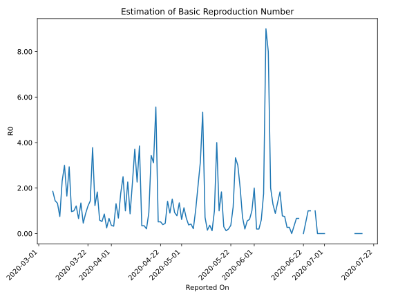

# Country Figures: Time Series for Basic Reproduction Number of SanMarino 

| Reported On | &Delta; Confirmed | Total &Delta; Confirmed First Interval | Total &Delta; Confirmed Second Interval | Estimated Basic Reproduction Number R0 | 
|-------------|-------------------|----------------------------------------|-----------------------------------------|---------------------------------------------------|
| 2020-04-29 | 10 |  40  |  51  |  0.78  | 
| 2020-04-28 | 15 |  37  |  40  |  0.93  | 
| 2020-04-27 | 0 |  50  |  33  |  1.52  | 
| 2020-04-26 | 25 |  37  |  41  |  0.90  | 
| 2020-04-25 | 0 |  51  |  36  |  1.42  | 
| 2020-04-24 | 12 |  40  |  89  |  0.45  | 
| 2020-04-23 | 13 |  33  |  84  |  0.39  | 
| 2020-04-22 | 12 |  41  |  79  |  0.52  | 
| 2020-04-21 | 14 |  36  |  70  |  0.51  | 
| 2020-04-20 | 1 |  89  |  16  |  5.56  | 
| 2020-04-19 | 6 |  84  |  27  |  3.11  | 
| 2020-04-18 | 20 |  79  |  23  |  3.43  | 
| 2020-04-17 | 9 |  70  |  77  |  0.91  | 
| 2020-04-16 | 54 |  16  |  77  |  0.21  | 
| 2020-04-15 | 1 |  27  |  78  |  0.35  | 
| 2020-04-14 | 15 |  23  |  67  |  0.34  | 
| 2020-04-13 | 0 |  77  |  20  |  3.85  | 
| 2020-04-12 | 0 |  77  |  34  |  2.26  | 
| 2020-04-11 | 12 |  78  |  21  |  3.71  | 
| 2020-04-10 | 11 |  67  |  30  |  2.23  | 
| 2020-04-09 | 54 |  20  |  23  |  0.87  | 
| 2020-04-08 | 0 |  34  |  15  |  2.27  | 
| 2020-04-07 | 13 |  21  |  21  |  1.00  | 
| 2020-04-06 | 0 |  30  |  12  |  2.50  | 
| 2020-04-05 | 7 |  23  |  13  |  1.77  | 
| 2020-04-04 | 14 |  15  |  22  |  0.68  | 
| 2020-04-03 | 0 |  21  |  16  |  1.31  | 
| 2020-04-02 | 9 |  12  |  37  |  0.32  | 
| 2020-04-01 | 0 |  13  |  36  |  0.36  | 
| 2020-03-31 | 6 |  22  |  33  |  0.67  | 
| 2020-03-30 | 6 |  16  |  64  |  0.25  | 
| 2020-03-29 | 0 |  37  |  43  |  0.86  | 
| 2020-03-28 | 1 |  36  |  68  |  0.53  | 
| 2020-03-27 | 15 |  33  |  56  |  0.59  | 
| 2020-03-26 | 0 |  64  |  35  |  1.83  | 
| 2020-03-25 | 21 |  43  |  35  |  1.23  | 
| 2020-03-24 | 0 |  68  |  18  |  3.78  | 
| 2020-03-23 | 12 |  56  |  39  |  1.44  | 
| 2020-03-22 | 31 |  35  |  29  |  1.21  | 
| 2020-03-21 | 0 |  35  |  40  |  0.88  | 
| 2020-03-20 | 25 |  18  |  39  |  0.46  | 
| 2020-03-19 | 0 |  39  |  29  |  1.34  | 
| 2020-03-18 | 10 |  29  |  44  |  0.66  | 
| 2020-03-17 | 0 |  40  |  33  |  1.21  | 
| 2020-03-16 | 8 |  39  |  39  |  1.00  | 
| 2020-03-15 | 21 |  29  |  30  |  0.97  | 
| 2020-03-14 | 0 |  44  |  15  |  2.93  | 
| 2020-03-13 | 11 |  33  |  20  |  1.65  | 
| 2020-03-12 | 7 |  39  |  13  |  3.00  | 
| 2020-03-11 | 11 |  30  |  13  |  2.31  | 
| 2020-03-10 | 15 |  15  |  20  |  0.75  | 
| 2020-03-09 | 0 |  20  |  15  |  1.33  | 
| 2020-03-08 | 13 |  13  |  9  |  1.44  | 
| 2020-03-07 | 2 |  13  |  7  |  1.86  | 
| 2020-03-06 | 0 |  20  |  None  |  None  | 
| 2020-03-05 | 5 |  15  |  None  |  None  | 
| 2020-03-04 | 6 |  9  |  None  |  None  | 
| 2020-03-03 | 2 |  7  |  None  |  None  | 
| 2020-03-02 | 7 |  None  |  None  |  None  | 
| 2020-03-01 | 0 |  None  |  None  |  None  | 
| 2020-02-29 | 0 |  None  |  None  |  None  | 
| 2020-02-28 | 0 |  None  |  None  |  None  | 
| 2020-02-27 | None |  None  |  None  |  None  | 

