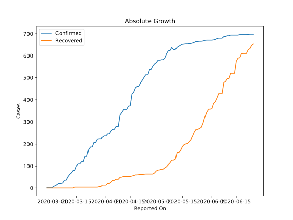
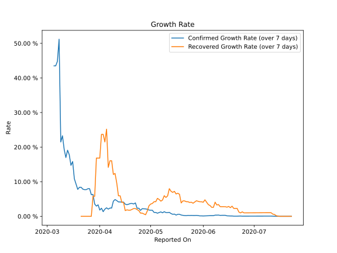

# Country Figures: Growth Rate for SanMarino 

The growth rates below are calculated based on
* an exponential growth assumption
* for time difference of past seven (7) days.
The growth rate is to be understood as on "growth per day".

The first growth rate indicates the increase of confirmed (infected) cases.

The second growth rate indicates the increase of recovered (healed) cases.

| Reported On | Confirmed | Growth Rate (Confirmed) | Recovered | Growth Rate (Recovered) |
|-------------|-----------|-------------------------|-----------|-------------------------|
| 2020-05-02 | 580 |  1.75 %  | 83 |  3.714 %  | 
| 2020-05-01 | 580 |  1.75 %  | 82 |  3.541 %  | 
| 2020-04-30 | 569 |  1.82 %  | 78 |  3.051 %  | 
| 2020-04-29 | 563 |  2.04 %  | 69 |  1.528 %  | 
| 2020-04-28 | 553 |  2.14 %  | 64 |  0.454 %  | 
| 2020-04-27 | 538 |  2.18 %  | 64 |  0.686 %  | 
| 2020-04-26 | 538 |  2.21 %  | 64 |  0.922 %  | 
| 2020-04-25 | 513 |  1.71 %  | 64 |  0.922 %  | 
| 2020-04-24 | 513 |  2.36 %  | 64 |  1.655 %  | 
| 2020-04-23 | 501 |  2.32 %  | 63 |  1.940 %  | 
| 2020-04-22 | 488 |  3.88 %  | 62 |  2.241 %  | 
| 2020-04-21 | 476 |  3.56 %  | 62 |  2.241 %  | 
| 2020-04-20 | 462 |  3.72 %  | 61 |  2.008 %  | 
| 2020-04-19 | 461 |  3.69 %  | 60 |  1.772 %  | 
| 2020-04-18 | 455 |  3.51 %  | 60 |  1.772 %  | 
| 2020-04-17 | 435 |  3.35 %  | 57 |  1.872 %  | 
| 2020-04-16 | 426 |  3.52 %  | 55 |  1.650 %  | 
| 2020-04-15 | 372 |  4.11 %  | 53 |  4.020 %  | 
| 2020-04-14 | 371 |  4.07 %  | 53 |  4.020 %  | 
| 2020-04-13 | 356 |  4.16 %  | 53 |  5.928 %  | 
| 2020-04-12 | 356 |  4.16 %  | 53 |  5.928 %  | 
| 2020-04-11 | 356 |  4.54 %  | 53 |  9.635 %  | 
| 2020-04-10 | 344 |  4.85 %  | 50 |  12.393 %  | 
| 2020-04-09 | 333 |  4.38 %  | 49 |  12.104 %  | 
| 2020-04-08 | 279 |  2.39 %  | 40 |  16.056 %  | 
| 2020-04-07 | 279 |  2.39 %  | 40 |  16.056 %  | 
| 2020-04-06 | 266 |  2.08 %  | 35 |  14.149 %  | 
| 2020-04-05 | 266 |  2.46 %  | 35 |  25.194 %  | 
| 2020-04-04 | 259 |  2.07 %  | 27 |  21.487 %  | 
| 2020-04-03 | 245 |  1.34 %  | 21 |  23.689 %  | 
| 2020-04-02 | 245 |  2.34 %  | 21 |  23.689 %  | 
| 2020-04-01 | 236 |  1.80 %  | 13 |  16.838 %  | 
| 2020-03-31 | 236 |  3.32 %  | 13 |  16.838 %  | 
| 2020-03-30 | 230 |  2.96 %  | 13 |  16.838 %  | 
| 2020-03-29 | 224 |  3.53 %  | 6 |  5.792 %  | 
| 2020-03-28 | 224 |  6.31 %  | 6 |  5.792 %  | 
| 2020-03-27 | 223 |  6.25 %  | 4 |  None  | 
| 2020-03-26 | 208 |  7.98 %  | 4 |  None  | 
| 2020-03-25 | 208 |  7.98 %  | 4 |  None  | 
| 2020-03-24 | 187 |  7.71 %  | 4 |  None  | 
| 2020-03-23 | 187 |  7.71 %  | 4 |  None  | 
| 2020-03-22 | 175 |  7.85 %  | 4 |  None  | 
| 2020-03-21 | 144 |  8.40 %  | 4 |  None  | 
| 2020-03-20 | 144 |  8.40 %  | 4 |  None  | 
| 2020-03-19 | 119 |  7.79 %  | 4 |  None  | 
| 2020-03-18 | 119 |  9.31 %  | 4 |  None  | 
| 2020-03-17 | 109 |  10.85 %  | 4 |  None  | 
| 2020-03-16 | 109 |  15.83 %  | 4 |  None  | 
| 2020-03-15 | 101 |  14.74 %  | 4 |  None  | 
| 2020-03-14 | 80 |  17.81 %  | 4 |  None  | 
| 2020-03-13 | 80 |  19.11 %  | 0 |  None  | 
| 2020-03-12 | 69 |  16.99 %  | 0 |  None  | 
| 2020-03-11 | 62 |  19.35 %  | 0 |  None  | 
| 2020-03-10 | 51 |  23.27 %  | 0 |  None  | 
| 2020-03-09 | 36 |  21.49 %  | 0 |  None  | 
| 2020-03-08 | 36 |  51.19 %  | 0 |  None  | 
| 2020-03-07 | 23 |  44.79 %  | 0 |  None  | 
| 2020-03-06 | 21 |  43.49 %  | 0 |  None  | 
| 2020-03-05 | 21 |  43.49 %  | 0 |  None  | 
| 2020-03-04 | 16 |  None  | 0 |  None  | 
| 2020-03-03 | 10 |  None  | 0 |  None  | 
| 2020-03-02 | 8 |  None  | 0 |  None  | 
| 2020-03-01 | 1 |  None  | 0 |  None  | 
| 2020-02-29 | 1 |  None  | 0 |  None  | 
| 2020-02-28 | 1 |  None  | 0 |  None  | 
| 2020-02-27 | 1 |  None  | 0 |  None  | 

