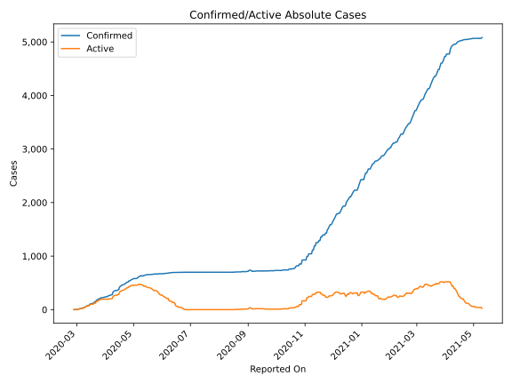
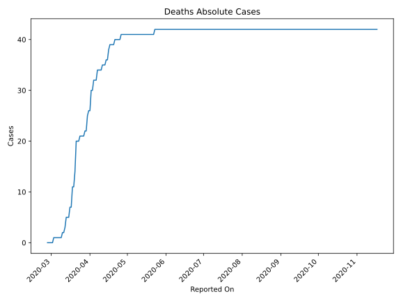
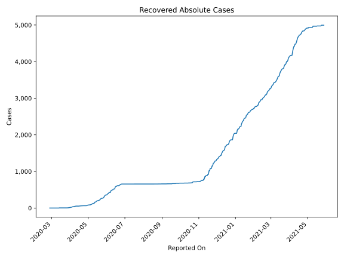
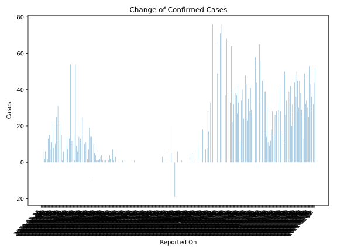
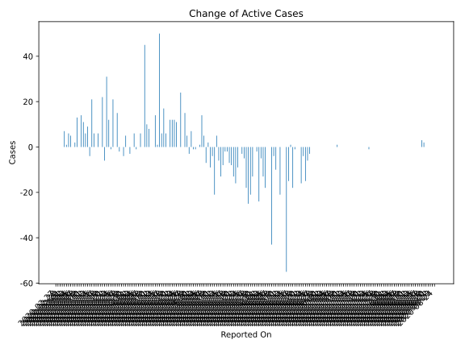
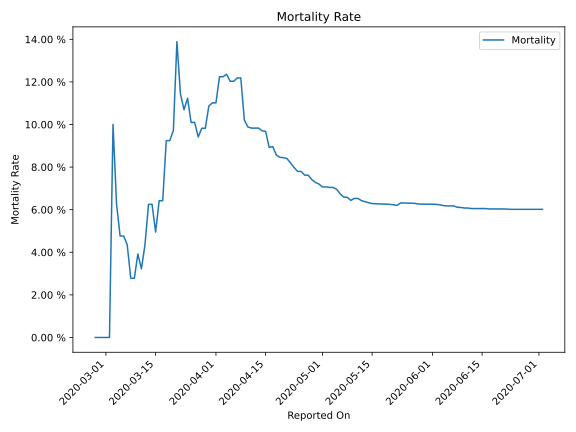

# Country Figures: Time Series for SanMarino 

| Reported On | Confirmed | Deaths | Recovered | Active | Mortality | &Delta; Confirmed | &Delta; Deaths | &Delta; Recovered | &Delta; Active | % Active of Population |
|-------------|-----------|--------|-----------|--------|-----------|-------------------|----------------|-------------------|----------------|------------------------|
| 2020-04-16 | 426 | 38 | 55 | 333 |  8.92 %  | 54 | 2 | 2 | 50 |  0.986 %  | 
| 2020-04-15 | 372 | 36 | 53 | 283 |  9.68 %  | 1 | 0 | 0 | 1 |  0.838 %  | 
| 2020-04-14 | 371 | 36 | 53 | 282 |  9.70 %  | 15 | 1 | 0 | 14 |  0.835 %  | 
| 2020-04-13 | 356 | 35 | 53 | 268 |  9.83 %  | 0 | 0 | 0 | 0 |  0.793 %  | 
| 2020-04-12 | 356 | 35 | 53 | 268 |  9.83 %  | 0 | 0 | 0 | 0 |  0.793 %  | 
| 2020-04-11 | 356 | 35 | 53 | 268 |  9.83 %  | 12 | 1 | 3 | 8 |  0.793 %  | 
| 2020-04-10 | 344 | 34 | 50 | 260 |  9.88 %  | 11 | 0 | 1 | 10 |  0.770 %  | 
| 2020-04-09 | 333 | 34 | 49 | 250 |  10.21 %  | 54 | 0 | 9 | 45 |  0.740 %  | 
| 2020-04-08 | 279 | 34 | 40 | 205 |  12.19 %  | 0 | 0 | 0 | 0 |  0.607 %  | 
| 2020-04-07 | 279 | 34 | 40 | 205 |  12.19 %  | 13 | 2 | 5 | 6 |  0.607 %  | 
| 2020-04-06 | 266 | 32 | 35 | 199 |  12.03 %  | 0 | 0 | 0 | 0 |  0.589 %  | 
| 2020-04-05 | 266 | 32 | 35 | 199 |  12.03 %  | 7 | 0 | 8 | -1 |  0.589 %  | 
| 2020-04-04 | 259 | 32 | 27 | 200 |  12.36 %  | 14 | 2 | 6 | 6 |  0.592 %  | 
| 2020-04-03 | 245 | 30 | 21 | 194 |  12.24 %  | 0 | 0 | 0 | 0 |  0.574 %  | 
| 2020-04-02 | 245 | 30 | 21 | 194 |  12.24 %  | 9 | 4 | 8 | -3 |  0.574 %  | 
| 2020-04-01 | 236 | 26 | 13 | 197 |  11.02 %  | 0 | 0 | 0 | 0 |  0.583 %  | 
| 2020-03-31 | 236 | 26 | 13 | 197 |  11.02 %  | 6 | 1 | 0 | 5 |  0.583 %  | 
| 2020-03-30 | 230 | 25 | 13 | 192 |  10.87 %  | 6 | 3 | 7 | -4 |  0.568 %  | 
| 2020-03-29 | 224 | 22 | 6 | 196 |  9.82 %  | 0 | 0 | 0 | 0 |  0.580 %  | 
| 2020-03-28 | 224 | 22 | 6 | 196 |  9.82 %  | 1 | 1 | 2 | -2 |  0.580 %  | 
| 2020-03-27 | 223 | 21 | 4 | 198 |  9.42 %  | 15 | 0 | 0 | 15 |  0.586 %  | 
| 2020-03-26 | 208 | 21 | 4 | 183 |  10.10 %  | 0 | 0 | 0 | 0 |  0.542 %  | 
| 2020-03-25 | 208 | 21 | 4 | 183 |  10.10 %  | 21 | 0 | 0 | 21 |  0.542 %  | 
| 2020-03-24 | 187 | 21 | 4 | 162 |  11.23 %  | 0 | 1 | 0 | -1 |  0.480 %  | 
| 2020-03-23 | 187 | 20 | 4 | 163 |  10.70 %  | 12 | 0 | 0 | 12 |  0.482 %  | 
| 2020-03-22 | 175 | 20 | 4 | 151 |  11.43 %  | 31 | 0 | 0 | 31 |  0.447 %  | 
| 2020-03-21 | 144 | 20 | 4 | 120 |  13.89 %  | 0 | 6 | 0 | -6 |  0.355 %  | 
| 2020-03-20 | 144 | 14 | 4 | 126 |  9.72 %  | 25 | 3 | 0 | 22 |  0.373 %  | 
| 2020-03-19 | 119 | 11 | 4 | 104 |  9.24 %  | 0 | 0 | 0 | 0 |  0.308 %  | 
| 2020-03-18 | 119 | 11 | 4 | 104 |  9.24 %  | 10 | 4 | 0 | 6 |  0.308 %  | 
| 2020-03-17 | 109 | 7 | 4 | 98 |  6.42 %  | 0 | 0 | 0 | 0 |  0.290 %  | 
| 2020-03-16 | 109 | 7 | 4 | 98 |  6.42 %  | 8 | 2 | 0 | 6 |  0.290 %  | 
| 2020-03-15 | 101 | 5 | 4 | 92 |  4.95 %  | 21 | 0 | 0 | 21 |  0.272 %  | 
| 2020-03-14 | 80 | 5 | 4 | 71 |  6.25 %  | 0 | 0 | 4 | -4 |  0.210 %  | 
| 2020-03-13 | 80 | 5 | 0 | 75 |  6.25 %  | 11 | 2 | 0 | 9 |  0.222 %  | 
| 2020-03-12 | 69 | 3 | 0 | 66 |  4.35 %  | 7 | 1 | 0 | 6 |  0.195 %  | 
| 2020-03-11 | 62 | 2 | 0 | 60 |  3.23 %  | 11 | 0 | 0 | 11 |  0.178 %  | 
| 2020-03-10 | 51 | 2 | 0 | 49 |  3.92 %  | 15 | 1 | 0 | 14 |  0.145 %  | 
| 2020-03-09 | 36 | 1 | 0 | 35 |  2.78 %  | 0 | 0 | 0 | 0 |  0.104 %  | 
| 2020-03-08 | 36 | 1 | 0 | 35 |  2.78 %  | 13 | 0 | 0 | 13 |  0.104 %  | 
| 2020-03-07 | 23 | 1 | 0 | 22 |  4.35 %  | 2 | 0 | 0 | 2 |  0.065 %  | 
| 2020-03-06 | 21 | 1 | 0 | 20 |  4.76 %  | 0 | 0 | 0 | 0 |  0.059 %  | 
| 2020-03-05 | 21 | 1 | 0 | 20 |  4.76 %  | 5 | 0 | 0 | 5 |  0.059 %  | 
| 2020-03-04 | 16 | 1 | 0 | 15 |  6.25 %  | 6 | 0 | 0 | 6 |  0.044 %  | 
| 2020-03-03 | 10 | 1 | 0 | 9 |  10.00 %  | 2 | 1 | 0 | 1 |  0.027 %  | 
| 2020-03-02 | 8 | 0 | 0 | 8 |  None  | 7 | 0 | 0 | 7 |  0.024 %  | 
| 2020-03-01 | 1 | 0 | 0 | 1 |  None  | 0 | 0 | 0 | 0 |  0.003 %  | 
| 2020-02-29 | 1 | 0 | 0 | 1 |  None  | 0 | 0 | 0 | 0 |  0.003 %  | 
| 2020-02-28 | 1 | 0 | 0 | 1 |  None  | 0 | 0 | 0 | 0 |  0.003 %  | 
| 2020-02-27 | 1 | 0 | 0 | 1 |  None  | None | None | None | None |  0.003 %  | 

