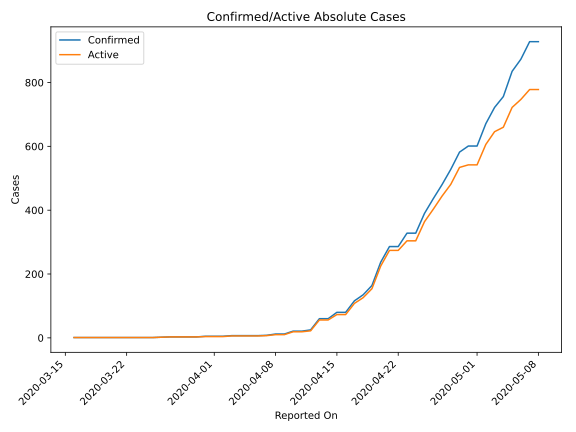
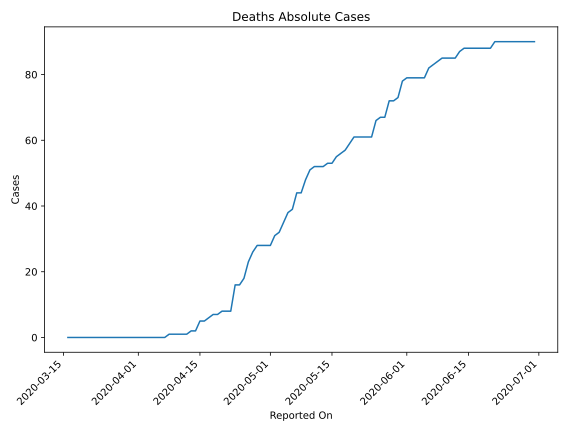
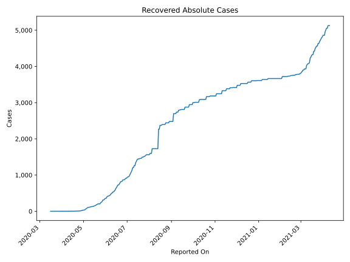
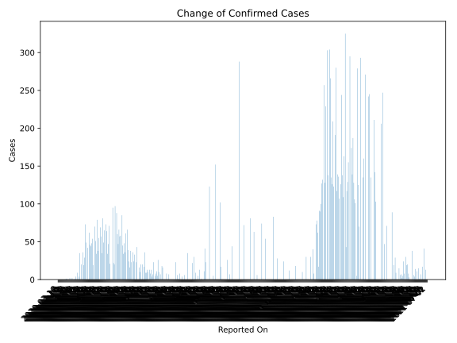
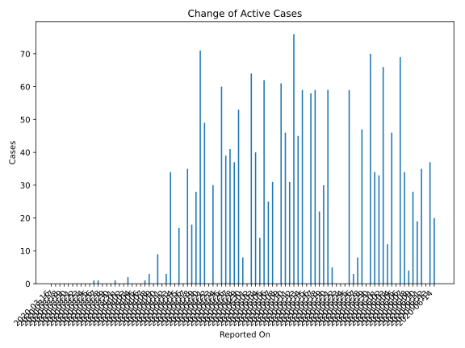
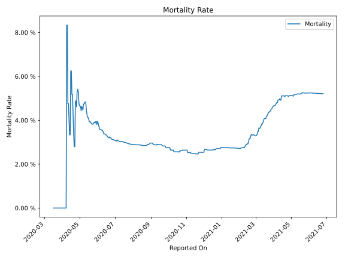

# Country Figures: Time Series for Somalia 

| Reported On | Confirmed | Deaths | Recovered | Active | Mortality | &Delta; Confirmed | &Delta; Deaths | &Delta; Recovered | &Delta; Active | % Active of Population |
|-------------|-----------|--------|-----------|--------|-----------|-------------------|----------------|-------------------|----------------|------------------------|
| 2020-04-26 | 436 | 23 | 10 | 403 |  5.28 %  | 46 | 5 | 2 | 39 |  0.003 %  | 
| 2020-04-25 | 390 | 18 | 8 | 364 |  4.62 %  | 62 | 2 | 0 | 60 |  0.002 %  | 
| 2020-04-24 | 328 | 16 | 8 | 304 |  4.88 %  | 0 | 0 | 0 | 0 |  0.002 %  | 
| 2020-04-23 | 328 | 16 | 8 | 304 |  4.88 %  | 42 | 8 | 4 | 30 |  0.002 %  | 
| 2020-04-22 | 286 | 8 | 4 | 274 |  2.80 %  | 0 | 0 | 0 | 0 |  0.002 %  | 
| 2020-04-21 | 286 | 8 | 4 | 274 |  2.80 %  | 49 | 0 | 0 | 49 |  0.002 %  | 
| 2020-04-20 | 237 | 8 | 4 | 225 |  3.38 %  | 73 | 1 | 1 | 71 |  0.001 %  | 
| 2020-04-19 | 164 | 7 | 3 | 154 |  4.27 %  | 29 | 0 | 1 | 28 |  0.001 %  | 
| 2020-04-18 | 135 | 7 | 2 | 126 |  5.19 %  | 19 | 1 | 0 | 18 |  0.001 %  | 
| 2020-04-17 | 116 | 6 | 2 | 108 |  5.17 %  | 36 | 1 | 0 | 35 |  0.001 %  | 
| 2020-04-16 | 80 | 5 | 2 | 73 |  6.25 %  | 0 | 0 | 0 | 0 |  0.000 %  | 
| 2020-04-15 | 80 | 5 | 2 | 73 |  6.25 %  | 20 | 3 | 0 | 17 |  0.000 %  | 
| 2020-04-14 | 60 | 2 | 2 | 56 |  3.33 %  | 0 | 0 | 0 | 0 |  0.000 %  | 
| 2020-04-13 | 60 | 2 | 2 | 56 |  3.33 %  | 35 | 1 | 0 | 34 |  0.000 %  | 
| 2020-04-12 | 25 | 1 | 2 | 22 |  4.00 %  | 4 | 0 | 1 | 3 |  0.000 %  | 
| 2020-04-11 | 21 | 1 | 1 | 19 |  4.76 %  | 0 | 0 | 0 | 0 |  0.000 %  | 
| 2020-04-10 | 21 | 1 | 1 | 19 |  4.76 %  | 9 | 0 | 0 | 9 |  0.000 %  | 
| 2020-04-09 | 12 | 1 | 1 | 10 |  8.33 %  | 0 | 0 | 0 | 0 |  0.000 %  | 
| 2020-04-08 | 12 | 1 | 1 | 10 |  8.33 %  | 4 | 1 | 0 | 3 |  0.000 %  | 
| 2020-04-07 | 8 | 0 | 1 | 7 |  None  | 1 | 0 | 0 | 1 |  0.000 %  | 
| 2020-04-06 | 7 | 0 | 1 | 6 |  None  | 0 | 0 | 0 | 0 |  0.000 %  | 
| 2020-04-05 | 7 | 0 | 1 | 6 |  None  | 0 | 0 | 0 | 0 |  0.000 %  | 
| 2020-04-04 | 7 | 0 | 1 | 6 |  None  | 0 | 0 | 0 | 0 |  0.000 %  | 
| 2020-04-03 | 7 | 0 | 1 | 6 |  None  | 2 | 0 | 0 | 2 |  0.000 %  | 
| 2020-04-02 | 5 | 0 | 1 | 4 |  None  | 0 | 0 | 0 | 0 |  0.000 %  | 
| 2020-04-01 | 5 | 0 | 1 | 4 |  None  | 0 | 0 | 0 | 0 |  0.000 %  | 
| 2020-03-31 | 5 | 0 | 1 | 4 |  None  | 2 | 0 | 1 | 1 |  0.000 %  | 
| 2020-03-30 | 3 | 0 | 0 | 3 |  None  | 0 | 0 | 0 | 0 |  0.000 %  | 
| 2020-03-29 | 3 | 0 | 0 | 3 |  None  | 0 | 0 | 0 | 0 |  0.000 %  | 
| 2020-03-28 | 3 | 0 | 0 | 3 |  None  | 0 | 0 | 0 | 0 |  0.000 %  | 
| 2020-03-27 | 3 | 0 | 0 | 3 |  None  | 1 | 0 | 0 | 1 |  0.000 %  | 
| 2020-03-26 | 2 | 0 | 0 | 2 |  None  | 1 | 0 | 0 | 1 |  0.000 %  | 
| 2020-03-25 | 1 | 0 | 0 | 1 |  None  | 0 | 0 | 0 | 0 |  0.000 %  | 
| 2020-03-24 | 1 | 0 | 0 | 1 |  None  | 0 | 0 | 0 | 0 |  0.000 %  | 
| 2020-03-23 | 1 | 0 | 0 | 1 |  None  | 0 | 0 | 0 | 0 |  0.000 %  | 
| 2020-03-22 | 1 | 0 | 0 | 1 |  None  | 0 | 0 | 0 | 0 |  0.000 %  | 
| 2020-03-21 | 1 | 0 | 0 | 1 |  None  | 0 | 0 | 0 | 0 |  0.000 %  | 
| 2020-03-20 | 1 | 0 | 0 | 1 |  None  | 0 | 0 | 0 | 0 |  0.000 %  | 
| 2020-03-19 | 1 | 0 | 0 | 1 |  None  | 0 | 0 | 0 | 0 |  0.000 %  | 
| 2020-03-18 | 1 | 0 | 0 | 1 |  None  | 0 | 0 | 0 | 0 |  0.000 %  | 
| 2020-03-17 | 1 | 0 | 0 | 1 |  None  | 0 | 0 | 0 | 0 |  0.000 %  | 
| 2020-03-16 | 1 | 0 | 0 | 1 |  None  | None | None | None | None |  0.000 %  | 

