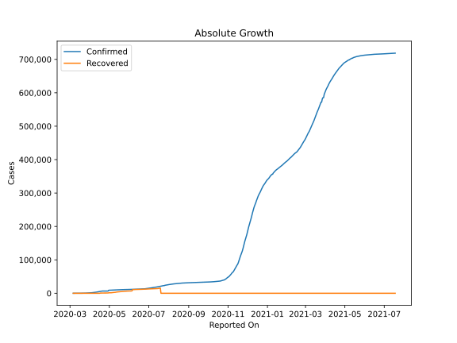
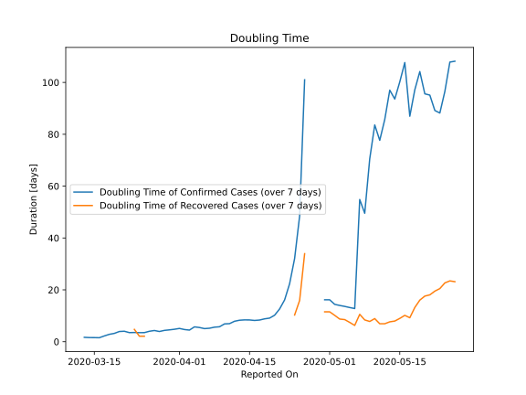

# Country Figures: Doubling Time of Infections for Serbia 

The doubling time below are calculated based on
* an exponential growth assumption
* for time difference of past seven (7) days.
The doubling time's unit is "days".

The first doubling time indicates the increase of confirmed (infected)
cases. There, the *higher* the number is, the better is to take control
of the disease.

The second doubling time indicates the increase of recovered (healed)
cases. There, the *lower* the number is, the better it is to take
control of the disease.

| Reported On | Confirmed | Doubling Time (Confirmed) | Recovered | Doubling Time (Recovered) |
|-------------|-----------|---------------------------|-----------|---------------------------|
| 2020-05-06 | 9791 |  12.8 days  | 1971 |  6.3 days  | 
| 2020-05-05 | 9677 |  13.2 days  | 1723 |  7.4 days  | 
| 2020-05-04 | 9557 |  13.6 days  | 1574 |  8.5 days  | 
| 2020-05-03 | 9464 |  14.0 days  | 1551 |  8.7 days  | 
| 2020-05-02 | 9362 |  14.4 days  | 1426 |  10.2 days  | 
| 2020-05-01 | 9009 |  16.2 days  | 1343 |  11.5 days  | 
| 2020-04-30 | 9009 |  16.2 days  | 1343 |  11.5 days  | 
| 2020-04-29 | 6630 |  None  | 870 |  None  | 
| 2020-04-28 | 6630 |  None  | 870 |  None  | 
| 2020-04-27 | 6630 |  None  | 870 |  None  | 
| 2020-04-26 | 6630 |  101.0 days  | 870 |  33.9 days  | 
| 2020-04-25 | 6630 |  48.5 days  | 870 |  15.9 days  | 
| 2020-04-24 | 6630 |  32.1 days  | 870 |  10.3 days  | 
| 2020-04-23 | 6630 |  22.3 days  | 870 |  None  | 
| 2020-04-22 | 6630 |  16.1 days  | 870 |  None  | 
| 2020-04-21 | 6630 |  12.6 days  | 870 |  None  | 
| 2020-04-20 | 6630 |  10.2 days  | 870 |  None  | 
| 2020-04-19 | 6318 |  9.1 days  | 753 |  None  | 
| 2020-04-18 | 5994 |  8.8 days  | 637 |  None  | 
| 2020-04-17 | 5690 |  8.4 days  | 534 |  None  | 
| 2020-04-16 | 5318 |  8.2 days  | 0 |  None  | 
| 2020-04-15 | 4873 |  8.4 days  | 0 |  None  | 
| 2020-04-14 | 4465 |  8.4 days  | 0 |  None  | 
| 2020-04-13 | 4054 |  8.3 days  | 0 |  None  | 
| 2020-04-12 | 3630 |  7.9 days  | 0 |  None  | 
| 2020-04-11 | 3380 |  7.0 days  | 0 |  None  | 
| 2020-04-10 | 3105 |  6.9 days  | 0 |  None  | 
| 2020-04-09 | 2867 |  5.8 days  | 0 |  None  | 
| 2020-04-08 | 2666 |  5.6 days  | 0 |  None  | 
| 2020-04-07 | 2447 |  5.2 days  | 0 |  None  | 
| 2020-04-06 | 2200 |  5.0 days  | 0 |  None  | 
| 2020-04-05 | 1908 |  5.5 days  | 0 |  None  | 
| 2020-04-04 | 1624 |  5.7 days  | 0 |  None  | 
| 2020-04-03 | 1476 |  4.5 days  | 0 |  None  | 
| 2020-04-02 | 1171 |  4.7 days  | 0 |  None  | 
| 2020-04-01 | 1060 |  5.1 days  | 0 |  None  | 
| 2020-03-31 | 900 |  4.8 days  | 0 |  None  | 
| 2020-03-30 | 785 |  4.6 days  | 0 |  None  | 
| 2020-03-29 | 741 |  4.4 days  | 0 |  None  | 
| 2020-03-28 | 659 |  3.9 days  | 0 |  None  | 
| 2020-03-27 | 457 |  4.3 days  | 0 |  None  | 
| 2020-03-26 | 384 |  4.0 days  | 0 |  None  | 
| 2020-03-25 | 384 |  3.5 days  | 15 |  2.1 days  | 
| 2020-03-24 | 303 |  3.5 days  | 15 |  2.1 days  | 
| 2020-03-23 | 249 |  3.5 days  | 3 |  4.8 days  | 
| 2020-03-22 | 222 |  3.5 days  | 2 |  None  | 
| 2020-03-21 | 171 |  4.0 days  | 1 |  None  | 
| 2020-03-20 | 135 |  3.9 days  | 1 |  None  | 
| 2020-03-19 | 103 |  3.2 days  | 1 |  None  | 
| 2020-03-18 | 83 |  2.8 days  | 1 |  None  | 
| 2020-03-17 | 65 |  2.2 days  | 1 |  None  | 
| 2020-03-16 | 55 |  1.5 days  | 1 |  None  | 
| 2020-03-15 | 48 |  1.6 days  | 0 |  None  | 
| 2020-03-14 | 46 |  1.6 days  | 0 |  None  | 
| 2020-03-13 | 35 |  1.7 days  | 0 |  None  | 
| 2020-03-12 | 19 |  None  | 0 |  None  | 
| 2020-03-11 | 12 |  None  | 0 |  None  | 
| 2020-03-10 | 5 |  None  | 0 |  None  | 
| 2020-03-09 | 1 |  None  | 0 |  None  | 
| 2020-03-08 | 1 |  None  | 0 |  None  | 
| 2020-03-07 | 1 |  None  | 0 |  None  | 
| 2020-03-06 | 1 |  None  | 0 |  None  | 

