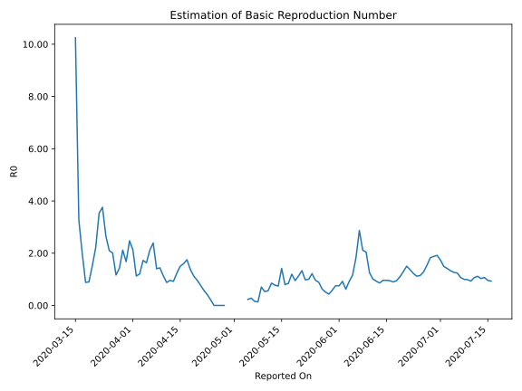

# Country Figures: Time Series for Basic Reproduction Number of Serbia 

| Reported On | &Delta; Confirmed | Total &Delta; Confirmed First Interval | Total &Delta; Confirmed Second Interval | Estimated Basic Reproduction Number R0 | 
|-------------|-------------------|----------------------------------------|-----------------------------------------|---------------------------------------------------|
| 2020-05-03 | 102 |  2732  |  None  |  None  | 
| 2020-05-02 | 353 |  2379  |  None  |  None  | 
| 2020-05-01 | 0 |  2379  |  None  |  None  | 
| 2020-04-30 | 2379 |  None  |  None  |  None  | 
| 2020-04-29 | 0 |  None  |  None  |  None  | 
| 2020-04-28 | 0 |  None  |  312  |  None  | 
| 2020-04-27 | 0 |  None  |  636  |  None  | 
| 2020-04-26 | 0 |  None  |  940  |  None  | 
| 2020-04-25 | 0 |  None  |  1312  |  None  | 
| 2020-04-24 | 0 |  312  |  1445  |  0.22  | 
| 2020-04-23 | 0 |  636  |  1529  |  0.42  | 
| 2020-04-22 | 0 |  940  |  1636  |  0.57  | 
| 2020-04-21 | 0 |  1312  |  1688  |  0.78  | 
| 2020-04-20 | 312 |  1445  |  1493  |  0.97  | 
| 2020-04-19 | 324 |  1529  |  1360  |  1.12  | 
| 2020-04-18 | 304 |  1636  |  1187  |  1.38  | 
| 2020-04-17 | 372 |  1688  |  964  |  1.75  | 
| 2020-04-16 | 445 |  1493  |  933  |  1.60  | 
| 2020-04-15 | 408 |  1360  |  905  |  1.50  | 
| 2020-04-14 | 411 |  1187  |  959  |  1.24  | 
| 2020-04-13 | 424 |  964  |  1042  |  0.93  | 
| 2020-04-12 | 250 |  933  |  971  |  0.96  | 
| 2020-04-11 | 275 |  905  |  1029  |  0.88  | 
| 2020-04-10 | 238 |  959  |  848  |  1.13  | 
| 2020-04-09 | 201 |  1042  |  724  |  1.44  | 
| 2020-04-08 | 219 |  971  |  691  |  1.41  | 
| 2020-04-07 | 247 |  1029  |  430  |  2.39  | 
| 2020-04-06 | 292 |  848  |  401  |  2.11  | 
| 2020-04-05 | 284 |  724  |  443  |  1.63  | 
| 2020-04-04 | 148 |  691  |  401  |  1.72  | 
| 2020-04-03 | 305 |  430  |  357  |  1.20  | 
| 2020-04-02 | 111 |  401  |  356  |  1.13  | 
| 2020-04-01 | 160 |  443  |  208  |  2.13  | 
| 2020-03-31 | 115 |  401  |  162  |  2.48  | 
| 2020-03-30 | 44 |  357  |  213  |  1.68  | 
| 2020-03-29 | 82 |  356  |  168  |  2.12  | 
| 2020-03-28 | 202 |  208  |  146  |  1.42  | 
| 2020-03-27 | 73 |  162  |  139  |  1.17  | 
| 2020-03-26 | 0 |  213  |  106  |  2.01  | 
| 2020-03-25 | 81 |  168  |  80  |  2.10  | 
| 2020-03-24 | 54 |  146  |  55  |  2.65  | 
| 2020-03-23 | 27 |  139  |  37  |  3.76  | 
| 2020-03-22 | 51 |  106  |  30  |  3.53  | 
| 2020-03-21 | 36 |  80  |  36  |  2.22  | 
| 2020-03-20 | 32 |  55  |  36  |  1.53  | 
| 2020-03-19 | 20 |  37  |  41  |  0.90  | 
| 2020-03-18 | 18 |  30  |  34  |  0.88  | 
| 2020-03-17 | 10 |  36  |  18  |  2.00  | 
| 2020-03-16 | 7 |  36  |  11  |  3.27  | 
| 2020-03-15 | 2 |  41  |  4  |  10.25  | 
| 2020-03-14 | 11 |  34  |  None  |  None  | 
| 2020-03-13 | 16 |  18  |  None  |  None  | 
| 2020-03-12 | 7 |  11  |  None  |  None  | 
| 2020-03-11 | 7 |  4  |  None  |  None  | 
| 2020-03-10 | 4 |  None  |  None  |  None  | 
| 2020-03-09 | 0 |  None  |  None  |  None  | 
| 2020-03-08 | 0 |  None  |  None  |  None  | 
| 2020-03-07 | 0 |  None  |  None  |  None  | 
| 2020-03-06 | None |  None  |  None  |  None  | 

