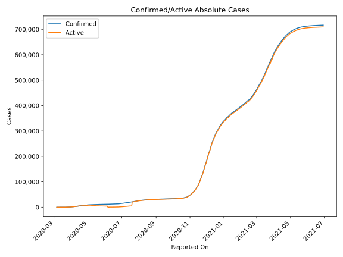
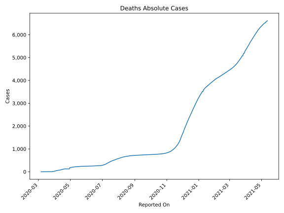
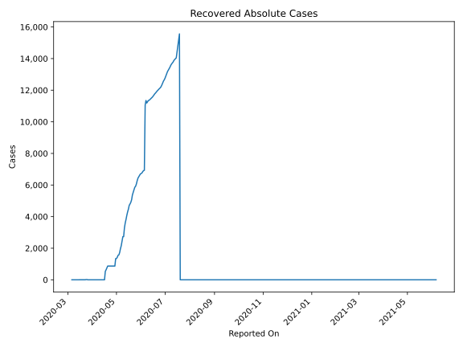
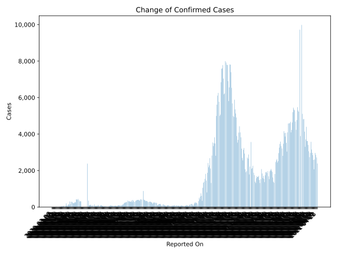
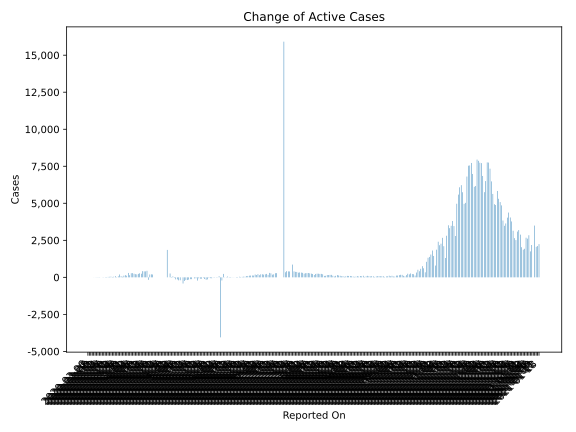
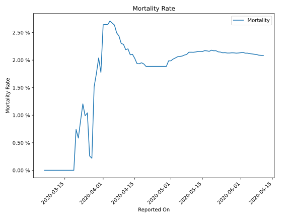

# Country Figures: Time Series for Serbia 

| Reported On | Confirmed | Deaths | Recovered | Active | Mortality | &Delta; Confirmed | &Delta; Deaths | &Delta; Recovered | &Delta; Active | % Active of Population |
|-------------|-----------|--------|-----------|--------|-----------|-------------------|----------------|-------------------|----------------|------------------------|
| 2020-04-30 | 9009 | 179 | 1343 | 7487 |  1.99 %  | 2379 | 54 | 473 | 1852 |  0.107 %  | 
| 2020-04-29 | 6630 | 125 | 870 | 5635 |  1.89 %  | 0 | 0 | 0 | 0 |  0.081 %  | 
| 2020-04-28 | 6630 | 125 | 870 | 5635 |  1.89 %  | 0 | 0 | 0 | 0 |  0.081 %  | 
| 2020-04-27 | 6630 | 125 | 870 | 5635 |  1.89 %  | 0 | 0 | 0 | 0 |  0.081 %  | 
| 2020-04-26 | 6630 | 125 | 870 | 5635 |  1.89 %  | 0 | 0 | 0 | 0 |  0.081 %  | 
| 2020-04-25 | 6630 | 125 | 870 | 5635 |  1.89 %  | 0 | 0 | 0 | 0 |  0.081 %  | 
| 2020-04-24 | 6630 | 125 | 870 | 5635 |  1.89 %  | 0 | 0 | 0 | 0 |  0.081 %  | 
| 2020-04-23 | 6630 | 125 | 870 | 5635 |  1.89 %  | 0 | 0 | 0 | 0 |  0.081 %  | 
| 2020-04-22 | 6630 | 125 | 870 | 5635 |  1.89 %  | 0 | 0 | 0 | 0 |  0.081 %  | 
| 2020-04-21 | 6630 | 125 | 870 | 5635 |  1.89 %  | 0 | 0 | 0 | 0 |  0.081 %  | 
| 2020-04-20 | 6630 | 125 | 870 | 5635 |  1.89 %  | 312 | 3 | 117 | 192 |  0.081 %  | 
| 2020-04-19 | 6318 | 122 | 753 | 5443 |  1.93 %  | 324 | 5 | 116 | 203 |  0.078 %  | 
| 2020-04-18 | 5994 | 117 | 637 | 5240 |  1.95 %  | 304 | 7 | 103 | 194 |  0.075 %  | 
| 2020-04-17 | 5690 | 110 | 534 | 5046 |  1.93 %  | 372 | 7 | 534 | -169 |  0.072 %  | 
| 2020-04-16 | 5318 | 103 | 0 | 5215 |  1.94 %  | 445 | 4 | 0 | 441 |  0.075 %  | 
| 2020-04-15 | 4873 | 99 | 0 | 4774 |  2.03 %  | 408 | 5 | 0 | 403 |  0.068 %  | 
| 2020-04-14 | 4465 | 94 | 0 | 4371 |  2.11 %  | 411 | 9 | 0 | 402 |  0.063 %  | 
| 2020-04-13 | 4054 | 85 | 0 | 3969 |  2.10 %  | 424 | 5 | 0 | 419 |  0.057 %  | 
| 2020-04-12 | 3630 | 80 | 0 | 3550 |  2.20 %  | 250 | 6 | 0 | 244 |  0.051 %  | 
| 2020-04-11 | 3380 | 74 | 0 | 3306 |  2.19 %  | 275 | 3 | 0 | 272 |  0.047 %  | 
| 2020-04-10 | 3105 | 71 | 0 | 3034 |  2.29 %  | 238 | 5 | 0 | 233 |  0.043 %  | 
| 2020-04-09 | 2867 | 66 | 0 | 2801 |  2.30 %  | 201 | 1 | 0 | 200 |  0.040 %  | 
| 2020-04-08 | 2666 | 65 | 0 | 2601 |  2.44 %  | 219 | 4 | 0 | 215 |  0.037 %  | 
| 2020-04-07 | 2447 | 61 | 0 | 2386 |  2.49 %  | 247 | 3 | 0 | 244 |  0.034 %  | 
| 2020-04-06 | 2200 | 58 | 0 | 2142 |  2.64 %  | 292 | 7 | 0 | 285 |  0.031 %  | 
| 2020-04-05 | 1908 | 51 | 0 | 1857 |  2.67 %  | 284 | 7 | 0 | 277 |  0.027 %  | 
| 2020-04-04 | 1624 | 44 | 0 | 1580 |  2.71 %  | 148 | 5 | 0 | 143 |  0.023 %  | 
| 2020-04-03 | 1476 | 39 | 0 | 1437 |  2.64 %  | 305 | 8 | 0 | 297 |  0.021 %  | 
| 2020-04-02 | 1171 | 31 | 0 | 1140 |  2.65 %  | 111 | 3 | 0 | 108 |  0.016 %  | 
| 2020-04-01 | 1060 | 28 | 0 | 1032 |  2.64 %  | 160 | 12 | 0 | 148 |  0.015 %  | 
| 2020-03-31 | 900 | 16 | 0 | 884 |  1.78 %  | 115 | 0 | 0 | 115 |  0.013 %  | 
| 2020-03-30 | 785 | 16 | 0 | 769 |  2.04 %  | 44 | 3 | 0 | 41 |  0.011 %  | 
| 2020-03-29 | 741 | 13 | 0 | 728 |  1.75 %  | 82 | 3 | 0 | 79 |  0.010 %  | 
| 2020-03-28 | 659 | 10 | 0 | 649 |  1.52 %  | 202 | 9 | 0 | 193 |  0.009 %  | 
| 2020-03-27 | 457 | 1 | 0 | 456 |  0.22 %  | 73 | 0 | 0 | 73 |  0.007 %  | 
| 2020-03-26 | 384 | 1 | 0 | 383 |  0.26 %  | 0 | -3 | -15 | 18 |  0.005 %  | 
| 2020-03-25 | 384 | 4 | 15 | 365 |  1.04 %  | 81 | 1 | 0 | 80 |  0.005 %  | 
| 2020-03-24 | 303 | 3 | 15 | 285 |  0.99 %  | 54 | 0 | 12 | 42 |  0.004 %  | 
| 2020-03-23 | 249 | 3 | 3 | 243 |  1.20 %  | 27 | 1 | 1 | 25 |  0.003 %  | 
| 2020-03-22 | 222 | 2 | 2 | 218 |  0.90 %  | 51 | 1 | 1 | 49 |  0.003 %  | 
| 2020-03-21 | 171 | 1 | 1 | 169 |  0.58 %  | 36 | 0 | 0 | 36 |  0.002 %  | 
| 2020-03-20 | 135 | 1 | 1 | 133 |  0.74 %  | 32 | 1 | 0 | 31 |  0.002 %  | 
| 2020-03-19 | 103 | 0 | 1 | 102 |  None  | 20 | 0 | 0 | 20 |  0.001 %  | 
| 2020-03-18 | 83 | 0 | 1 | 82 |  None  | 18 | 0 | 0 | 18 |  0.001 %  | 
| 2020-03-17 | 65 | 0 | 1 | 64 |  None  | 10 | 0 | 0 | 10 |  0.001 %  | 
| 2020-03-16 | 55 | 0 | 1 | 54 |  None  | 7 | 0 | 1 | 6 |  0.001 %  | 
| 2020-03-15 | 48 | 0 | 0 | 48 |  None  | 2 | 0 | 0 | 2 |  0.001 %  | 
| 2020-03-14 | 46 | 0 | 0 | 46 |  None  | 11 | 0 | 0 | 11 |  0.001 %  | 
| 2020-03-13 | 35 | 0 | 0 | 35 |  None  | 16 | 0 | 0 | 16 |  0.001 %  | 
| 2020-03-12 | 19 | 0 | 0 | 19 |  None  | 7 | 0 | 0 | 7 |  0.000 %  | 
| 2020-03-11 | 12 | 0 | 0 | 12 |  None  | 7 | 0 | 0 | 7 |  0.000 %  | 
| 2020-03-10 | 5 | 0 | 0 | 5 |  None  | 4 | 0 | 0 | 4 |  0.000 %  | 
| 2020-03-09 | 1 | 0 | 0 | 1 |  None  | 0 | 0 | 0 | 0 |  0.000 %  | 
| 2020-03-08 | 1 | 0 | 0 | 1 |  None  | 0 | 0 | 0 | 0 |  0.000 %  | 
| 2020-03-07 | 1 | 0 | 0 | 1 |  None  | 0 | 0 | 0 | 0 |  0.000 %  | 
| 2020-03-06 | 1 | 0 | 0 | 1 |  None  | None | None | None | None |  0.000 %  | 

