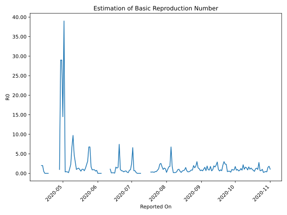

# Country Figures: Time Series for Basic Reproduction Number of SouthSudan 

| Reported On | &Delta; Confirmed | Total &Delta; Confirmed First Interval | Total &Delta; Confirmed Second Interval | Estimated Basic Reproduction Number R0 | 
|-------------|-------------------|----------------------------------------|-----------------------------------------|---------------------------------------------------|
| 2020-05-08 | 46 |  28  |  12  |  2.33  | 
| 2020-05-07 | 16 |  13  |  11  |  1.18  | 
| 2020-05-06 | 6 |  7  |  39  |  0.18  | 
| 2020-05-05 | 6 |  11  |  29  |  0.38  | 
| 2020-05-04 | 0 |  12  |  29  |  0.41  | 
| 2020-05-03 | 1 |  11  |  29  |  0.38  | 
| 2020-05-02 | 0 |  39  |  1  |  39.00  | 
| 2020-05-01 | 10 |  29  |  2  |  14.50  | 
| 2020-04-30 | 1 |  29  |  1  |  29.00  | 
| 2020-04-29 | 0 |  29  |  1  |  29.00  | 
| 2020-04-28 | 28 |  1  |  1  |  1.00  | 
| 2020-04-27 | 0 |  2  |  None  |  None  | 
| 2020-04-26 | 1 |  1  |  None  |  None  | 
| 2020-04-25 | 0 |  1  |  None  |  None  | 
| 2020-04-24 | 0 |  1  |  None  |  None  | 
| 2020-04-23 | 1 |  None  |  None  |  None  | 
| 2020-04-22 | 0 |  None  |  None  |  None  | 
| 2020-04-21 | 0 |  None  |  None  |  None  | 
| 2020-04-20 | 0 |  None  |  None  |  None  | 
| 2020-04-19 | 0 |  None  |  None  |  None  | 
| 2020-04-18 | 0 |  None  |  1  |  None  | 
| 2020-04-17 | 0 |  None  |  2  |  None  | 
| 2020-04-16 | 0 |  None  |  2  |  None  | 
| 2020-04-15 | 0 |  None  |  3  |  None  | 
| 2020-04-14 | 0 |  1  |  2  |  0.50  | 
| 2020-04-13 | 0 |  2  |  1  |  2.00  | 
| 2020-04-12 | 0 |  2  |  1  |  2.00  | 
| 2020-04-11 | 0 |  3  |  None  |  None  | 
| 2020-04-10 | 1 |  2  |  None  |  None  | 
| 2020-04-09 | 1 |  1  |  None  |  None  | 
| 2020-04-08 | 0 |  1  |  None  |  None  | 
| 2020-04-07 | 1 |  None  |  None  |  None  | 
| 2020-04-06 | 0 |  None  |  None  |  None  | 
| 2020-04-05 | None |  None  |  None  |  None  | 

