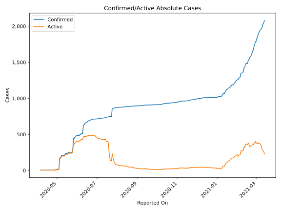
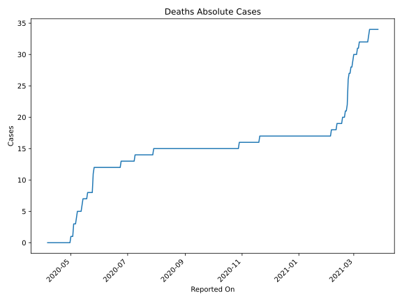
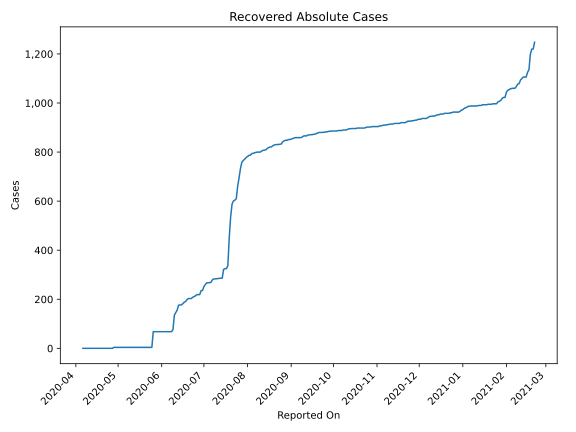
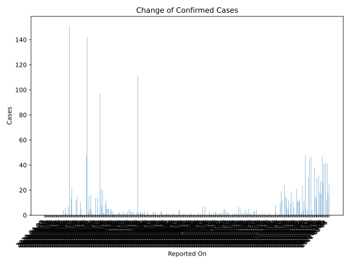
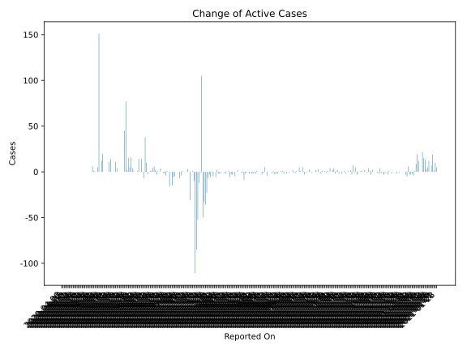
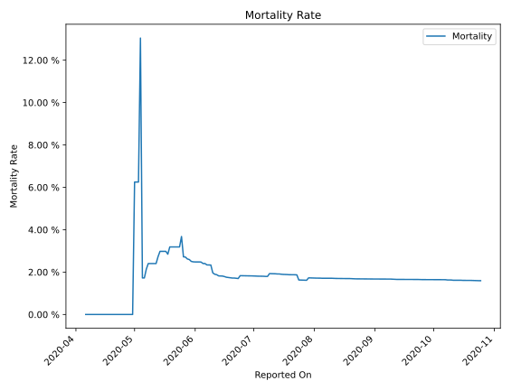

# Country Figures: Time Series for SaoTome and Principe 

| Reported On | Confirmed | Deaths | Recovered | Active | Mortality | &Delta; Confirmed | &Delta; Deaths | &Delta; Recovered | &Delta; Active | % Active of Population |
|-------------|-----------|--------|-----------|--------|-----------|-------------------|----------------|-------------------|----------------|------------------------|
| 2020-05-07 | 187 | 4 | 4 | 179 |  2.14 %  | 13 | 1 | 0 | 12 |  0.085 %  | 
| 2020-05-06 | 174 | 3 | 4 | 167 |  1.72 %  | 0 | 0 | 0 | 0 |  0.079 %  | 
| 2020-05-05 | 174 | 3 | 4 | 167 |  1.72 %  | 151 | 0 | 0 | 151 |  0.079 %  | 
| 2020-05-04 | 23 | 3 | 4 | 16 |  13.04 %  | 7 | 2 | 0 | 5 |  0.008 %  | 
| 2020-05-03 | 16 | 1 | 4 | 11 |  6.25 %  | 0 | 0 | 0 | 0 |  0.005 %  | 
| 2020-05-02 | 16 | 1 | 4 | 11 |  6.25 %  | 0 | 0 | 0 | 0 |  0.005 %  | 
| 2020-05-01 | 16 | 1 | 4 | 11 |  6.25 %  | 2 | 1 | 0 | 1 |  0.005 %  | 
| 2020-04-30 | 14 | 0 | 4 | 10 |  None  | 6 | 0 | 0 | 6 |  0.005 %  | 
| 2020-04-29 | 8 | 0 | 4 | 4 |  None  | 0 | 0 | 0 | 0 |  0.002 %  | 
| 2020-04-28 | 8 | 0 | 4 | 4 |  None  | 4 | 0 | 4 | 0 |  0.002 %  | 
| 2020-04-27 | 4 | 0 | 0 | 4 |  None  | 0 | 0 | 0 | 0 |  0.002 %  | 
| 2020-04-26 | 4 | 0 | 0 | 4 |  None  | 0 | 0 | 0 | 0 |  0.002 %  | 
| 2020-04-25 | 4 | 0 | 0 | 4 |  None  | 0 | 0 | 0 | 0 |  0.002 %  | 
| 2020-04-24 | 4 | 0 | 0 | 4 |  None  | 0 | 0 | 0 | 0 |  0.002 %  | 
| 2020-04-23 | 4 | 0 | 0 | 4 |  None  | 0 | 0 | 0 | 0 |  0.002 %  | 
| 2020-04-22 | 4 | 0 | 0 | 4 |  None  | 0 | 0 | 0 | 0 |  0.002 %  | 
| 2020-04-21 | 4 | 0 | 0 | 4 |  None  | 0 | 0 | 0 | 0 |  0.002 %  | 
| 2020-04-20 | 4 | 0 | 0 | 4 |  None  | 0 | 0 | 0 | 0 |  0.002 %  | 
| 2020-04-19 | 4 | 0 | 0 | 4 |  None  | 0 | 0 | 0 | 0 |  0.002 %  | 
| 2020-04-18 | 4 | 0 | 0 | 4 |  None  | 0 | 0 | 0 | 0 |  0.002 %  | 
| 2020-04-17 | 4 | 0 | 0 | 4 |  None  | 0 | 0 | 0 | 0 |  0.002 %  | 
| 2020-04-16 | 4 | 0 | 0 | 4 |  None  | 0 | 0 | 0 | 0 |  0.002 %  | 
| 2020-04-15 | 4 | 0 | 0 | 4 |  None  | 0 | 0 | 0 | 0 |  0.002 %  | 
| 2020-04-14 | 4 | 0 | 0 | 4 |  None  | 0 | 0 | 0 | 0 |  0.002 %  | 
| 2020-04-13 | 4 | 0 | 0 | 4 |  None  | 0 | 0 | 0 | 0 |  0.002 %  | 
| 2020-04-12 | 4 | 0 | 0 | 4 |  None  | 0 | 0 | 0 | 0 |  0.002 %  | 
| 2020-04-11 | 4 | 0 | 0 | 4 |  None  | 0 | 0 | 0 | 0 |  0.002 %  | 
| 2020-04-10 | 4 | 0 | 0 | 4 |  None  | 0 | 0 | 0 | 0 |  0.002 %  | 
| 2020-04-09 | 4 | 0 | 0 | 4 |  None  | 0 | 0 | 0 | 0 |  0.002 %  | 
| 2020-04-08 | 4 | 0 | 0 | 4 |  None  | 0 | 0 | 0 | 0 |  0.002 %  | 
| 2020-04-07 | 4 | 0 | 0 | 4 |  None  | 0 | 0 | 0 | 0 |  0.002 %  | 
| 2020-04-06 | 4 | 0 | 0 | 4 |  None  | None | None | None | None |  0.002 %  | 

