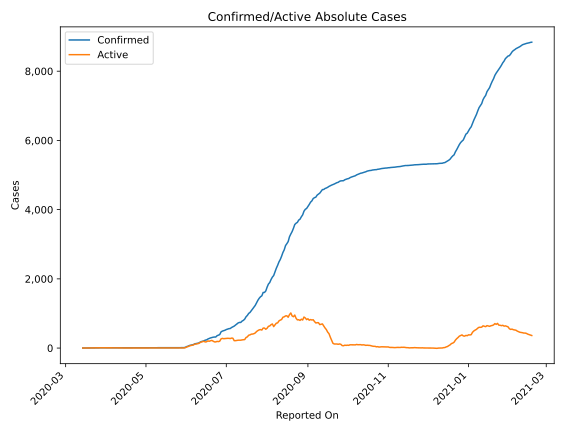
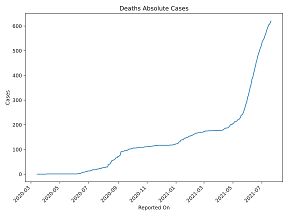
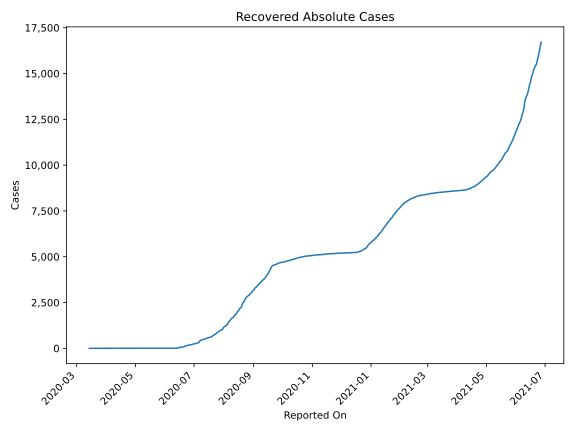
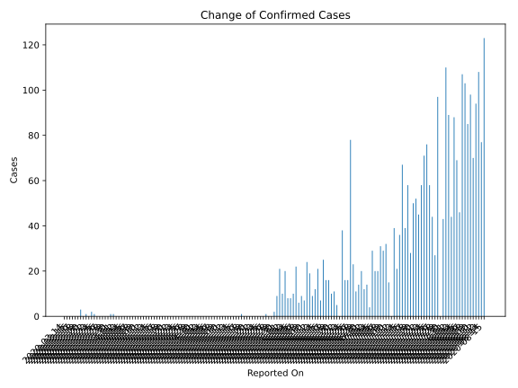
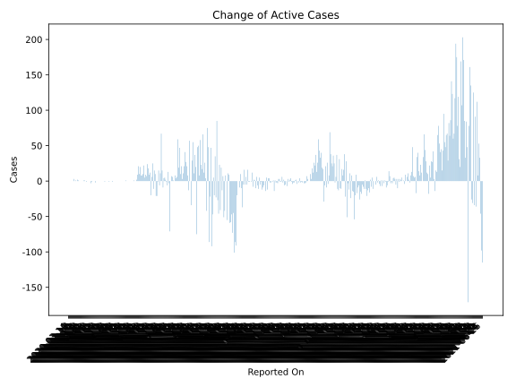
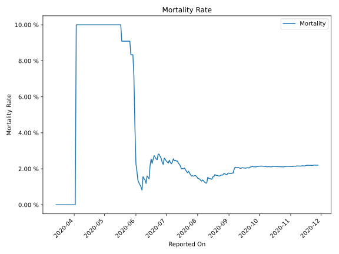

# Country Figures: Time Series for Suriname 

| Reported On | Confirmed | Deaths | Recovered | Active | Mortality | &Delta; Confirmed | &Delta; Deaths | &Delta; Active | % Active of Population |
|-------------|-----------|--------|-----------|--------|-----------|-------------------|----------------|----------------|------------------------|
| 2020-03-31 | 9 | 0 | 0 | 9 |  None  | 1 | 0 | 1 |  0.002 %  | 
| 2020-03-30 | 8 | 0 | 0 | 8 |  None  | 0 | 0 | 0 |  0.001 %  | 
| 2020-03-29 | 8 | 0 | 0 | 8 |  None  | 0 | 0 | 0 |  0.001 %  | 
| 2020-03-28 | 8 | 0 | 0 | 8 |  None  | 0 | 0 | 0 |  0.001 %  | 
| 2020-03-27 | 8 | 0 | 0 | 8 |  None  | 0 | 0 | 0 |  0.001 %  | 
| 2020-03-26 | 8 | 0 | 0 | 8 |  None  | 0 | 0 | 0 |  0.001 %  | 
| 2020-03-25 | 8 | 0 | 0 | 8 |  None  | 1 | 0 | 1 |  0.001 %  | 
| 2020-03-24 | 7 | 0 | 0 | 7 |  None  | 2 | 0 | 2 |  0.001 %  | 
| 2020-03-23 | 5 | 0 | 0 | 5 |  None  | 0 | 0 | 0 |  0.001 %  | 
| 2020-03-22 | 5 | 0 | 0 | 5 |  None  | 1 | 0 | 1 |  0.001 %  | 
| 2020-03-21 | 4 | 0 | 0 | 4 |  None  | 0 | 0 | 0 |  0.001 %  | 
| 2020-03-20 | 4 | 0 | 0 | 4 |  None  | 3 | 0 | 3 |  0.001 %  | 
| 2020-03-19 | 1 | 0 | 0 | 1 |  None  | 0 | 0 | 0 |  0.000 %  | 
| 2020-03-18 | 1 | 0 | 0 | 1 |  None  | 0 | 0 | 0 |  0.000 %  | 
| 2020-03-17 | 1 | 0 | 0 | 1 |  None  | 0 | 0 | 0 |  0.000 %  | 
| 2020-03-16 | 1 | 0 | 0 | 1 |  None  | 0 | 0 | 0 |  0.000 %  | 
| 2020-03-15 | 1 | 0 | 0 | 1 |  None  | 0 | 0 | 0 |  0.000 %  | 
| 2020-03-14 | 1 | 0 | 0 | 1 |  None  | None | None | None |  0.000 %  | 

