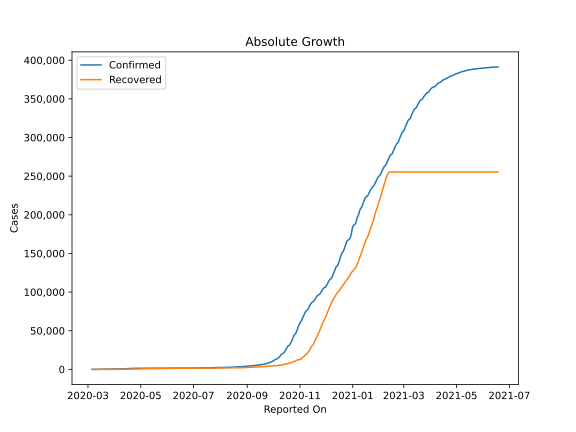
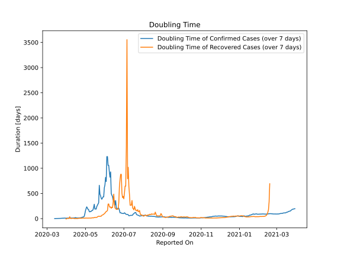

# Country Figures: Doubling Time of Infections for Slovakia 

The doubling time below are calculated based on
* an exponential growth assumption
* for time difference of past seven (7) days.
The doubling time's unit is "days".

The first doubling time indicates the increase of confirmed (infected)
cases. There, the *higher* the number is, the better is to take control
of the disease.

The second doubling time indicates the increase of recovered (healed)
cases. There, the *lower* the number is, the better it is to take
control of the disease.

| Reported On | Confirmed | Doubling Time (Confirmed) | Recovered | Doubling Time (Recovered) |
|-------------|-----------|---------------------------|-----------|---------------------------|
| 2020-04-18 | 1089 |  12.4 days  | 213 |  2.5 days  | 
| 2020-04-17 | 1049 |  13.0 days  | 175 |  2.7 days  | 
| 2020-04-16 | 977 |  15.0 days  | 167 |  2.8 days  | 
| 2020-04-15 | 863 |  21.0 days  | 151 |  2.5 days  | 
| 2020-04-14 | 835 |  13.7 days  | 113 |  2.6 days  | 
| 2020-04-13 | 769 |  13.6 days  | 107 |  2.2 days  | 
| 2020-04-12 | 742 |  11.8 days  | 23 |  6.2 days  | 
| 2020-04-11 | 728 |  11.5 days  | 23 |  6.2 days  | 
| 2020-04-10 | 715 |  10.8 days  | 23 |  6.2 days  | 
| 2020-04-09 | 701 |  10.1 days  | 23 |  3.5 days  | 
| 2020-04-08 | 682 |  9.4 days  | 16 |  3.2 days  | 
| 2020-04-07 | 581 |  10.7 days  | 13 |  3.6 days  | 
| 2020-04-06 | 534 |  10.8 days  | 8 |  36.7 days  | 
| 2020-04-05 | 485 |  11.5 days  | 10 |  3.3 days  | 
| 2020-04-04 | 471 |  10.5 days  | 10 |  3.3 days  | 
| 2020-04-03 | 450 |  9.8 days  | 10 |  3.3 days  | 
| 2020-04-02 | 426 |  8.0 days  | 5 |  5.6 days  | 
| 2020-04-01 | 400 |  8.2 days  | 3 |  -5.4 days  | 
| 2020-03-31 | 363 |  8.8 days  | 3 |  -5.4 days  | 
| 2020-03-30 | 336 |  8.5 days  | 7 |  None  | 
| 2020-03-29 | 314 |  9.5 days  | 2 |  -3.5 days  | 
| 2020-03-28 | 292 |  10.1 days  | 2 |  None  | 
| 2020-03-27 | 269 |  7.5 days  | 2 |  None  | 
| 2020-03-26 | 226 |  8.3 days  | 2 |  None  | 
| 2020-03-25 | 216 |  7.1 days  | 7 |  None  | 
| 2020-03-24 | 204 |  5.0 days  | 7 |  None  | 
| 2020-03-23 | 186 |  4.8 days  | 7 |  None  | 
| 2020-03-22 | 185 |  4.3 days  | 7 |  None  | 
| 2020-03-21 | 178 |  3.8 days  | 0 |  None  | 
| 2020-03-20 | 137 |  3.7 days  | 0 |  None  | 
| 2020-03-19 | 123 |  2.7 days  | 0 |  None  | 
| 2020-03-18 | 105 |  2.4 days  | 0 |  None  | 
| 2020-03-17 | 72 |  2.4 days  | 0 |  None  | 
| 2020-03-16 | 63 |  1.9 days  | 0 |  None  | 
| 2020-03-15 | 54 |  2.0 days  | 0 |  None  | 
| 2020-03-14 | 44 |  1.6 days  | 0 |  None  | 
| 2020-03-13 | 32 |  1.7 days  | 0 |  None  | 
| 2020-03-12 | 16 |  None  | 0 |  None  | 
| 2020-03-11 | 10 |  None  | 0 |  None  | 
| 2020-03-10 | 7 |  None  | 0 |  None  | 
| 2020-03-09 | 3 |  None  | 0 |  None  | 
| 2020-03-08 | 3 |  None  | 0 |  None  | 
| 2020-03-07 | 1 |  None  | 0 |  None  | 
| 2020-03-06 | 1 |  None  | 0 |  None  | 

