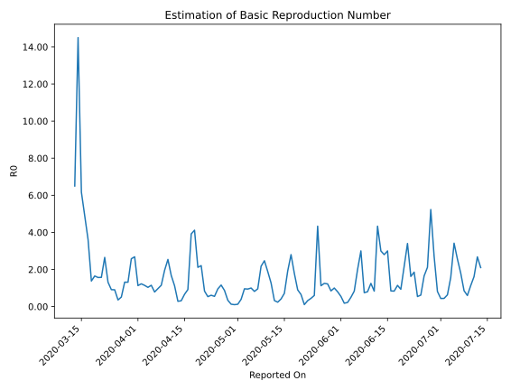

# Country Figures: Time Series for Basic Reproduction Number of Slovakia 

| Reported On | &Delta; Confirmed | Total &Delta; Confirmed First Interval | Total &Delta; Confirmed Second Interval | Estimated Basic Reproduction Number R0 | 
|-------------|-------------------|----------------------------------------|-----------------------------------------|---------------------------------------------------|
| 2020-05-02 | 4 |  22  |  56  |  0.39  | 
| 2020-05-01 | 7 |  17  |  135  |  0.13  | 
| 2020-04-30 | 5 |  18  |  174  |  0.10  | 
| 2020-04-29 | 7 |  24  |  187  |  0.13  | 
| 2020-04-28 | 3 |  56  |  164  |  0.34  | 
| 2020-04-27 | 2 |  135  |  155  |  0.87  | 
| 2020-04-26 | 6 |  174  |  150  |  1.16  | 
| 2020-04-25 | 13 |  187  |  196  |  0.95  | 
| 2020-04-24 | 35 |  164  |  298  |  0.55  | 
| 2020-04-23 | 81 |  155  |  254  |  0.61  | 
| 2020-04-22 | 45 |  150  |  280  |  0.54  | 
| 2020-04-21 | 26 |  196  |  235  |  0.83  | 
| 2020-04-20 | 12 |  298  |  135  |  2.21  | 
| 2020-04-19 | 72 |  254  |  120  |  2.12  | 
| 2020-04-18 | 40 |  280  |  68  |  4.12  | 
| 2020-04-17 | 72 |  235  |  60  |  3.92  | 
| 2020-04-16 | 114 |  135  |  147  |  0.92  | 
| 2020-04-15 | 28 |  120  |  181  |  0.66  | 
| 2020-04-14 | 66 |  68  |  216  |  0.31  | 
| 2020-04-13 | 27 |  60  |  211  |  0.28  | 
| 2020-04-12 | 14 |  147  |  131  |  1.12  | 
| 2020-04-11 | 13 |  181  |  108  |  1.68  | 
| 2020-04-10 | 14 |  216  |  85  |  2.54  | 
| 2020-04-09 | 19 |  211  |  108  |  1.95  | 
| 2020-04-08 | 101 |  131  |  114  |  1.15  | 
| 2020-04-07 | 47 |  108  |  112  |  0.96  | 
| 2020-04-06 | 49 |  85  |  108  |  0.79  | 
| 2020-04-05 | 14 |  108  |  94  |  1.15  | 
| 2020-04-04 | 21 |  114  |  110  |  1.04  | 
| 2020-04-03 | 24 |  112  |  98  |  1.14  | 
| 2020-04-02 | 26 |  108  |  88  |  1.23  | 
| 2020-04-01 | 37 |  94  |  83  |  1.13  | 
| 2020-03-31 | 27 |  110  |  41  |  2.68  | 
| 2020-03-30 | 22 |  98  |  38  |  2.58  | 
| 2020-03-29 | 22 |  88  |  67  |  1.31  | 
| 2020-03-28 | 23 |  83  |  63  |  1.32  | 
| 2020-03-27 | 43 |  41  |  80  |  0.51  | 
| 2020-03-26 | 10 |  38  |  106  |  0.36  | 
| 2020-03-25 | 12 |  67  |  74  |  0.91  | 
| 2020-03-24 | 18 |  63  |  69  |  0.91  | 
| 2020-03-23 | 1 |  80  |  61  |  1.31  | 
| 2020-03-22 | 7 |  106  |  40  |  2.65  | 
| 2020-03-21 | 41 |  74  |  47  |  1.57  | 
| 2020-03-20 | 14 |  69  |  44  |  1.57  | 
| 2020-03-19 | 18 |  61  |  37  |  1.65  | 
| 2020-03-18 | 33 |  40  |  29  |  1.38  | 
| 2020-03-17 | 9 |  47  |  13  |  3.62  | 
| 2020-03-16 | 9 |  44  |  9  |  4.89  | 
| 2020-03-15 | 10 |  37  |  6  |  6.17  | 
| 2020-03-14 | 12 |  29  |  2  |  14.50  | 
| 2020-03-13 | 16 |  13  |  2  |  6.50  | 
| 2020-03-12 | 6 |  9  |  None  |  None  | 
| 2020-03-11 | 3 |  6  |  None  |  None  | 
| 2020-03-10 | 4 |  2  |  None  |  None  | 
| 2020-03-09 | 0 |  2  |  None  |  None  | 
| 2020-03-08 | 2 |  None  |  None  |  None  | 
| 2020-03-07 | 0 |  None  |  None  |  None  | 
| 2020-03-06 | None |  None  |  None  |  None  | 

