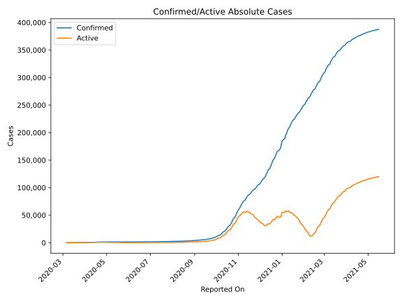
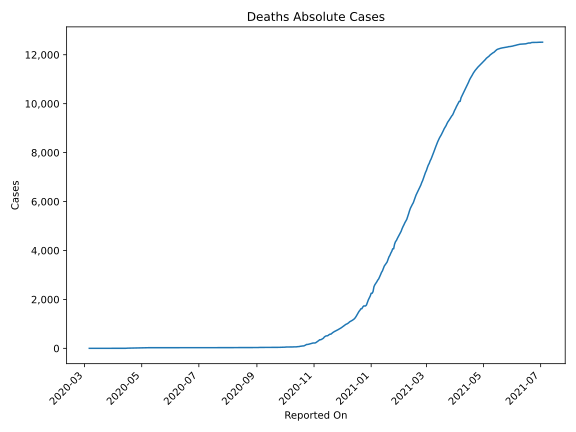
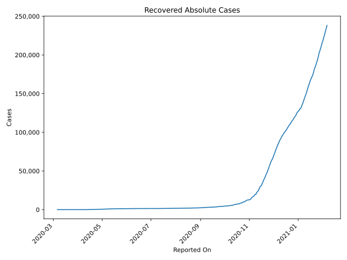
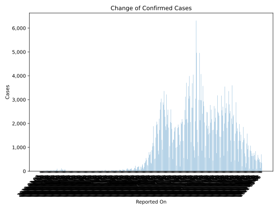
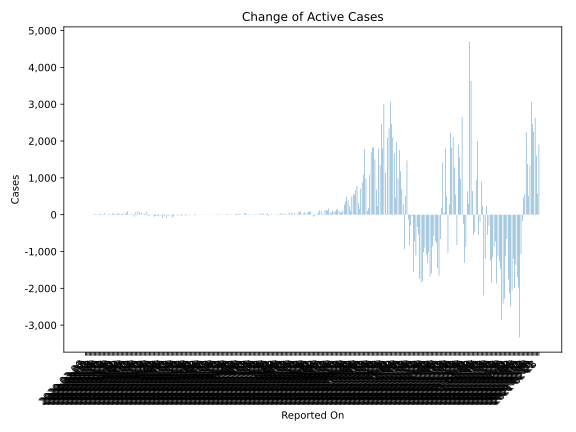
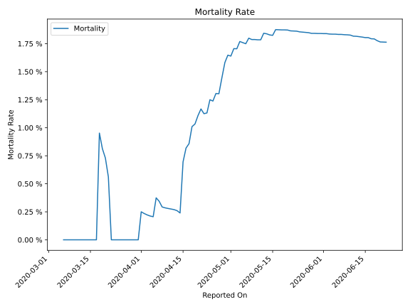

# Country Figures: Time Series for Slovakia 

| Reported On | Confirmed | Deaths | Recovered | Active | Mortality | &Delta; Confirmed | &Delta; Deaths | &Delta; Recovered | &Delta; Active | % Active of Population |
|-------------|-----------|--------|-----------|--------|-----------|-------------------|----------------|-------------------|----------------|------------------------|
| 2020-04-10 | 715 | 2 | 23 | 690 |  0.28 %  | 14 | 0 | 0 | 14 |  0.013 %  | 
| 2020-04-09 | 701 | 2 | 23 | 676 |  0.29 %  | 19 | 0 | 7 | 12 |  0.012 %  | 
| 2020-04-08 | 682 | 2 | 16 | 664 |  0.29 %  | 101 | 0 | 3 | 98 |  0.012 %  | 
| 2020-04-07 | 581 | 2 | 13 | 566 |  0.34 %  | 47 | 0 | 5 | 42 |  0.010 %  | 
| 2020-04-06 | 534 | 2 | 8 | 524 |  0.37 %  | 49 | 1 | -2 | 50 |  0.010 %  | 
| 2020-04-05 | 485 | 1 | 10 | 474 |  0.21 %  | 14 | 0 | 0 | 14 |  0.009 %  | 
| 2020-04-04 | 471 | 1 | 10 | 460 |  0.21 %  | 21 | 0 | 0 | 21 |  0.008 %  | 
| 2020-04-03 | 450 | 1 | 10 | 439 |  0.22 %  | 24 | 0 | 5 | 19 |  0.008 %  | 
| 2020-04-02 | 426 | 1 | 5 | 420 |  0.23 %  | 26 | 0 | 2 | 24 |  0.008 %  | 
| 2020-04-01 | 400 | 1 | 3 | 396 |  0.25 %  | 37 | 1 | 0 | 36 |  0.007 %  | 
| 2020-03-31 | 363 | 0 | 3 | 360 |  None  | 27 | 0 | -4 | 31 |  0.007 %  | 
| 2020-03-30 | 336 | 0 | 7 | 329 |  None  | 22 | 0 | 5 | 17 |  0.006 %  | 
| 2020-03-29 | 314 | 0 | 2 | 312 |  None  | 22 | 0 | 0 | 22 |  0.006 %  | 
| 2020-03-28 | 292 | 0 | 2 | 290 |  None  | 23 | 0 | 0 | 23 |  0.005 %  | 
| 2020-03-27 | 269 | 0 | 2 | 267 |  None  | 43 | 0 | 0 | 43 |  0.005 %  | 
| 2020-03-26 | 226 | 0 | 2 | 224 |  None  | 10 | 0 | -5 | 15 |  0.004 %  | 
| 2020-03-25 | 216 | 0 | 7 | 209 |  None  | 12 | 0 | 0 | 12 |  0.004 %  | 
| 2020-03-24 | 204 | 0 | 7 | 197 |  None  | 18 | 0 | 0 | 18 |  0.004 %  | 
| 2020-03-23 | 186 | 0 | 7 | 179 |  None  | 1 | 0 | 0 | 1 |  0.003 %  | 
| 2020-03-22 | 185 | 0 | 7 | 178 |  None  | 7 | -1 | 7 | 1 |  0.003 %  | 
| 2020-03-21 | 178 | 1 | 0 | 177 |  0.56 %  | 41 | 0 | 0 | 41 |  0.003 %  | 
| 2020-03-20 | 137 | 1 | 0 | 136 |  0.73 %  | 14 | 0 | 0 | 14 |  0.002 %  | 
| 2020-03-19 | 123 | 1 | 0 | 122 |  0.81 %  | 18 | 0 | 0 | 18 |  0.002 %  | 
| 2020-03-18 | 105 | 1 | 0 | 104 |  0.95 %  | 33 | 1 | 0 | 32 |  0.002 %  | 
| 2020-03-17 | 72 | 0 | 0 | 72 |  None  | 9 | 0 | 0 | 9 |  0.001 %  | 
| 2020-03-16 | 63 | 0 | 0 | 63 |  None  | 9 | 0 | 0 | 9 |  0.001 %  | 
| 2020-03-15 | 54 | 0 | 0 | 54 |  None  | 10 | 0 | 0 | 10 |  0.001 %  | 
| 2020-03-14 | 44 | 0 | 0 | 44 |  None  | 12 | 0 | 0 | 12 |  0.001 %  | 
| 2020-03-13 | 32 | 0 | 0 | 32 |  None  | 16 | 0 | 0 | 16 |  0.001 %  | 
| 2020-03-12 | 16 | 0 | 0 | 16 |  None  | 6 | 0 | 0 | 6 |  0.000 %  | 
| 2020-03-11 | 10 | 0 | 0 | 10 |  None  | 3 | 0 | 0 | 3 |  0.000 %  | 
| 2020-03-10 | 7 | 0 | 0 | 7 |  None  | 4 | 0 | 0 | 4 |  0.000 %  | 
| 2020-03-09 | 3 | 0 | 0 | 3 |  None  | 0 | 0 | 0 | 0 |  0.000 %  | 
| 2020-03-08 | 3 | 0 | 0 | 3 |  None  | 2 | 0 | 0 | 2 |  0.000 %  | 
| 2020-03-07 | 1 | 0 | 0 | 1 |  None  | 0 | 0 | 0 | 0 |  0.000 %  | 
| 2020-03-06 | 1 | 0 | 0 | 1 |  None  | None | None | None | None |  0.000 %  | 

