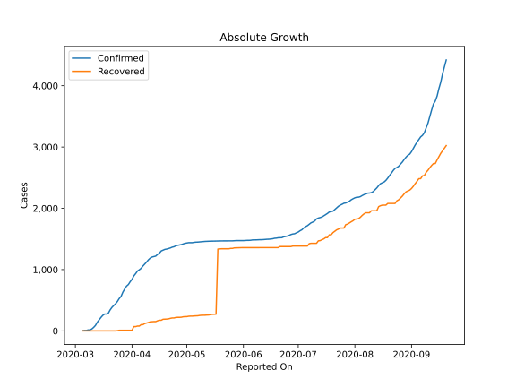
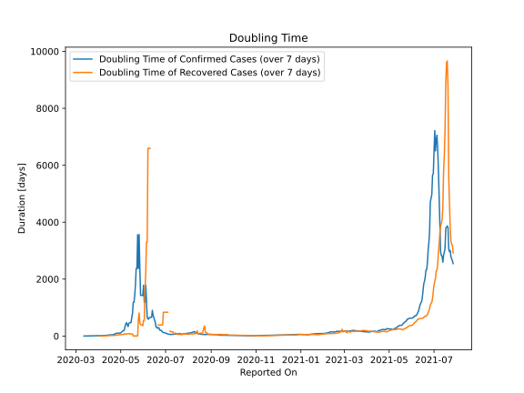

# Country Figures: Doubling Time of Infections for Slovenia 

The doubling time below are calculated based on
* an exponential growth assumption
* for time difference of past seven (7) days.
The doubling time's unit is "days".

The first doubling time indicates the increase of confirmed (infected)
cases. There, the *higher* the number is, the better is to take control
of the disease.

The second doubling time indicates the increase of recovered (healed)
cases. There, the *lower* the number is, the better it is to take
control of the disease.

| Reported On | Confirmed | Doubling Time (Confirmed) | Recovered | Doubling Time (Recovered) |
|-------------|-----------|---------------------------|-----------|---------------------------|
| 2020-04-30 | 1429 |  108.0 days  | 233 |  49.3 days  | 
| 2020-04-29 | 1418 |  103.8 days  | 230 |  42.5 days  | 
| 2020-04-28 | 1408 |  104.6 days  | 223 |  39.5 days  | 
| 2020-04-27 | 1402 |  99.4 days  | 221 |  36.2 days  | 
| 2020-04-26 | 1396 |  100.5 days  | 221 |  34.8 days  | 
| 2020-04-25 | 1388 |  92.8 days  | 219 |  34.5 days  | 
| 2020-04-24 | 1373 |  94.4 days  | 211 |  25.5 days  | 
| 2020-04-23 | 1366 |  65.5 days  | 211 |  25.5 days  | 
| 2020-04-22 | 1353 |  60.4 days  | 205 |  22.7 days  | 
| 2020-04-21 | 1344 |  50.5 days  | 197 |  19.1 days  | 
| 2020-04-20 | 1335 |  50.5 days  | 193 |  20.7 days  | 
| 2020-04-19 | 1330 |  49.5 days  | 192 |  20.0 days  | 
| 2020-04-18 | 1317 |  47.4 days  | 190 |  19.8 days  | 
| 2020-04-17 | 1304 |  41.8 days  | 174 |  20.6 days  | 
| 2020-04-16 | 1268 |  40.6 days  | 174 |  16.1 days  | 
| 2020-04-15 | 1248 |  36.4 days  | 165 |  15.6 days  | 
| 2020-04-14 | 1220 |  34.6 days  | 152 |  12.5 days  | 
| 2020-04-13 | 1212 |  28.6 days  | 152 |  12.5 days  | 
| 2020-04-12 | 1205 |  26.0 days  | 150 |  7.9 days  | 
| 2020-04-11 | 1188 |  25.2 days  | 148 |  8.1 days  | 
| 2020-04-10 | 1160 |  22.7 days  | 137 |  7.6 days  | 
| 2020-04-09 | 1124 |  21.9 days  | 128 |  8.4 days  | 
| 2020-04-08 | 1091 |  19.0 days  | 120 |  2.3 days  | 
| 2020-04-07 | 1059 |  17.8 days  | 102 |  2.4 days  | 
| 2020-04-06 | 1021 |  16.5 days  | 102 |  2.4 days  | 
| 2020-04-05 | 997 |  15.9 days  | 79 |  2.7 days  | 
| 2020-04-04 | 977 |  14.0 days  | 79 |  2.7 days  | 
| 2020-04-03 | 934 |  12.8 days  | 70 |  2.8 days  | 
| 2020-04-02 | 897 |  10.7 days  | 70 |  2.8 days  | 
| 2020-04-01 | 841 |  10.8 days  | 10 |  None  | 
| 2020-03-31 | 802 |  9.8 days  | 10 |  4.4 days  | 
| 2020-03-30 | 756 |  9.4 days  | 10 |  None  | 
| 2020-03-29 | 730 |  8.9 days  | 10 |  None  | 
| 2020-03-28 | 684 |  8.7 days  | 10 |  None  | 
| 2020-03-27 | 632 |  8.2 days  | 10 |  None  | 
| 2020-03-26 | 562 |  7.5 days  | 10 |  None  | 
| 2020-03-25 | 528 |  7.8 days  | 10 |  None  | 
| 2020-03-24 | 480 |  9.1 days  | 3 |  None  | 
| 2020-03-23 | 442 |  9.0 days  | 0 |  None  | 
| 2020-03-22 | 414 |  8.0 days  | 0 |  None  | 
| 2020-03-21 | 383 |  6.8 days  | 0 |  None  | 
| 2020-03-20 | 341 |  5.8 days  | 0 |  None  | 
| 2020-03-19 | 286 |  4.5 days  | 0 |  None  | 
| 2020-03-18 | 275 |  3.4 days  | 0 |  None  | 
| 2020-03-17 | 275 |  2.6 days  | 0 |  None  | 
| 2020-03-16 | 253 |  2.1 days  | 0 |  None  | 
| 2020-03-15 | 219 |  2.2 days  | 0 |  None  | 
| 2020-03-14 | 181 |  1.8 days  | 0 |  None  | 
| 2020-03-13 | 141 |  1.9 days  | 0 |  None  | 
| 2020-03-12 | 89 |  1.6 days  | 0 |  None  | 
| 2020-03-11 | 57 |  None  | 0 |  None  | 
| 2020-03-10 | 31 |  None  | 0 |  None  | 
| 2020-03-09 | 16 |  None  | 0 |  None  | 
| 2020-03-08 | 16 |  None  | 0 |  None  | 
| 2020-03-07 | 7 |  None  | 0 |  None  | 
| 2020-03-06 | 7 |  None  | 0 |  None  | 
| 2020-03-05 | 2 |  None  | 0 |  None  | 

