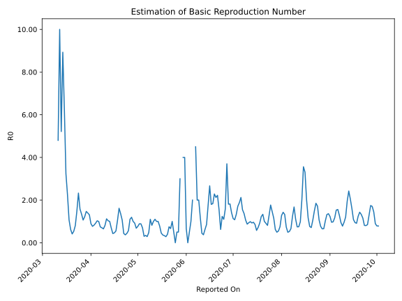

# Country Figures: Time Series for Basic Reproduction Number of Slovenia 

| Reported On | &Delta; Confirmed | Total &Delta; Confirmed First Interval | Total &Delta; Confirmed Second Interval | Estimated Basic Reproduction Number R0 | 
|-------------|-------------------|----------------------------------------|-----------------------------------------|---------------------------------------------------|
| 2020-05-03 | 0 |  31  |  35  |  0.89  | 
| 2020-05-02 | 5 |  32  |  36  |  0.89  | 
| 2020-05-01 | 5 |  33  |  43  |  0.77  | 
| 2020-04-30 | 11 |  30  |  44  |  0.68  | 
| 2020-04-29 | 10 |  35  |  38  |  0.92  | 
| 2020-04-28 | 6 |  36  |  36  |  1.00  | 
| 2020-04-27 | 6 |  43  |  36  |  1.19  | 
| 2020-04-26 | 8 |  44  |  40  |  1.10  | 
| 2020-04-25 | 15 |  38  |  67  |  0.57  | 
| 2020-04-24 | 7 |  36  |  82  |  0.44  | 
| 2020-04-23 | 13 |  36  |  97  |  0.37  | 
| 2020-04-22 | 9 |  40  |  92  |  0.43  | 
| 2020-04-21 | 9 |  67  |  63  |  1.06  | 
| 2020-04-20 | 5 |  82  |  60  |  1.37  | 
| 2020-04-19 | 13 |  97  |  60  |  1.62  | 
| 2020-04-18 | 13 |  92  |  88  |  1.05  | 
| 2020-04-17 | 36 |  63  |  114  |  0.55  | 
| 2020-04-16 | 20 |  60  |  129  |  0.47  | 
| 2020-04-15 | 28 |  60  |  139  |  0.43  | 
| 2020-04-14 | 8 |  88  |  127  |  0.69  | 
| 2020-04-13 | 7 |  114  |  114  |  1.00  | 
| 2020-04-12 | 17 |  129  |  125  |  1.03  | 
| 2020-04-11 | 28 |  139  |  124  |  1.12  | 
| 2020-04-10 | 36 |  127  |  156  |  0.81  | 
| 2020-04-09 | 33 |  114  |  175  |  0.65  | 
| 2020-04-08 | 32 |  125  |  178  |  0.70  | 
| 2020-04-07 | 38 |  124  |  167  |  0.74  | 
| 2020-04-06 | 24 |  156  |  157  |  0.99  | 
| 2020-04-05 | 20 |  175  |  170  |  1.03  | 
| 2020-04-04 | 43 |  178  |  194  |  0.92  | 
| 2020-04-03 | 37 |  167  |  202  |  0.83  | 
| 2020-04-02 | 56 |  157  |  204  |  0.77  | 
| 2020-04-01 | 39 |  170  |  190  |  0.89  | 
| 2020-03-31 | 46 |  194  |  148  |  1.31  | 
| 2020-03-30 | 26 |  202  |  145  |  1.39  | 
| 2020-03-29 | 46 |  204  |  139  |  1.47  | 
| 2020-03-28 | 52 |  190  |  156  |  1.22  | 
| 2020-03-27 | 70 |  148  |  139  |  1.06  | 
| 2020-03-26 | 34 |  145  |  108  |  1.34  | 
| 2020-03-25 | 48 |  139  |  88  |  1.58  | 
| 2020-03-24 | 38 |  156  |  67  |  2.33  | 
| 2020-03-23 | 28 |  139  |  94  |  1.48  | 
| 2020-03-22 | 31 |  108  |  134  |  0.81  | 
| 2020-03-21 | 42 |  88  |  164  |  0.54  | 
| 2020-03-20 | 55 |  67  |  162  |  0.41  | 
| 2020-03-19 | 11 |  94  |  150  |  0.63  | 
| 2020-03-18 | 0 |  134  |  125  |  1.07  | 
| 2020-03-17 | 22 |  164  |  73  |  2.25  | 
| 2020-03-16 | 34 |  162  |  50  |  3.24  | 
| 2020-03-15 | 38 |  150  |  24  |  6.25  | 
| 2020-03-14 | 40 |  125  |  14  |  8.93  | 
| 2020-03-13 | 52 |  73  |  14  |  5.21  | 
| 2020-03-12 | 32 |  50  |  5  |  10.00  | 
| 2020-03-11 | 26 |  24  |  5  |  4.80  | 
| 2020-03-10 | 15 |  14  |  None  |  None  | 
| 2020-03-09 | 0 |  14  |  None  |  None  | 
| 2020-03-08 | 9 |  5  |  None  |  None  | 
| 2020-03-07 | 0 |  5  |  None  |  None  | 
| 2020-03-06 | 5 |  None  |  None  |  None  | 
| 2020-03-05 | None |  None  |  None  |  None  | 

