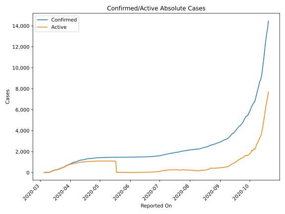
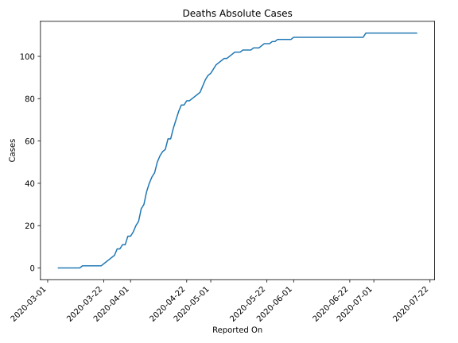
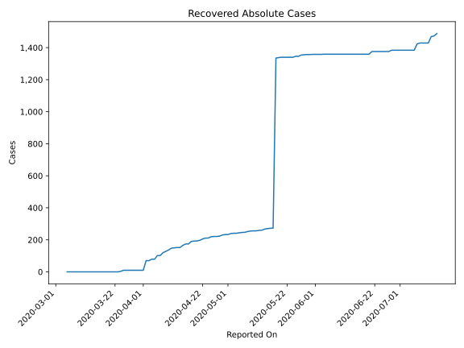
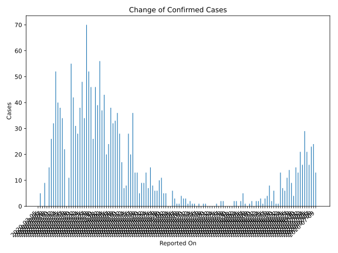
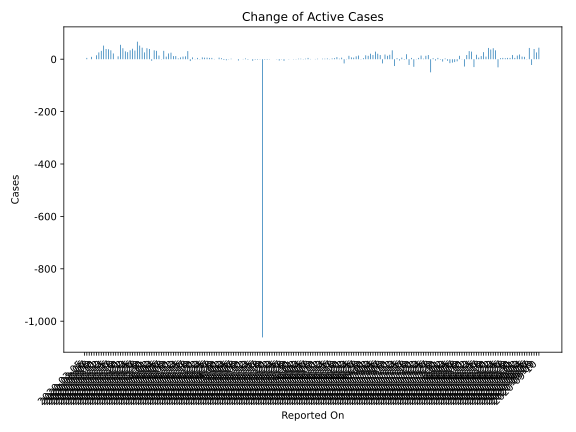
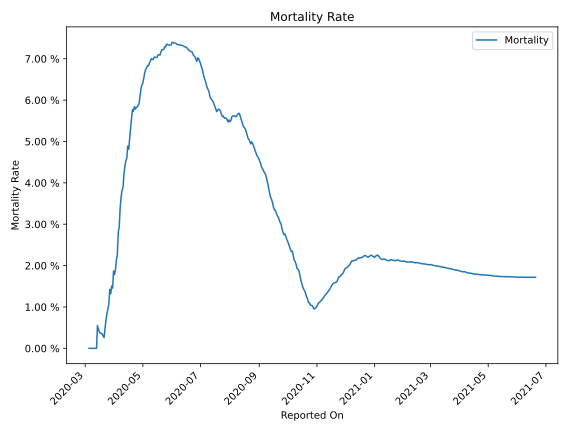

# Country Figures: Time Series for Slovenia 

| Reported On | Confirmed | Deaths | Recovered | Active | Mortality | &Delta; Confirmed | &Delta; Deaths | &Delta; Active | % Active of Population |
|-------------|-----------|--------|-----------|--------|-----------|-------------------|----------------|----------------|------------------------|
| 2020-03-31 | 802 | 15 | 10 | 777 |  1.87 %  | 46 | 4 | 42 |  0.038 %  | 
| 2020-03-30 | 756 | 11 | 10 | 735 |  1.46 %  | 26 | 0 | 26 |  0.036 %  | 
| 2020-03-29 | 730 | 11 | 10 | 709 |  1.51 %  | 46 | 2 | 44 |  0.034 %  | 
| 2020-03-28 | 684 | 9 | 10 | 665 |  1.32 %  | 52 | 0 | 52 |  0.032 %  | 
| 2020-03-27 | 632 | 9 | 10 | 613 |  1.42 %  | 70 | 3 | 67 |  0.030 %  | 
| 2020-03-26 | 562 | 6 | 10 | 546 |  1.07 %  | 34 | 1 | 33 |  0.026 %  | 
| 2020-03-25 | 528 | 5 | 10 | 513 |  0.95 %  | 48 | 1 | 40 |  0.025 %  | 
| 2020-03-24 | 480 | 4 | 3 | 473 |  0.83 %  | 38 | 1 | 34 |  0.023 %  | 
| 2020-03-23 | 442 | 3 | 0 | 439 |  0.68 %  | 28 | 1 | 27 |  0.021 %  | 
| 2020-03-22 | 414 | 2 | 0 | 412 |  0.48 %  | 31 | 1 | 30 |  0.020 %  | 
| 2020-03-21 | 383 | 1 | 0 | 382 |  0.26 %  | 42 | 0 | 42 |  0.018 %  | 
| 2020-03-20 | 341 | 1 | 0 | 340 |  0.29 %  | 55 | 0 | 55 |  0.016 %  | 
| 2020-03-19 | 286 | 1 | 0 | 285 |  0.35 %  | 11 | 0 | 11 |  0.014 %  | 
| 2020-03-18 | 275 | 1 | 0 | 274 |  0.36 %  | 0 | 0 | 0 |  0.013 %  | 
| 2020-03-17 | 275 | 1 | 0 | 274 |  0.36 %  | 22 | 0 | 22 |  0.013 %  | 
| 2020-03-16 | 253 | 1 | 0 | 252 |  0.40 %  | 34 | 0 | 34 |  0.012 %  | 
| 2020-03-15 | 219 | 1 | 0 | 218 |  0.46 %  | 38 | 0 | 38 |  0.011 %  | 
| 2020-03-14 | 181 | 1 | 0 | 180 |  0.55 %  | 40 | 1 | 39 |  0.009 %  | 
| 2020-03-13 | 141 | 0 | 0 | 141 |  None  | 52 | 0 | 52 |  0.007 %  | 
| 2020-03-12 | 89 | 0 | 0 | 89 |  None  | 32 | 0 | 32 |  0.004 %  | 
| 2020-03-11 | 57 | 0 | 0 | 57 |  None  | 26 | 0 | 26 |  0.003 %  | 
| 2020-03-10 | 31 | 0 | 0 | 31 |  None  | 15 | 0 | 15 |  0.001 %  | 
| 2020-03-09 | 16 | 0 | 0 | 16 |  None  | 0 | 0 | 0 |  0.001 %  | 
| 2020-03-08 | 16 | 0 | 0 | 16 |  None  | 9 | 0 | 9 |  0.001 %  | 
| 2020-03-07 | 7 | 0 | 0 | 7 |  None  | 0 | 0 | 0 |  0.000 %  | 
| 2020-03-06 | 7 | 0 | 0 | 7 |  None  | 5 | 0 | 5 |  0.000 %  | 
| 2020-03-05 | 2 | 0 | 0 | 2 |  None  | None | None | None |  0.000 %  | 

