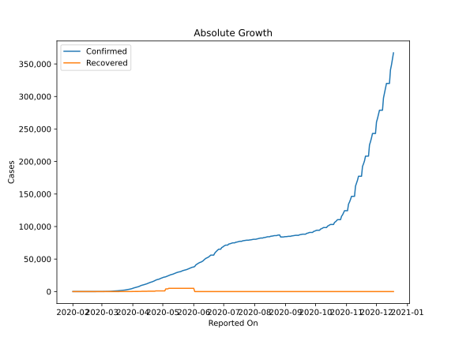
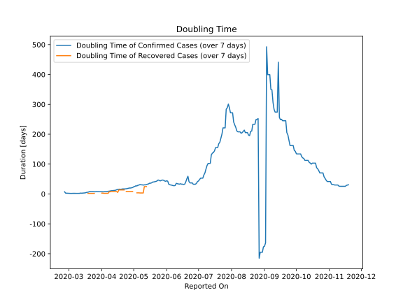

# Country Figures: Doubling Time of Infections for Sweden 

The doubling time below are calculated based on
* an exponential growth assumption
* for time difference of past seven (7) days.
The doubling time's unit is "days".

The first doubling time indicates the increase of confirmed (infected)
cases. There, the *higher* the number is, the better is to take control
of the disease.

The second doubling time indicates the increase of recovered (healed)
cases. There, the *lower* the number is, the better it is to take
control of the disease.

| Reported On | Confirmed | Doubling Time (Confirmed) | Recovered | Doubling Time (Recovered) |
|-------------|-----------|---------------------------|-----------|---------------------------|
| 2020-04-20 | 14777 |  16.5 days  | 550 |  13.6 days  | 
| 2020-04-19 | 14385 |  15.7 days  | 550 |  13.6 days  | 
| 2020-04-18 | 13822 |  16.1 days  | 550 |  13.6 days  | 
| 2020-04-17 | 13216 |  16.0 days  | 550 |  13.6 days  | 
| 2020-04-16 | 12540 |  15.7 days  | 550 |  5.3 days  | 
| 2020-04-15 | 11927 |  14.3 days  | 381 |  8.2 days  | 
| 2020-04-14 | 11445 |  12.6 days  | 381 |  8.2 days  | 
| 2020-04-13 | 10948 |  11.9 days  | 381 |  8.2 days  | 
| 2020-04-12 | 10483 |  11.7 days  | 381 |  8.2 days  | 
| 2020-04-11 | 10151 |  11.0 days  | 381 |  8.2 days  | 
| 2020-04-10 | 9685 |  11.0 days  | 381 |  8.2 days  | 
| 2020-04-09 | 9141 |  10.1 days  | 205 |  7.4 days  | 
| 2020-04-08 | 8419 |  9.5 days  | 205 |  7.4 days  | 
| 2020-04-07 | 7693 |  9.2 days  | 205 |  2.2 days  | 
| 2020-04-06 | 7206 |  8.7 days  | 205 |  2.2 days  | 
| 2020-04-05 | 6830 |  8.3 days  | 205 |  2.2 days  | 
| 2020-04-04 | 6443 |  8.1 days  | 205 |  2.2 days  | 
| 2020-04-03 | 6131 |  7.4 days  | 205 |  2.2 days  | 
| 2020-04-02 | 5568 |  7.5 days  | 103 |  2.9 days  | 
| 2020-04-01 | 4947 |  7.6 days  | 103 |  2.9 days  | 
| 2020-03-31 | 4435 |  7.7 days  | 16 |  None  | 
| 2020-03-30 | 4028 |  7.5 days  | 16 |  None  | 
| 2020-03-29 | 3700 |  7.8 days  | 16 |  None  | 
| 2020-03-28 | 3447 |  7.6 days  | 16 |  None  | 
| 2020-03-27 | 3069 |  8.1 days  | 16 |  None  | 
| 2020-03-26 | 2840 |  7.5 days  | 16 |  None  | 
| 2020-03-25 | 2526 |  7.5 days  | 16 |  2.1 days  | 
| 2020-03-24 | 2286 |  7.8 days  | 16 |  2.1 days  | 
| 2020-03-23 | 2046 |  8.2 days  | 16 |  2.1 days  | 
| 2020-03-22 | 1931 |  8.0 days  | 16 |  2.1 days  | 
| 2020-03-21 | 1763 |  8.3 days  | 16 |  2.1 days  | 
| 2020-03-20 | 1639 |  7.3 days  | 16 |  2.1 days  | 
| 2020-03-19 | 1439 |  5.9 days  | 16 |  2.1 days  | 
| 2020-03-18 | 1279 |  5.5 days  | 1 |  None  | 
| 2020-03-17 | 1190 |  4.3 days  | 1 |  None  | 
| 2020-03-16 | 1103 |  3.6 days  | 1 |  None  | 
| 2020-03-15 | 1022 |  3.3 days  | 1 |  None  | 
| 2020-03-14 | 961 |  3.0 days  | 1 |  None  | 
| 2020-03-13 | 814 |  2.7 days  | 1 |  None  | 
| 2020-03-12 | 599 |  3.0 days  | 1 |  None  | 
| 2020-03-11 | 500 |  2.2 days  | 1 |  None  | 
| 2020-03-10 | 355 |  2.0 days  | 1 |  None  | 
| 2020-03-09 | 248 |  2.1 days  | 1 |  None  | 
| 2020-03-08 | 203 |  2.1 days  | 0 |  None  | 
| 2020-03-07 | 161 |  2.2 days  | 0 |  None  | 
| 2020-03-06 | 101 |  2.1 days  | 0 |  None  | 
| 2020-03-05 | 94 |  2.2 days  | 0 |  None  | 
| 2020-03-04 | 35 |  2.0 days  | 0 |  None  | 
| 2020-03-03 | 21 |  1.9 days  | 0 |  None  | 
| 2020-03-02 | 15 |  2.1 days  | 0 |  None  | 
| 2020-03-01 | 14 |  2.2 days  | 0 |  None  | 
| 2020-02-29 | 12 |  2.3 days  | 0 |  None  | 
| 2020-02-28 | 7 |  2.8 days  | 0 |  None  | 
| 2020-02-27 | 7 |  2.8 days  | 0 |  None  | 
| 2020-02-26 | 2 |  7.3 days  | 0 |  None  | 
| 2020-02-25 | 1 |  None  | 0 |  None  | 
| 2020-02-24 | 1 |  None  | 0 |  None  | 
| 2020-02-23 | 1 |  None  | 0 |  None  | 
| 2020-02-22 | 1 |  None  | 0 |  None  | 
| 2020-02-21 | 1 |  None  | 0 |  None  | 
| 2020-02-20 | 1 |  None  | 0 |  None  | 
| 2020-02-19 | 1 |  None  | 0 |  None  | 
| 2020-02-18 | 1 |  None  | 0 |  None  | 
| 2020-02-17 | 1 |  None  | 0 |  None  | 
| 2020-02-16 | 1 |  None  | 0 |  None  | 
| 2020-02-15 | 1 |  None  | 0 |  None  | 
| 2020-02-14 | 1 |  None  | 0 |  None  | 
| 2020-02-13 | 1 |  None  | 0 |  None  | 
| 2020-02-12 | 1 |  None  | 0 |  None  | 
| 2020-02-11 | 1 |  None  | 0 |  None  | 
| 2020-02-10 | 1 |  None  | 0 |  None  | 
| 2020-02-09 | 1 |  None  | 0 |  None  | 
| 2020-02-08 | 1 |  None  | 0 |  None  | 
| 2020-02-07 | 1 |  None  | 0 |  None  | 
| 2020-02-06 | 1 |  None  | 0 |  None  | 
| 2020-02-05 | 1 |  None  | 0 |  None  | 
| 2020-02-04 | 1 |  None  | 0 |  None  | 
| 2020-02-03 | 1 |  None  | 0 |  None  | 
| 2020-02-02 | 1 |  None  | 0 |  None  | 
| 2020-02-01 | 1 |  None  | 0 |  None  | 

