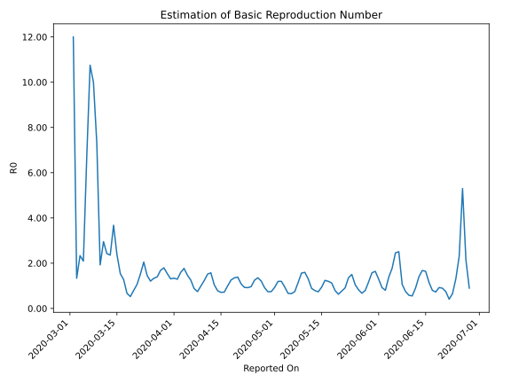

# Country Figures: Time Series for Basic Reproduction Number of Sweden 

| Reported On | &Delta; Confirmed | Total &Delta; Confirmed First Interval | Total &Delta; Confirmed Second Interval | Estimated Basic Reproduction Number R0 | 
|-------------|-------------------|----------------------------------------|-----------------------------------------|---------------------------------------------------|
| 2020-05-01 | 428 |  2452  |  2636  |  0.93  | 
| 2020-04-30 | 790 |  2125  |  2855  |  0.74  | 
| 2020-04-29 | 681 |  2054  |  2790  |  0.74  | 
| 2020-04-28 | 695 |  2171  |  2370  |  0.92  | 
| 2020-04-27 | 286 |  2636  |  2182  |  1.21  | 
| 2020-04-26 | 463 |  2855  |  2106  |  1.36  | 
| 2020-04-25 | 610 |  2790  |  2237  |  1.25  | 
| 2020-04-24 | 812 |  2370  |  2458  |  0.96  | 
| 2020-04-23 | 751 |  2182  |  2377  |  0.92  | 
| 2020-04-22 | 682 |  2106  |  2268  |  0.93  | 
| 2020-04-21 | 545 |  2237  |  2057  |  1.09  | 
| 2020-04-20 | 392 |  2458  |  1776  |  1.38  | 
| 2020-04-19 | 563 |  2377  |  1760  |  1.35  | 
| 2020-04-18 | 606 |  2268  |  1807  |  1.26  | 
| 2020-04-17 | 676 |  2057  |  2064  |  1.00  | 
| 2020-04-16 | 613 |  1776  |  2458  |  0.72  | 
| 2020-04-15 | 482 |  1760  |  2479  |  0.71  | 
| 2020-04-14 | 497 |  1807  |  2311  |  0.78  | 
| 2020-04-13 | 465 |  2064  |  1976  |  1.04  | 
| 2020-04-12 | 332 |  2458  |  1562  |  1.57  | 
| 2020-04-11 | 466 |  2479  |  1638  |  1.51  | 
| 2020-04-10 | 544 |  2311  |  1883  |  1.23  | 
| 2020-04-09 | 722 |  1976  |  2008  |  0.98  | 
| 2020-04-08 | 726 |  1562  |  2103  |  0.74  | 
| 2020-04-07 | 487 |  1638  |  1868  |  0.88  | 
| 2020-04-06 | 376 |  1883  |  1500  |  1.26  | 
| 2020-04-05 | 387 |  2008  |  1366  |  1.47  | 
| 2020-04-04 | 312 |  2103  |  1188  |  1.77  | 
| 2020-04-03 | 563 |  1868  |  1174  |  1.59  | 
| 2020-04-02 | 621 |  1500  |  1161  |  1.29  | 
| 2020-04-01 | 512 |  1366  |  1023  |  1.34  | 
| 2020-03-31 | 407 |  1188  |  909  |  1.31  | 
| 2020-03-30 | 328 |  1174  |  763  |  1.54  | 
| 2020-03-29 | 253 |  1161  |  647  |  1.79  | 
| 2020-03-28 | 378 |  1023  |  607  |  1.69  | 
| 2020-03-27 | 229 |  909  |  652  |  1.39  | 
| 2020-03-26 | 314 |  763  |  573  |  1.33  | 
| 2020-03-25 | 240 |  647  |  536  |  1.21  | 
| 2020-03-24 | 240 |  607  |  417  |  1.46  | 
| 2020-03-23 | 115 |  652  |  318  |  2.05  | 
| 2020-03-22 | 168 |  573  |  376  |  1.52  | 
| 2020-03-21 | 124 |  536  |  504  |  1.06  | 
| 2020-03-20 | 200 |  417  |  522  |  0.80  | 
| 2020-03-19 | 160 |  318  |  606  |  0.52  | 
| 2020-03-18 | 89 |  376  |  566  |  0.66  | 
| 2020-03-17 | 87 |  504  |  396  |  1.27  | 
| 2020-03-16 | 81 |  522  |  339  |  1.54  | 
| 2020-03-15 | 61 |  606  |  254  |  2.39  | 
| 2020-03-14 | 147 |  566  |  154  |  3.68  | 
| 2020-03-13 | 215 |  396  |  168  |  2.36  | 
| 2020-03-12 | 99 |  339  |  140  |  2.42  | 
| 2020-03-11 | 145 |  254  |  86  |  2.95  | 
| 2020-03-10 | 107 |  154  |  80  |  1.93  | 
| 2020-03-09 | 45 |  168  |  23  |  7.30  | 
| 2020-03-08 | 42 |  140  |  14  |  10.00  | 
| 2020-03-07 | 60 |  86  |  8  |  10.75  | 
| 2020-03-06 | 7 |  80  |  12  |  6.67  | 
| 2020-03-05 | 59 |  23  |  11  |  2.09  | 
| 2020-03-04 | 14 |  14  |  6  |  2.33  | 
| 2020-03-03 | 6 |  8  |  6  |  1.33  | 
| 2020-03-02 | 1 |  12  |  1  |  12.00  | 
| 2020-03-01 | 2 |  11  |  None  |  None  | 
| 2020-02-29 | 5 |  6  |  None  |  None  | 
| 2020-02-28 | 0 |  6  |  None  |  None  | 
| 2020-02-27 | 5 |  1  |  None  |  None  | 
| 2020-02-26 | 1 |  None  |  None  |  None  | 
| 2020-02-25 | 0 |  None  |  None  |  None  | 
| 2020-02-24 | 0 |  None  |  None  |  None  | 
| 2020-02-23 | 0 |  None  |  None  |  None  | 
| 2020-02-22 | 0 |  None  |  None  |  None  | 
| 2020-02-21 | 0 |  None  |  None  |  None  | 
| 2020-02-20 | 0 |  None  |  None  |  None  | 
| 2020-02-19 | 0 |  None  |  None  |  None  | 
| 2020-02-18 | 0 |  None  |  None  |  None  | 
| 2020-02-17 | 0 |  None  |  None  |  None  | 
| 2020-02-16 | 0 |  None  |  None  |  None  | 
| 2020-02-15 | 0 |  None  |  None  |  None  | 
| 2020-02-14 | 0 |  None  |  None  |  None  | 
| 2020-02-13 | 0 |  None  |  None  |  None  | 
| 2020-02-12 | 0 |  None  |  None  |  None  | 
| 2020-02-11 | 0 |  None  |  None  |  None  | 
| 2020-02-10 | 0 |  None  |  None  |  None  | 
| 2020-02-09 | 0 |  None  |  None  |  None  | 
| 2020-02-08 | 0 |  None  |  None  |  None  | 
| 2020-02-07 | 0 |  None  |  None  |  None  | 
| 2020-02-06 | 0 |  None  |  None  |  None  | 
| 2020-02-05 | 0 |  None  |  None  |  None  | 
| 2020-02-04 | 0 |  None  |  None  |  None  | 
| 2020-02-03 | 0 |  None  |  None  |  None  | 
| 2020-02-02 | 0 |  None  |  None  |  None  | 
| 2020-02-01 | 0 |  None  |  None  |  None  | 
| 2020-01-31 | None |  None  |  None  |  None  | 

