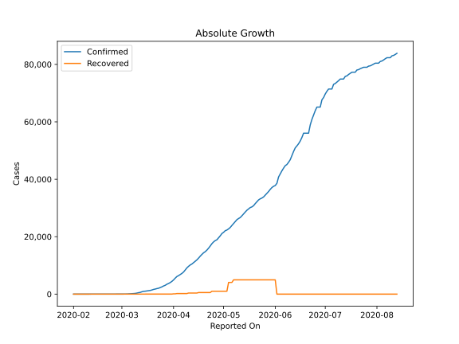
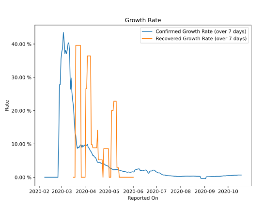

# Country Figures: Growth Rate for Sweden 

The growth rates below are calculated based on
* an exponential growth assumption
* for time difference of past seven (7) days.
The growth rate is to be understood as on "growth per day".

The first growth rate indicates the increase of confirmed (infected) cases.

The second growth rate indicates the increase of recovered (healed) cases.

| Reported On | Confirmed | Growth Rate (Confirmed) | Recovered | Growth Rate (Recovered) |
|-------------|-----------|-------------------------|-----------|-------------------------|
| 2020-04-15 | 11927 |  4.98 %  | 381 |  8.854 %  | 
| 2020-04-14 | 11445 |  5.67 %  | 381 |  8.854 %  | 
| 2020-04-13 | 10948 |  5.97 %  | 381 |  8.854 %  | 
| 2020-04-12 | 10483 |  6.12 %  | 381 |  8.854 %  | 
| 2020-04-11 | 10151 |  6.49 %  | 381 |  8.854 %  | 
| 2020-04-10 | 9685 |  6.53 %  | 381 |  8.854 %  | 
| 2020-04-09 | 9141 |  7.08 %  | 205 |  9.833 %  | 
| 2020-04-08 | 8419 |  7.60 %  | 205 |  9.833 %  | 
| 2020-04-07 | 7693 |  7.87 %  | 205 |  36.435 %  | 
| 2020-04-06 | 7206 |  8.31 %  | 205 |  36.435 %  | 
| 2020-04-05 | 6830 |  8.76 %  | 205 |  36.435 %  | 
| 2020-04-04 | 6443 |  8.94 %  | 205 |  36.435 %  | 
| 2020-04-03 | 6131 |  9.89 %  | 205 |  36.435 %  | 
| 2020-04-02 | 5568 |  9.62 %  | 103 |  26.602 %  | 
| 2020-04-01 | 4947 |  9.60 %  | 103 |  26.602 %  | 
| 2020-03-31 | 4435 |  9.47 %  | 16 |  None  | 
| 2020-03-30 | 4028 |  9.68 %  | 16 |  None  | 
| 2020-03-29 | 3700 |  9.29 %  | 16 |  None  | 
| 2020-03-28 | 3447 |  9.58 %  | 16 |  None  | 
| 2020-03-27 | 3069 |  8.96 %  | 16 |  None  | 
| 2020-03-26 | 2840 |  9.71 %  | 16 |  None  | 
| 2020-03-25 | 2526 |  9.72 %  | 16 |  39.608 %  | 
| 2020-03-24 | 2286 |  9.33 %  | 16 |  39.608 %  | 
| 2020-03-23 | 2046 |  8.83 %  | 16 |  39.608 %  | 
| 2020-03-22 | 1931 |  9.09 %  | 16 |  39.608 %  | 
| 2020-03-21 | 1763 |  8.67 %  | 16 |  39.608 %  | 
| 2020-03-20 | 1639 |  10.00 %  | 16 |  39.608 %  | 
| 2020-03-19 | 1439 |  12.52 %  | 16 |  39.608 %  | 
| 2020-03-18 | 1279 |  13.42 %  | 1 |  None  | 
| 2020-03-17 | 1190 |  17.28 %  | 1 |  None  | 
| 2020-03-16 | 1103 |  21.32 %  | 1 |  None  | 
| 2020-03-15 | 1022 |  23.09 %  | 1 |  None  | 
| 2020-03-14 | 961 |  25.52 %  | 1 |  None  | 
| 2020-03-13 | 814 |  29.81 %  | 1 |  None  | 
| 2020-03-12 | 599 |  26.46 %  | 1 |  None  | 
| 2020-03-11 | 500 |  37.99 %  | 1 |  None  | 
| 2020-03-10 | 355 |  40.39 %  | 1 |  None  | 
| 2020-03-09 | 248 |  40.08 %  | 1 |  None  | 
| 2020-03-08 | 203 |  38.20 %  | 0 |  None  | 
| 2020-03-07 | 161 |  37.09 %  | 0 |  None  | 
| 2020-03-06 | 101 |  38.13 %  | 0 |  None  | 
| 2020-03-05 | 94 |  37.11 %  | 0 |  None  | 
| 2020-03-04 | 35 |  40.89 %  | 0 |  None  | 
| 2020-03-03 | 21 |  43.49 %  | 0 |  None  | 
| 2020-03-02 | 15 |  38.69 %  | 0 |  None  | 
| 2020-03-01 | 14 |  37.70 %  | 0 |  None  | 
| 2020-02-29 | 12 |  35.50 %  | 0 |  None  | 
| 2020-02-28 | 7 |  27.80 %  | 0 |  None  | 
| 2020-02-27 | 7 |  27.80 %  | 0 |  None  | 
| 2020-02-26 | 2 |  9.90 %  | 0 |  None  | 
| 2020-02-25 | 1 |  None  | 0 |  None  | 
| 2020-02-24 | 1 |  None  | 0 |  None  | 
| 2020-02-23 | 1 |  None  | 0 |  None  | 
| 2020-02-22 | 1 |  None  | 0 |  None  | 
| 2020-02-21 | 1 |  None  | 0 |  None  | 
| 2020-02-20 | 1 |  None  | 0 |  None  | 
| 2020-02-19 | 1 |  None  | 0 |  None  | 
| 2020-02-18 | 1 |  None  | 0 |  None  | 
| 2020-02-17 | 1 |  None  | 0 |  None  | 
| 2020-02-16 | 1 |  None  | 0 |  None  | 
| 2020-02-15 | 1 |  None  | 0 |  None  | 
| 2020-02-14 | 1 |  None  | 0 |  None  | 
| 2020-02-13 | 1 |  None  | 0 |  None  | 
| 2020-02-12 | 1 |  None  | 0 |  None  | 
| 2020-02-11 | 1 |  None  | 0 |  None  | 
| 2020-02-10 | 1 |  None  | 0 |  None  | 
| 2020-02-09 | 1 |  None  | 0 |  None  | 
| 2020-02-08 | 1 |  None  | 0 |  None  | 
| 2020-02-07 | 1 |  None  | 0 |  None  | 
| 2020-02-06 | 1 |  None  | 0 |  None  | 
| 2020-02-05 | 1 |  None  | 0 |  None  | 
| 2020-02-04 | 1 |  None  | 0 |  None  | 
| 2020-02-03 | 1 |  None  | 0 |  None  | 
| 2020-02-02 | 1 |  None  | 0 |  None  | 
| 2020-02-01 | 1 |  None  | 0 |  None  | 

