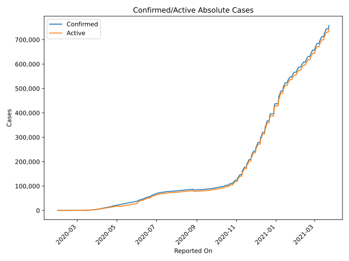
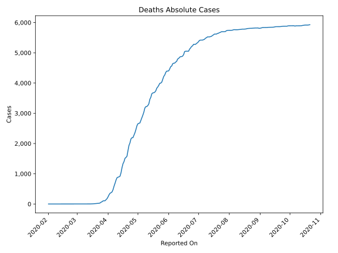
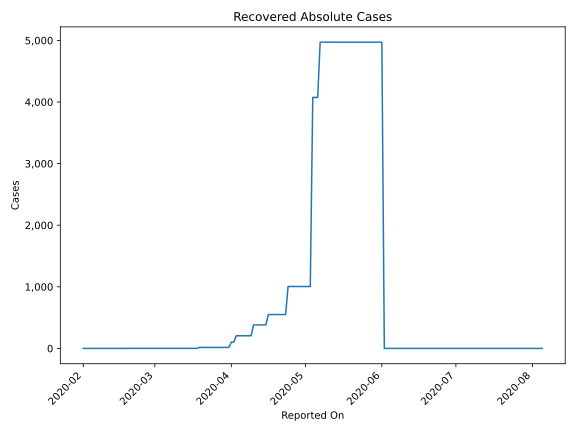
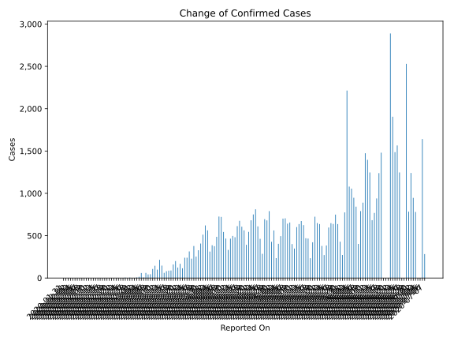
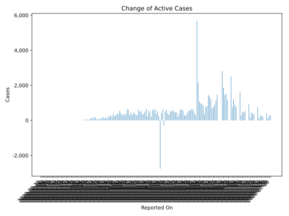
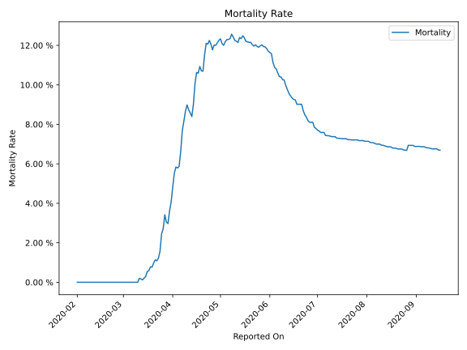

# Country Figures: Time Series for Sweden 

| Reported On | Confirmed | Deaths | Recovered | Active | Mortality | &Delta; Confirmed | &Delta; Deaths | &Delta; Active | % Active of Population |
|-------------|-----------|--------|-----------|--------|-----------|-------------------|----------------|----------------|------------------------|
| 2020-04-09 | 9141 | 793 | 205 | 8143 |  8.68 %  | 722 | 106 | 616 |  0.080 %  | 
| 2020-04-08 | 8419 | 687 | 205 | 7527 |  8.16 %  | 726 | 96 | 630 |  0.074 %  | 
| 2020-04-07 | 7693 | 591 | 205 | 6897 |  7.68 %  | 487 | 114 | 373 |  0.068 %  | 
| 2020-04-06 | 7206 | 477 | 205 | 6524 |  6.62 %  | 376 | 76 | 300 |  0.064 %  | 
| 2020-04-05 | 6830 | 401 | 205 | 6224 |  5.87 %  | 387 | 28 | 359 |  0.061 %  | 
| 2020-04-04 | 6443 | 373 | 205 | 5865 |  5.79 %  | 312 | 15 | 297 |  0.058 %  | 
| 2020-04-03 | 6131 | 358 | 205 | 5568 |  5.84 %  | 563 | 50 | 411 |  0.055 %  | 
| 2020-04-02 | 5568 | 308 | 103 | 5157 |  5.53 %  | 621 | 69 | 552 |  0.051 %  | 
| 2020-04-01 | 4947 | 239 | 103 | 4605 |  4.83 %  | 512 | 59 | 366 |  0.045 %  | 
| 2020-03-31 | 4435 | 180 | 16 | 4239 |  4.06 %  | 407 | 34 | 373 |  0.042 %  | 
| 2020-03-30 | 4028 | 146 | 16 | 3866 |  3.62 %  | 328 | 36 | 292 |  0.038 %  | 
| 2020-03-29 | 3700 | 110 | 16 | 3574 |  2.97 %  | 253 | 5 | 248 |  0.035 %  | 
| 2020-03-28 | 3447 | 105 | 16 | 3326 |  3.05 %  | 378 | 0 | 378 |  0.033 %  | 
| 2020-03-27 | 3069 | 105 | 16 | 2948 |  3.42 %  | 229 | 28 | 201 |  0.029 %  | 
| 2020-03-26 | 2840 | 77 | 16 | 2747 |  2.71 %  | 314 | 15 | 299 |  0.027 %  | 
| 2020-03-25 | 2526 | 62 | 16 | 2448 |  2.45 %  | 240 | 26 | 214 |  0.024 %  | 
| 2020-03-24 | 2286 | 36 | 16 | 2234 |  1.57 %  | 240 | 11 | 229 |  0.022 %  | 
| 2020-03-23 | 2046 | 25 | 16 | 2005 |  1.22 %  | 115 | 4 | 111 |  0.020 %  | 
| 2020-03-22 | 1931 | 21 | 16 | 1894 |  1.09 %  | 168 | 1 | 167 |  0.019 %  | 
| 2020-03-21 | 1763 | 20 | 16 | 1727 |  1.13 %  | 124 | 4 | 120 |  0.017 %  | 
| 2020-03-20 | 1639 | 16 | 16 | 1607 |  0.98 %  | 200 | 5 | 195 |  0.016 %  | 
| 2020-03-19 | 1439 | 11 | 16 | 1412 |  0.76 %  | 160 | 1 | 144 |  0.014 %  | 
| 2020-03-18 | 1279 | 10 | 1 | 1268 |  0.78 %  | 89 | 3 | 86 |  0.012 %  | 
| 2020-03-17 | 1190 | 7 | 1 | 1182 |  0.59 %  | 87 | 1 | 86 |  0.012 %  | 
| 2020-03-16 | 1103 | 6 | 1 | 1096 |  0.54 %  | 81 | 3 | 78 |  0.011 %  | 
| 2020-03-15 | 1022 | 3 | 1 | 1018 |  0.29 %  | 61 | 1 | 60 |  0.010 %  | 
| 2020-03-14 | 961 | 2 | 1 | 958 |  0.21 %  | 147 | 1 | 146 |  0.009 %  | 
| 2020-03-13 | 814 | 1 | 1 | 812 |  0.12 %  | 215 | 0 | 215 |  0.008 %  | 
| 2020-03-12 | 599 | 1 | 1 | 597 |  0.17 %  | 99 | 0 | 99 |  0.006 %  | 
| 2020-03-11 | 500 | 1 | 1 | 498 |  0.20 %  | 145 | 1 | 144 |  0.005 %  | 
| 2020-03-10 | 355 | 0 | 1 | 354 |  None  | 107 | 0 | 107 |  0.003 %  | 
| 2020-03-09 | 248 | 0 | 1 | 247 |  None  | 45 | 0 | 44 |  0.002 %  | 
| 2020-03-08 | 203 | 0 | 0 | 203 |  None  | 42 | 0 | 42 |  0.002 %  | 
| 2020-03-07 | 161 | 0 | 0 | 161 |  None  | 60 | 0 | 60 |  0.002 %  | 
| 2020-03-06 | 101 | 0 | 0 | 101 |  None  | 7 | 0 | 7 |  0.001 %  | 
| 2020-03-05 | 94 | 0 | 0 | 94 |  None  | 59 | 0 | 59 |  0.001 %  | 
| 2020-03-04 | 35 | 0 | 0 | 35 |  None  | 14 | 0 | 14 |  0.000 %  | 
| 2020-03-03 | 21 | 0 | 0 | 21 |  None  | 6 | 0 | 6 |  0.000 %  | 
| 2020-03-02 | 15 | 0 | 0 | 15 |  None  | 1 | 0 | 1 |  0.000 %  | 
| 2020-03-01 | 14 | 0 | 0 | 14 |  None  | 2 | 0 | 2 |  0.000 %  | 
| 2020-02-29 | 12 | 0 | 0 | 12 |  None  | 5 | 0 | 5 |  0.000 %  | 
| 2020-02-28 | 7 | 0 | 0 | 7 |  None  | 0 | 0 | 0 |  0.000 %  | 
| 2020-02-27 | 7 | 0 | 0 | 7 |  None  | 5 | 0 | 5 |  0.000 %  | 
| 2020-02-26 | 2 | 0 | 0 | 2 |  None  | 1 | 0 | 1 |  0.000 %  | 
| 2020-02-25 | 1 | 0 | 0 | 1 |  None  | 0 | 0 | 0 |  0.000 %  | 
| 2020-02-24 | 1 | 0 | 0 | 1 |  None  | 0 | 0 | 0 |  0.000 %  | 
| 2020-02-23 | 1 | 0 | 0 | 1 |  None  | 0 | 0 | 0 |  0.000 %  | 
| 2020-02-22 | 1 | 0 | 0 | 1 |  None  | 0 | 0 | 0 |  0.000 %  | 
| 2020-02-21 | 1 | 0 | 0 | 1 |  None  | 0 | 0 | 0 |  0.000 %  | 
| 2020-02-20 | 1 | 0 | 0 | 1 |  None  | 0 | 0 | 0 |  0.000 %  | 
| 2020-02-19 | 1 | 0 | 0 | 1 |  None  | 0 | 0 | 0 |  0.000 %  | 
| 2020-02-18 | 1 | 0 | 0 | 1 |  None  | 0 | 0 | 0 |  0.000 %  | 
| 2020-02-17 | 1 | 0 | 0 | 1 |  None  | 0 | 0 | 0 |  0.000 %  | 
| 2020-02-16 | 1 | 0 | 0 | 1 |  None  | 0 | 0 | 0 |  0.000 %  | 
| 2020-02-15 | 1 | 0 | 0 | 1 |  None  | 0 | 0 | 0 |  0.000 %  | 
| 2020-02-14 | 1 | 0 | 0 | 1 |  None  | 0 | 0 | 0 |  0.000 %  | 
| 2020-02-13 | 1 | 0 | 0 | 1 |  None  | 0 | 0 | 0 |  0.000 %  | 
| 2020-02-12 | 1 | 0 | 0 | 1 |  None  | 0 | 0 | 0 |  0.000 %  | 
| 2020-02-11 | 1 | 0 | 0 | 1 |  None  | 0 | 0 | 0 |  0.000 %  | 
| 2020-02-10 | 1 | 0 | 0 | 1 |  None  | 0 | 0 | 0 |  0.000 %  | 
| 2020-02-09 | 1 | 0 | 0 | 1 |  None  | 0 | 0 | 0 |  0.000 %  | 
| 2020-02-08 | 1 | 0 | 0 | 1 |  None  | 0 | 0 | 0 |  0.000 %  | 
| 2020-02-07 | 1 | 0 | 0 | 1 |  None  | 0 | 0 | 0 |  0.000 %  | 
| 2020-02-06 | 1 | 0 | 0 | 1 |  None  | 0 | 0 | 0 |  0.000 %  | 
| 2020-02-05 | 1 | 0 | 0 | 1 |  None  | 0 | 0 | 0 |  0.000 %  | 
| 2020-02-04 | 1 | 0 | 0 | 1 |  None  | 0 | 0 | 0 |  0.000 %  | 
| 2020-02-03 | 1 | 0 | 0 | 1 |  None  | 0 | 0 | 0 |  0.000 %  | 
| 2020-02-02 | 1 | 0 | 0 | 1 |  None  | 0 | 0 | 0 |  0.000 %  | 
| 2020-02-01 | 1 | 0 | 0 | 1 |  None  | 0 | None | None |  0.000 %  | 
| 2020-01-31 | 1 | None | None | None |  None  | None | None | None |  n/a  | 

