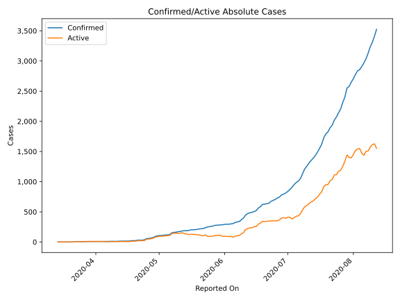
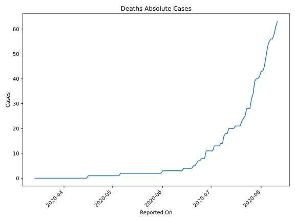
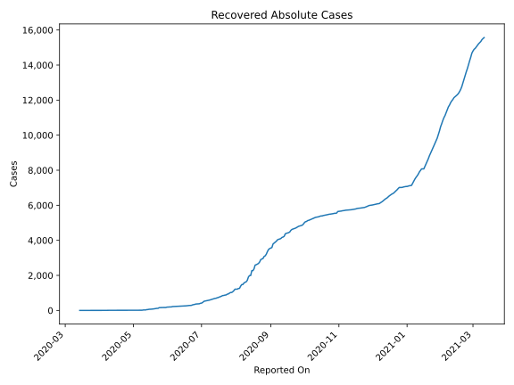
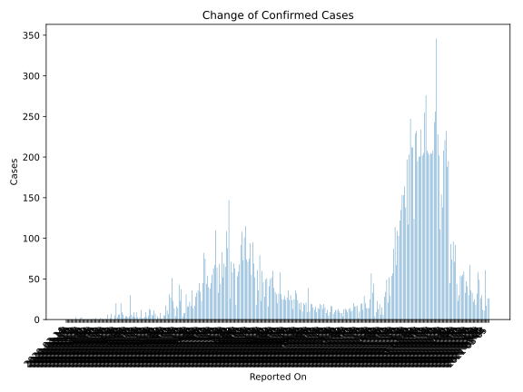
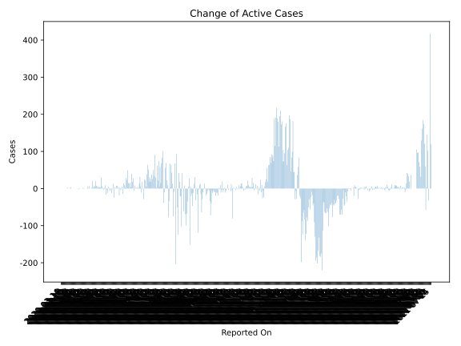
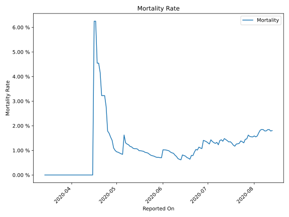

# Country Figures: Time Series for Eswatini 

| Reported On | Confirmed | Deaths | Recovered | Active | Mortality | &Delta; Confirmed | &Delta; Deaths | &Delta; Recovered | &Delta; Active | % Active of Population |
|-------------|-----------|--------|-----------|--------|-----------|-------------------|----------------|-------------------|----------------|------------------------|
| 2020-05-05 | 119 | 1 | 12 | 106 |  0.84 %  | 3 | 0 | 0 | 3 |  0.009 %  | 
| 2020-05-04 | 116 | 1 | 12 | 103 |  0.86 %  | 4 | 0 | 0 | 4 |  0.009 %  | 
| 2020-05-03 | 112 | 1 | 12 | 99 |  0.89 %  | 4 | 0 | 0 | 4 |  0.009 %  | 
| 2020-05-02 | 108 | 1 | 12 | 95 |  0.93 %  | 2 | 0 | 0 | 2 |  0.008 %  | 
| 2020-05-01 | 106 | 1 | 12 | 93 |  0.94 %  | 6 | 0 | 0 | 6 |  0.008 %  | 
| 2020-04-30 | 100 | 1 | 12 | 87 |  1.00 %  | 9 | 0 | 2 | 7 |  0.008 %  | 
| 2020-04-29 | 91 | 1 | 10 | 80 |  1.10 %  | 20 | 0 | 0 | 20 |  0.007 %  | 
| 2020-04-28 | 71 | 1 | 10 | 60 |  1.41 %  | 6 | 0 | 0 | 6 |  0.005 %  | 
| 2020-04-27 | 65 | 1 | 10 | 54 |  1.54 %  | 6 | 0 | 0 | 6 |  0.005 %  | 
| 2020-04-26 | 59 | 1 | 10 | 48 |  1.69 %  | 3 | 0 | 0 | 3 |  0.004 %  | 
| 2020-04-25 | 56 | 1 | 10 | 45 |  1.79 %  | 20 | 0 | 0 | 20 |  0.004 %  | 
| 2020-04-24 | 36 | 1 | 10 | 25 |  2.78 %  | 5 | 0 | 2 | 3 |  0.002 %  | 
| 2020-04-23 | 31 | 1 | 8 | 22 |  3.23 %  | 0 | 0 | 0 | 0 |  0.002 %  | 
| 2020-04-22 | 31 | 1 | 8 | 22 |  3.23 %  | 0 | 0 | 0 | 0 |  0.002 %  | 
| 2020-04-21 | 31 | 1 | 8 | 22 |  3.23 %  | 7 | 0 | 0 | 7 |  0.002 %  | 
| 2020-04-20 | 24 | 1 | 8 | 15 |  4.17 %  | 2 | 0 | 0 | 2 |  0.001 %  | 
| 2020-04-19 | 22 | 1 | 8 | 13 |  4.55 %  | 0 | 0 | 0 | 0 |  0.001 %  | 
| 2020-04-18 | 22 | 1 | 8 | 13 |  4.55 %  | 6 | 0 | 0 | 6 |  0.001 %  | 
| 2020-04-17 | 16 | 1 | 8 | 7 |  6.25 %  | 0 | 0 | 0 | 0 |  0.001 %  | 
| 2020-04-16 | 16 | 1 | 8 | 7 |  6.25 %  | 1 | 1 | 0 | 0 |  0.001 %  | 
| 2020-04-15 | 15 | 0 | 8 | 7 |  None  | 0 | 0 | 0 | 0 |  0.001 %  | 
| 2020-04-14 | 15 | 0 | 8 | 7 |  None  | 0 | 0 | 1 | -1 |  0.001 %  | 
| 2020-04-13 | 15 | 0 | 7 | 8 |  None  | 1 | 0 | 0 | 1 |  0.001 %  | 
| 2020-04-12 | 14 | 0 | 7 | 7 |  None  | 2 | 0 | 0 | 2 |  0.001 %  | 
| 2020-04-11 | 12 | 0 | 7 | 5 |  None  | 0 | 0 | 0 | 0 |  0.000 %  | 
| 2020-04-10 | 12 | 0 | 7 | 5 |  None  | 0 | 0 | 0 | 0 |  0.000 %  | 
| 2020-04-09 | 12 | 0 | 7 | 5 |  None  | 0 | 0 | 0 | 0 |  0.000 %  | 
| 2020-04-08 | 12 | 0 | 7 | 5 |  None  | 2 | 0 | 3 | -1 |  0.000 %  | 
| 2020-04-07 | 10 | 0 | 4 | 6 |  None  | 0 | 0 | 0 | 0 |  0.001 %  | 
| 2020-04-06 | 10 | 0 | 4 | 6 |  None  | 1 | 0 | 4 | -3 |  0.001 %  | 
| 2020-04-05 | 9 | 0 | 0 | 9 |  None  | 0 | 0 | 0 | 0 |  0.001 %  | 
| 2020-04-04 | 9 | 0 | 0 | 9 |  None  | 0 | 0 | 0 | 0 |  0.001 %  | 
| 2020-04-03 | 9 | 0 | 0 | 9 |  None  | 0 | 0 | 0 | 0 |  0.001 %  | 
| 2020-04-02 | 9 | 0 | 0 | 9 |  None  | 0 | 0 | 0 | 0 |  0.001 %  | 
| 2020-04-01 | 9 | 0 | 0 | 9 |  None  | 0 | 0 | 0 | 0 |  0.001 %  | 
| 2020-03-31 | 9 | 0 | 0 | 9 |  None  | 0 | 0 | 0 | 0 |  0.001 %  | 
| 2020-03-30 | 9 | 0 | 0 | 9 |  None  | 0 | 0 | 0 | 0 |  0.001 %  | 
| 2020-03-29 | 9 | 0 | 0 | 9 |  None  | 0 | 0 | 0 | 0 |  0.001 %  | 
| 2020-03-28 | 9 | 0 | 0 | 9 |  None  | 0 | 0 | 0 | 0 |  0.001 %  | 
| 2020-03-27 | 9 | 0 | 0 | 9 |  None  | 3 | 0 | 0 | 3 |  0.001 %  | 
| 2020-03-26 | 6 | 0 | 0 | 6 |  None  | 2 | 0 | 0 | 2 |  0.001 %  | 
| 2020-03-25 | 4 | 0 | 0 | 4 |  None  | 0 | 0 | 0 | 0 |  0.000 %  | 
| 2020-03-24 | 4 | 0 | 0 | 4 |  None  | 0 | 0 | 0 | 0 |  0.000 %  | 
| 2020-03-23 | 4 | 0 | 0 | 4 |  None  | 0 | 0 | 0 | 0 |  0.000 %  | 
| 2020-03-22 | 4 | 0 | 0 | 4 |  None  | 3 | 0 | 0 | 3 |  0.000 %  | 
| 2020-03-21 | 1 | 0 | 0 | 1 |  None  | 0 | 0 | 0 | 0 |  0.000 %  | 
| 2020-03-20 | 1 | 0 | 0 | 1 |  None  | 0 | 0 | 0 | 0 |  0.000 %  | 
| 2020-03-19 | 1 | 0 | 0 | 1 |  None  | 0 | 0 | 0 | 0 |  0.000 %  | 
| 2020-03-18 | 1 | 0 | 0 | 1 |  None  | 0 | 0 | 0 | 0 |  0.000 %  | 
| 2020-03-17 | 1 | 0 | 0 | 1 |  None  | 0 | 0 | 0 | 0 |  0.000 %  | 
| 2020-03-16 | 1 | 0 | 0 | 1 |  None  | 0 | 0 | 0 | 0 |  0.000 %  | 
| 2020-03-15 | 1 | 0 | 0 | 1 |  None  | 0 | 0 | 0 | 0 |  0.000 %  | 
| 2020-03-14 | 1 | 0 | 0 | 1 |  None  | None | None | None | None |  0.000 %  | 

