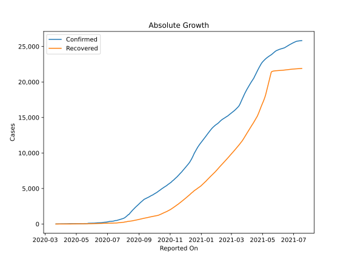

# Country Figures: Doubling Time of Infections for Syria 

The doubling time below are calculated based on
* an exponential growth assumption
* for time difference of past seven (7) days.
The doubling time's unit is "days".

The first doubling time indicates the increase of confirmed (infected)
cases. There, the *higher* the number is, the better is to take control
of the disease.

The second doubling time indicates the increase of recovered (healed)
cases. There, the *lower* the number is, the better it is to take
control of the disease.

| Reported On | Confirmed | Doubling Time (Confirmed) | Recovered | Doubling Time (Recovered) |
|-------------|-----------|---------------------------|-----------|---------------------------|
| 2020-04-28 | 43 |  206.5 days  | 21 |  4.2 days  | 
| 2020-04-27 | 43 |  50.0 days  | 19 |  4.0 days  | 
| 2020-04-26 | 43 |  50.0 days  | 14 |  5.1 days  | 
| 2020-04-25 | 42 |  48.8 days  | 11 |  6.5 days  | 
| 2020-04-24 | 42 |  48.8 days  | 6 |  27.0 days  | 
| 2020-04-23 | 42 |  20.5 days  | 6 |  27.0 days  | 
| 2020-04-22 | 42 |  20.5 days  | 6 |  27.0 days  | 
| 2020-04-21 | 42 |  13.4 days  | 6 |  27.0 days  | 
| 2020-04-20 | 39 |  11.3 days  | 5 |  None  | 
| 2020-04-19 | 39 |  11.3 days  | 5 |  None  | 
| 2020-04-18 | 38 |  11.9 days  | 5 |  None  | 
| 2020-04-17 | 38 |  7.3 days  | 5 |  22.1 days  | 
| 2020-04-16 | 33 |  9.1 days  | 5 |  22.1 days  | 
| 2020-04-15 | 33 |  9.1 days  | 5 |  22.1 days  | 
| 2020-04-14 | 29 |  11.8 days  | 5 |  9.8 days  | 
| 2020-04-13 | 25 |  18.0 days  | 5 |  5.6 days  | 
| 2020-04-12 | 25 |  18.0 days  | 5 |  5.6 days  | 
| 2020-04-11 | 25 |  11.2 days  | 5 |  5.6 days  | 
| 2020-04-10 | 19 |  28.6 days  | 4 |  None  | 
| 2020-04-09 | 19 |  28.6 days  | 4 |  None  | 
| 2020-04-08 | 19 |  7.9 days  | 4 |  None  | 
| 2020-04-07 | 19 |  7.9 days  | 3 |  None  | 
| 2020-04-06 | 19 |  7.9 days  | 2 |  None  | 
| 2020-04-05 | 19 |  6.8 days  | 2 |  None  | 
| 2020-04-04 | 16 |  4.5 days  | 2 |  None  | 
| 2020-04-03 | 16 |  4.5 days  | 0 |  None  | 
| 2020-04-02 | 16 |  4.5 days  | 0 |  None  | 
| 2020-04-01 | 10 |  7.3 days  | 0 |  None  | 
| 2020-03-31 | 10 |  2.4 days  | 0 |  None  | 
| 2020-03-30 | 10 |  2.4 days  | 0 |  None  | 
| 2020-03-29 | 9 |  2.5 days  | 0 |  None  | 
| 2020-03-28 | 5 |  None  | 0 |  None  | 
| 2020-03-27 | 5 |  None  | 0 |  None  | 
| 2020-03-26 | 5 |  None  | 0 |  None  | 
| 2020-03-25 | 5 |  None  | 0 |  None  | 
| 2020-03-24 | 1 |  None  | 0 |  None  | 
| 2020-03-23 | 1 |  None  | 0 |  None  | 
| 2020-03-22 | 1 |  None  | 0 |  None  | 

