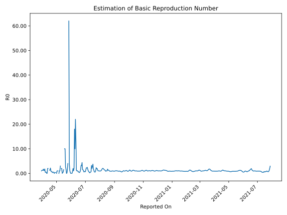

# Country Figures: Time Series for Basic Reproduction Number of Syria 

| Reported On | &Delta; Confirmed | Total &Delta; Confirmed First Interval | Total &Delta; Confirmed Second Interval | Estimated Basic Reproduction Number R0 | 
|-------------|-------------------|----------------------------------------|-----------------------------------------|---------------------------------------------------|
| 2020-04-27 | 0 |  1  |  4  |  0.25  | 
| 2020-04-26 | 1 |  None  |  4  |  None  | 
| 2020-04-25 | 0 |  3  |  6  |  0.50  | 
| 2020-04-24 | 0 |  3  |  6  |  0.50  | 
| 2020-04-23 | 0 |  4  |  9  |  0.44  | 
| 2020-04-22 | 0 |  4  |  13  |  0.31  | 
| 2020-04-21 | 3 |  6  |  8  |  0.75  | 
| 2020-04-20 | 0 |  6  |  8  |  0.75  | 
| 2020-04-19 | 1 |  9  |  10  |  0.90  | 
| 2020-04-18 | 0 |  13  |  6  |  2.17  | 
| 2020-04-17 | 5 |  8  |  6  |  1.33  | 
| 2020-04-16 | 0 |  8  |  6  |  1.33  | 
| 2020-04-15 | 4 |  10  |  None  |  None  | 
| 2020-04-14 | 4 |  6  |  None  |  None  | 
| 2020-04-13 | 0 |  6  |  3  |  2.00  | 
| 2020-04-12 | 0 |  6  |  3  |  2.00  | 
| 2020-04-11 | 6 |  None  |  3  |  None  | 
| 2020-04-10 | 0 |  None  |  9  |  None  | 
| 2020-04-09 | 0 |  3  |  6  |  0.50  | 
| 2020-04-08 | 0 |  3  |  6  |  0.50  | 
| 2020-04-07 | 0 |  3  |  7  |  0.43  | 
| 2020-04-06 | 0 |  9  |  5  |  1.80  | 
| 2020-04-05 | 3 |  6  |  5  |  1.20  | 
| 2020-04-04 | 0 |  6  |  5  |  1.20  | 
| 2020-04-03 | 0 |  7  |  4  |  1.75  | 
| 2020-04-02 | 6 |  5  |  4  |  1.25  | 
| 2020-04-01 | 0 |  5  |  4  |  1.25  | 
| 2020-03-31 | 0 |  5  |  4  |  1.25  | 
| 2020-03-30 | 1 |  4  |  4  |  1.00  | 
| 2020-03-29 | 4 |  4  |  None  |  None  | 
| 2020-03-28 | 0 |  4  |  None  |  None  | 
| 2020-03-27 | 0 |  4  |  None  |  None  | 
| 2020-03-26 | 0 |  4  |  None  |  None  | 
| 2020-03-25 | 4 |  None  |  None  |  None  | 
| 2020-03-24 | 0 |  None  |  None  |  None  | 
| 2020-03-23 | 0 |  None  |  None  |  None  | 
| 2020-03-22 | None |  None  |  None  |  None  | 

