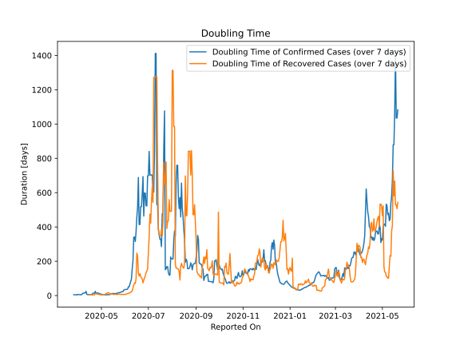

# Country Figures: New Infections in Previous 7 Days per 100,000 Population for Chad 

<!--  --> 

| Reported On | &Delta; Confirmed (on the day) | &Delta; Confirmed (last 7 days) | New Cases in Previous 7 Days per 100,000 Population |
|-------------|--------------------------------|---------------------------------|-----------------------------------------------------|
| 2020-05-09 |  62  |  205  |  1.324  |
| 2020-05-08 |  7  |  187  |  1.208  |
| 2020-05-07 |  83  |  180  |  1.163  |
| 2020-05-06 |  None  |  118  |  0.762  |
| 2020-05-05 |  53  |  118  |  0.762  |
| 2020-05-04 |  None  |  71  |  0.459  |
| 2020-05-03 |  None  |  71  |  0.459  |
| 2020-05-02 |  44  |  71  |  0.459  |
| 2020-05-01 |  None  |  33  |  0.213  |
| 2020-04-30 |  21  |  40  |  0.258  |
| 2020-04-29 |  None  |  19  |  0.123  |
| 2020-04-28 |  6  |  19  |  0.123  |
| 2020-04-27 |  None  |  13  |  0.084  |
| 2020-04-26 |  None  |  13  |  0.084  |
| 2020-04-25 |  6  |  13  |  0.084  |
| 2020-04-24 |  7  |  13  |  0.084  |
| 2020-04-23 |  None  |  6  |  0.039  |
| 2020-04-22 |  None  |  10  |  0.065  |
| 2020-04-21 |  None  |  10  |  0.065  |
| 2020-04-20 |  None  |  10  |  0.065  |
| 2020-04-19 |  None  |  15  |  0.097  |
| 2020-04-18 |  6  |  22  |  0.142  |
| 2020-04-17 |  None  |  16  |  0.103  |
| 2020-04-16 |  4  |  16  |  0.103  |
| 2020-04-15 |  None  |  13  |  0.084  |
| 2020-04-14 |  None  |  13  |  0.084  |
| 2020-04-13 |  5  |  14  |  0.090  |
| 2020-04-12 |  7  |  9  |  0.058  |
| 2020-04-11 |  None  |  2  |  0.013  |
| 2020-04-10 |  None  |  3  |  0.019  |
| 2020-04-09 |  1  |  3  |  0.019  |
| 2020-04-08 |  None  |  3  |  0.019  |
| 2020-04-07 |  1  |  3  |  0.019  |
| 2020-04-06 |  None  |  4  |  0.026  |
| 2020-04-05 |  None  |  6  |  0.039  |
| 2020-04-04 |  1  |  6  |  0.039  |
| 2020-04-03 |  None  |  5  |  0.032  |
| 2020-04-02 |  1  |  5  |  0.032  |
| 2020-04-01 |  None  |  4  |  0.026  |
| 2020-03-31 |  2  |  4  |  0.026  |
| 2020-03-30 |  2  |  4  |  0.026  |
| 2020-03-29 |  None  |  2  |  0.013  |
| 2020-03-28 |  None  |  2  |  0.013  |
| 2020-03-27 |  None  |  2  |  0.013  |
| 2020-03-26 |  None  |  2  |  0.013  |
| 2020-03-25 |  None  |  2  |  0.013  |
| 2020-03-24 |  2  |  2  |  0.013  |
| 2020-03-23 |  None  |  None  |  None  |
| 2020-03-22 |  None  |  None  |  None  |
| 2020-03-21 |  None  |  None  |  None  |
| 2020-03-20 |  None  |  None  |  None  |
| 2020-03-19 |  None  |  None  |  None  |

